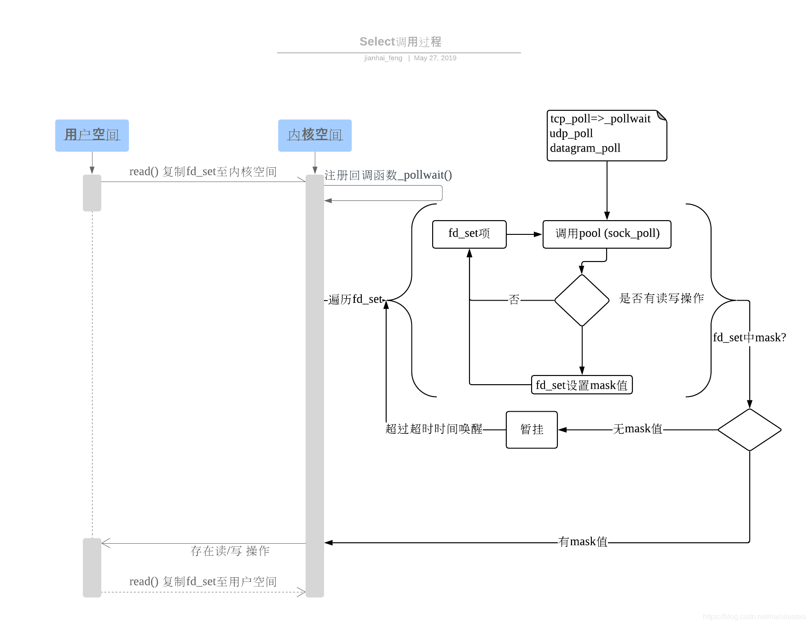

JAVA基础知识总结

## Object类

### 所有方法

```java
public native int hashCode()

public boolean equals(Object obj)

protected native Object clone() throws CloneNotSupportedException

public String toString()

public final native Class<?> getClass()

protected void finalize() throws Throwable {}

public final native void notify()

public final native void notifyAll()

public final native void wait(long timeout) throws InterruptedException

public final void wait(long timeout, int nanos) throws InterruptedException

public final void wait() throws InterruptedException
```

### hashCode方法与equals方法

[转载](https://www.cnblogs.com/wang-meng/p/7501378.html)

1.  原生的hashCode值是根据内存地址换算出来的一个值。
2.  原生的equals方法是严格判断一个对象是否相等的方法（object1 == object2）。

 为什么需要重写equals和hashCode方法？
   在我们的业务系统中判断对象时有时候需要的不是一种严格意义上的相等，而是一种业务上的对象相等。在这种情况下，原生的equals方法就不能满足我们的需求了。所以这个时候我们需要重写equals方法，来满足我们的业务系统上的需求。那么为什么在重写equals方法的时候需要重写hashCode方法呢？

   我们先来看一下Object.hashCode的通用约定（摘自《Effective Java》第45页）

1. 在一个应用程序执行期间，如果一个对象的equals方法做比较所用到的信息没有被修改的话，那么，对该对象调用hashCode方法多次，它必须始终如一地返回 同一个整数。在同一个应用程序的多次执行过程中，这个整数可以不同，即这个应用程序这次执行返回的整数与下一次执行返回的整数可以不一致。
2. 如果两个对象根据equals(Object)方法是相等的，那么调用这两个对象中任一个对象的hashCode方法必须产生同样的整数结果。
3. 如果两个对象根据equals(Object)方法是不相等的，那么调用这两个对象中任一个对象的hashCode方法，不要求必须产生不同的整数结果。然而，程序员应该意识到这样的事实，对于不相等的对象产生截然不同的整数结果，有可能提高散列表（hash table）的性能。

**如果只重写了equals方法而没有重写hashCode方法的话，则会违反约定的第二条：相等的对象必须具有相等的散列码（hashCode）。**

   **同时对于HashSet和HashMap这些基于散列值（hash）实现的类。**HashMap的底层处理机制是以数组的方法保存放入的数据的(Node<K,V>[] table)，其中的关键是数组下标的处理。**数组的下标是根据传入的元素hashCode方法的返回值再和特定的值异或决定的。**如果该数组位置上已经有放入的值了，且传入的键值相等则不处理，若不相等则覆盖原来的值，如果数组位置没有条目，则插入，并加入到相应的链表中。检查键是否存在也是根据hashCode值来确定的。所以如果不重写hashCode的话，**可能导致HashSet、HashMap不能正常的运作、**

  如果我们将某个自定义对象存到HashMap或者HashSet及其类似实现类中的时候，**如果该对象的属性参与了hashCode的计算，那么就不能修改该对象参数hashCode计算的属性了。**有可能会移除不了元素，导致内存泄漏。

### clone

clone() 是 Object 的 protected 方法，它不是 public，一个类不显式去重写 clone()，其它类就不能直接去调用该类实例的 clone() 方法。 

clone() 方法并不是 Cloneable 接口的方法，而是 Object 的一个 protected 方法。Cloneable 接口只是规定，如果一个类没有实现 Cloneable 接口又调用了 clone() 方法，就会抛出 CloneNotSupportedException。 

```java
public class CloneExample implements Cloneable {
    private int a;
    private int b;

    @Override
    public Object clone() throws CloneNotSupportedException {
        return super.clone();
    }
}
```

使用 clone() 方法来拷贝一个对象即复杂又有风险，它会抛出异常，并且还需要类型转换。Effective Java 书上讲到，最好不要去使用 clone()，可以使用拷贝构造函数或者拷贝工厂来拷贝一个对象。 

### JAVA对象的生命周期

对象的整个生命周期大致可以分为7个阶段：创建阶段（Creation）、应用阶段（Using）、不可视阶段（Invisible）、不可到达阶段（Unreachable）、可收集阶段（Collected）、终结阶段（Finalized）与释放阶段（Free）。

### java类生命周期

一个java类的完整的生命周期会经历加载、连接、初始化、使用、和卸载五个阶段

## 继承

**访问权限**

* private
* protected 修饰成员，子类可见
* default 包级可见
* public

**抽象类与接口**

抽象类和普通类最大的区别是，抽象类不能被实例化，只能被继承。 

接口是抽象类的延伸 ，从 Java 8 开始，接口也可以拥有默认的方法实现，这是因为不支持默认方法的接口的维护成本太高了。在 Java 8 之前，如果一个接口想要添加新的方法，那么要修改所有实现了该接口的类，让它们都实现新增的方法。

接口的成员（字段 + 方法）默认都是 public 的，并且不允许定义为 private 或者 protected。

接口的字段默认都是 static 和 final 的。

**比较**

- 从设计层面上看，抽象类提供了一种 IS-A 关系，需要满足里式替换原则，即子类对象必须能够替换掉所有父类对象。而接口更像是一种 LIKE-A 关系，它只是提供一种方法实现契约，并不要求接口和实现接口的类具有 IS-A 关系。（继承是一个"是不是"的关系，而接口实现则是"有没有"的关系）
- 从使用上来看，一个类可以实现多个接口，但是不能继承多个抽象类。
- 接口的字段只能是 static 和 final 类型的，而抽象类的字段没有这种限制。
- 接口的成员只能是 public 的，而抽象类的成员可以有多种访问权限。

**重写与重载**

**重写（Override）**存在于继承体系中，指子类实现了一个与父类在方法声明上完全相同的一个方法。重写有以下三个限制：

- 子类方法的访问权限必须大于等于父类方法；
- 子类方法的返回类型必须是父类方法返回类型或为其子类型。
- 子类方法抛出的异常类型必须是父类抛出异常类型或为其子类型。

**重载（Overload）**存在于同一个类中，指一个方法与已经存在的方法名称上相同，但是参数类型、个数、顺序至少有一个不同。

应该注意的是，返回值不同，其它都相同不算是重载。

## 异常

Throwable 可以用来表示任何可以作为异常抛出的类，分为两种： **Error** 和 **Exception**。其中 Error 用来表示 JVM 无法处理的错误，异常分为两种：

- **受检异常** ： 除了`RuntimeException`及其子类以外，其他的`Exception`类及其子类都属于这种异常，当程序中可能出现这类异常，要么使用`try-catch`语句进行捕获，要么用`throws`子句抛出，否则编译无法通过。 
- **非受检异常** ：是程序运行时错误， 包括`RuntimeException`及其子类和`Error`。 

在`Exception`分支中有一个重要的子类`RuntimeException`（运行时异常），该类型的异常自动为你所编写的程序定义`ArrayIndexOutOfBoundsException`（数组下标越界）、`NullPointerException`（空指针异常）、`ArithmeticException`（算术异常）、`MissingResourceException`（丢失资源）、`ClassNotFoundException`（找不到类）等异常，这些异常是不检查异常，程序中可以选择捕获处理，也可以不处理。这些异常一般是由程序逻辑错误引起的，程序应该从逻辑角度尽可能避免这类异常的发生；而`RuntimeException`之外的异常我们统称为非运行时异常，类型上属于`Exception`类及其子类，从程序语法角度讲是必须进行处理的异常，如果不处理，程序就不能编译通过。如`IOException`、`SQLException`等以及用户自定义的`Exception`异常，一般情况下不自定义检查异常。 

## JAVA数组

### 如何判断一个数组是否有重复数据

1. 若有限定：数组array有 n 个元素，而且元素的取值范围是 1~ n，所以可以通过遍历数组，假设下标 i 位的数字为 j。那么通过交换，将“下标 i 位上的数字 j“ 交换到“下标 j - 1 位上“，直到所有数字都出现在自己对应的下标处，或发生了冲突。此算法的时间复杂度为O(n)，空间复杂度为O(1)。

2.  Hash法 或者 位图法，时间复杂度 和 空间复杂度 都是 O(n)。 

   ————————————————
   版权声明：本文为CSDN博主「小僧_」的原创文章，遵循 CC 4.0 BY-SA 版权协议，转载请附上原文出处链接及本声明。
   原文链接：https://blog.csdn.net/cyuyanenen/article/details/51766433

## JAVA泛型

### 泛型擦除，java伪泛型 

[转载](https://www.cnblogs.com/wuqinglong/p/9456193.html)

#### 1. Java泛型的实现方法：类型擦除

大家都知道，Java的泛型是伪泛型，这是因为Java**在编译期间，所有的泛型信息都会被擦掉**，正确理解泛型概念的首要前提是理解类型擦除。**Java的泛型基本上都是在编译器这个层次上实现的，在生成的字节码中是不包含泛型中的类型信息的，使用泛型的时候加上类型参数，在编译器编译的时候会去掉，这个过程成为类型擦除**。

如在代码中定义`List<Object>`和`List<String>`等类型，在编译后都会变成`List`，JVM看到的只是List，而由**泛型附加的类型信息对JVM是看不到的**。Java编译器会在编译时尽可能的发现可能出错的地方，但是仍然无法在运行时刻出现的类型转换异常的情况，**类型擦除也是Java的泛型与C++模板机制实现方式之间的重要区别**。

##### 1-2.通过两个例子证明Java类型的类型擦除

例1.原始类型相等

```java
public class Test {
	public static void main(String[] args) {
        ArrayList<String> list1 = new ArrayList<String>();
        list1.add("abc");
        ArrayList<Integer> list2 = new ArrayList<Integer>();
        list2.add(123);

        System.out.println(list1.getClass() == list2.getClass());
    }
}
```

在这个例子中，我们定义了两个`ArrayList`数组，不过一个是`ArrayList<String>`泛型类型的，只能存储字符串；一个是`ArrayList<Integer>`泛型类型的，只能存储整数，最后，我们通过`list1`对象和`list2`对象的`getClass()`方法获取他们的类的信息，最后发现结果为`true`。说明泛型类型`String`和`Integer`都被擦除掉了，只剩下原始类型。

例2.通过反射添加其它类型元素

```java
public class Test {

    public static void main(String[] args) throws Exception {
        ArrayList<Integer> list = new ArrayList<Integer>();
        list.add(1);  //这样调用 add 方法只能存储整形，因为泛型类型的实例为 Integer
        list.getClass().getMethod("add", Object.class).invoke(list, "asd");
        for (int i = 0; i < list.size(); i++) {
            System.out.println(list.get(i));
        }
    }
}
```

在程序中定义了一个`ArrayList<Integer>`泛型类型实例化为`Integer`对象，如果直接调用`add()`方法，那么只能存储整数数据，不过当我们利用反射调用`add()`方法的时候，却可以存储字符串，这说明了`Integer`泛型实例在编译之后被擦除掉了，只保留了原始类型。

#### 2.类型擦除后保留的原始类型

在上面，两次提到了原始类型，什么是原始类型？

**原始类型** 就是擦除去了泛型信息，最后在字节码中的类型变量的真正类型，无论何时定义一个泛型，相应的原始类型都会被自动提供，类型变量擦除，并使用其限定类型（无限定的变量用Object）替换。

例3.原始类型Object

```java
class Pair<T> {  
    private T value;  
    public T getValue() {  
        return value;  
    }  
    public void setValue(T  value) {  
        this.value = value;  
    }  
}  
```

Pair的原始类型为:

```java
class Pair {  
    private Object value;  
    public Object getValue() {  
        return value;  
    }  
    public void setValue(Object  value) {  
        this.value = value;  
    }  
}
```

因为在`Pair<T>`中，T 是一个无限定的类型变量，所以用`Object`替换，其结果就是一个普通的类，如同泛型加入Java语言之前的已经实现的样子。在程序中可以包含不同类型的`Pair`，如`Pair<Integer>`或`Pair<String>`，但是擦除类型后他们的就成为原始的`Pair`类型了，原始类型都是`Object`。

从上面的例2中，我们也可以明白`ArrayList`被擦除类型后，原始类型也变为`Object`，所以通过反射我们就可以存储字符串了。

如果类型变量有限定，那么原始类型就用第一个边界的类型变量类替换。

比如: Pair这样声明的话

```java
public class Pair<T extends Comparable> {}
```

那么原始类型就是`Comparable`。

要区分原始类型和泛型变量的类型。

**在调用泛型方法时，可以指定泛型，也可以不指定泛型。**

- 在不指定泛型的情况下，泛型变量的类型为该方法中的几种类型的同一父类的最小级，直到Object
- 在指定泛型的情况下，该方法的几种类型必须是该泛型的实例的类型或者其子类

```java
public class Test {  
    public static void main(String[] args) {  

        /**不指定泛型的时候*/  
        int i = Test.add(1, 2); //这两个参数都是Integer，所以T为Integer类型  
        Number f = Test.add(1, 1.2); //这两个参数一个是Integer，以风格是Float，所以取同一父类的最小级，为Number  
        Object o = Test.add(1, "asd"); //这两个参数一个是Integer，以风格是Float，所以取同一父类的最小级，为Object  

        /**指定泛型的时候*/  
        int a = Test.<Integer>add(1, 2); //指定了Integer，所以只能为Integer类型或者其子类  
        int b = Test.<Integer>add(1, 2.2); //编译错误，指定了Integer，不能为Float  
        Number c = Test.<Number>add(1, 2.2); //指定为Number，所以可以为Integer和Float  
    }  

    //这是一个简单的泛型方法  
    public static <T> T add(T x,T y){  
        return y;  
    }  
}
```

其实在泛型类中，不指定泛型的时候，也差不多，只不过这个时候的泛型为`Object`，就比如`ArrayList`中，如果不指定泛型，那么这个`ArrayList`可以存储任意的对象。

例4.Object泛型

```java
public static void main(String[] args) {  
    ArrayList list = new ArrayList();  
    list.add(1);  
    list.add("121");  
    list.add(new Date());  
} 
```

#### 3.类型擦除引起的问题及解决方法

因为种种原因，**Java不能实现真正的泛型，只能使用类型擦除来实现伪泛型，这样虽然不会有类型膨胀问题，但是也引起来许多新问题，所以，SUN对这些问题做出了种种限制，避免我们发生各种错误。**

##### 3-1.先检查，再编译以及编译的对象和引用传递问题

Q: 既然说类型变量会在编译的时候擦除掉，那为什么我们往 ArrayList 创建的对象中添加整数会报错呢？不是说泛型变量String会在编译的时候变为Object类型吗？为什么不能存别的类型呢？既然类型擦除了，如何保证我们只能使用泛型变量限定的类型呢？

A: Java编译器是通过先检查代码中泛型的类型，然后在进行类型擦除，再进行编译。

例如：

```java
public static  void main(String[] args) {  

    ArrayList<String> list = new ArrayList<String>();  
    list.add("123");  
    list.add(123);//编译错误  
}
```

在上面的程序中，使用`add`方法添加一个整型，在IDE中，直接会报错，说明这就是在编译之前的检查，因为如果是在编译之后检查，类型擦除后，原始类型为`Object`，是应该允许任意引用类型添加的。可实际上却不是这样的，这恰恰说明了关于泛型变量的使用，是会在编译之前检查的。

那么，这个类型检查是针对谁的呢？我们先看看参数化类型和原始类型的兼容。

以 ArrayList举例子，以前的写法:

```java
ArrayList list = new ArrayList();  
```

现在的写法:

```java
ArrayList<String> list = new ArrayList<String>();
```

如果是与以前的代码兼容，各种引用传值之间，必然会出现如下的情况：

```java
ArrayList<String> list1 = new ArrayList(); //第一种 情况
ArrayList list2 = new ArrayList<String>(); //第二种 情况
```

**这样是没有错误的，不过会有个编译时警告。**

不过在第一种情况，可以实现与完全使用泛型参数一样的效果，第二种则没有效果。

因为类型检查就是编译时完成的，`new ArrayList()`只是在内存中开辟了一个存储空间，可以存储任何类型对象，而**真正设计类型检查的是它的引用**，因为我们是使用它引用`list1`来调用它的方法，比如说调用`add`方法，所以`list1`引用能完成泛型类型的检查。而引用`list2`没有使用泛型，所以不行。

举例子：

```java
public class Test {  
    public static void main(String[] args) {  

        ArrayList<String> list1 = new ArrayList();  
        list1.add("1"); //编译通过  
        list1.add(1); //编译错误  
        String str1 = list1.get(0); //返回类型就是String  

        ArrayList list2 = new ArrayList<String>();  
        list2.add("1"); //编译通过  
        list2.add(1); //编译通过  
        Object object = list2.get(0); //返回类型就是Object  

        new ArrayList<String>().add("11"); //编译通过  
        new ArrayList<String>().add(22); //编译错误  

        String str2 = new ArrayList<String>().get(0); //返回类型就是String  
    }  

}  
```

通过上面的例子，我们可以明白，类型检查就是针对引用的，谁是一个引用，用这个引用调用泛型方法，就会对这个引用调用的方法进行类型检测，而无关它真正引用的对象。

泛型中参数话类型为什么不考虑继承关系？

在Java中，像下面形式的引用传递是不允许的:

```java
ArrayList<String> list1 = new ArrayList<Object>(); //编译错误  
ArrayList<Object> list2 = new ArrayList<String>(); //编译错误
```

我们先看第一种情况，将第一种情况拓展成下面的形式：

```java
ArrayList<Object> list1 = new ArrayList<Object>();  
list1.add(new Object());  
list1.add(new Object());  
ArrayList<String> list2 = list1; //编译错误
```

实际上，在第4行代码的时候，就会有编译错误。那么，我们先假设它编译没错。那么当我们使用`list2`引用用`get()`方法取值的时候，返回的都是`String`类型的对象（上面提到了，类型检测是根据引用来决定的），可是它里面实际上已经被我们存放了`Object`类型的对象，这样就会有`ClassCastException`了。所以为了避免这种极易出现的错误，Java不允许进行这样的引用传递。（这也是泛型出现的原因，就是为了解决类型转换的问题，我们不能违背它的初衷）。

再看第二种情况，将第二种情况拓展成下面的形式：

```java
ArrayList<String> list1 = new ArrayList<String>();  
list1.add(new String());  
list1.add(new String());

ArrayList<Object> list2 = list1; //编译错误
```

没错，这样的情况比第一种情况好的多，最起码，在我们用`list2`取值的时候不会出现`ClassCastException`，因为是从`String`转换为`Object`。可是，这样做有什么意义呢，泛型出现的原因，就是为了解决类型转换的问题。我们使用了泛型，到头来，还是要自己强转，违背了泛型设计的初衷。所以java不允许这么干。再说，你如果又用`list2`往里面`add()`新的对象，那么到时候取得时候，我怎么知道我取出来的到底是`String`类型的，还是`Object`类型的呢？

**所以，要格外注意，泛型中的引用传递的问题。**

##### 3-2.自动类型转换

因为类型擦除的问题，所以所有的泛型类型变量最后都会被替换为原始类型。既然都被替换为原始类型，那么为什么我们在获取的时候，不需要进行强制类型转换呢？

看下`ArrayList.get()`方法：

```java
public E get(int index) {  
    RangeCheck(index); 
    return (E) elementData[index];  
}
```

可以看到，在`return`之前，会根据泛型变量进行强转。假设泛型类型变量为`Date`，虽然泛型信息会被擦除掉，但是会将`(E) elementData[index]`，编译为`(Date)elementData[index]`。所以我们不用自己进行强转。当存取一个泛型域时也会自动插入强制类型转换。假设`Pair`类的`value`域是`public`的，那么表达式：

```java
Date date = pair.value;
```

也会自动地在结果字节码中插入强制类型转换。

##### 3-3.类型擦除与多态的冲突和解决方法

现在有这样一个泛型类：

```java
class Pair<T> {  
    private T value;  
    public T getValue() {  
        return value;  
    }  
    public void setValue(T value) {  
        this.value = value;  
    }  
}
```

然后我们想要一个子类继承它。

```java
class DateInter extends Pair<Date> {  
    @Override  
    public void setValue(Date value) {  
        super.setValue(value);  
    }  
    @Override  
    public Date getValue() {  
        return super.getValue();  
    }  
}
```

在这个子类中，我们设定父类的泛型类型为`Pair`，在子类中，我们覆盖了父类的两个方法，我们的原意是这样的：将父类的泛型类型限定为`Date`，那么父类里面的两个方法的参数都为`Date`类型。

```java
public Date getValue() {  
    return value;  
}  

public void setValue(Date value) {  
    this.value = value;  
}
```

所以，我们在子类中重写这两个方法一点问题也没有，实际上，从他们的`@Override`标签中也可以看到，一点问题也没有，实际上是这样的吗？

分析：实际上，类型擦除后，父类的的泛型类型全部变为了原始类型`Object`，所以父类编译之后会变成下面的样子：

```java
class Pair {  
    private Object value;  

    public Object getValue() {  
        return value;  
    }  

    public void setValue(Object  value) {  
        this.value = value;  
    }  
}  
```

再看子类的两个重写的方法的类型：

```java
@Override  
public void setValue(Date value) {  
    super.setValue(value);  
}  
@Override  
public Date getValue() {  
    return super.getValue();  
}
```

先来分析`setValue`方法，父类的类型是`Object`，而子类的类型是`Date`，参数类型不一样，这如果实在普通的继承关系中，根本就不会是重写，而是重载。
　　
我们在一个main方法测试一下：

```java
public static void main(String[] args) throws ClassNotFoundException {  
        DateInter dateInter = new DateInter();  
        dateInter.setValue(new Date());                  
        dateInter.setValue(new Object()); //编译错误  
}
```

如果是重载，那么子类中两个`setValue`方法，一个是参数`Object`类型，一个是`Date`类型，可是我们发现，根本就没有这样的一个子类继承自父类的Object类型参数的方法。所以说，却是是重写了，而不是重载了。

为什么会这样呢？

原因是这样的，我们传入父类的泛型类型是`Date，Pair`，我们的本意是将泛型类变为如下：

```java
class Pair {  
    private Date value;  
    public Date getValue() {  
        return value;  
    }  
    public void setValue(Date value) {  
        this.value = value;  
    }  
}
```

然后再子类中重写参数类型为Date的那两个方法，实现继承中的多态。

可是由于种种原因，**虚拟机并不能将泛型类型变为`Date`，只能将类型擦除掉，变为原始类型`Object`。这样，我们的本意是进行重写，实现多态。可是类型擦除后，只能变为了重载。**这样，类型擦除就和多态有了冲突。JVM知道你的本意吗？知道！！！可是它能直接实现吗，不能！！！如果真的不能的话，那我们怎么去重写我们想要的`Date`类型参数的方法啊。

于是**JVM采用了一个特殊的方法，来完成这项功能，那就是桥方法**。

首先，我们用`javap -c className`的方式反编译下`DateInter`子类的字节码，结果如下：

```class
class com.tao.test.DateInter extends com.tao.test.Pair<java.util.Date> {  
  com.tao.test.DateInter();  
    Code:  
       0: aload_0  
       1: invokespecial #8                  // Method com/tao/test/Pair."<init>":()V  
       4: return  

  public void setValue(java.util.Date);  //我们重写的setValue方法  
    Code:  
       0: aload_0  
       1: aload_1  
       2: invokespecial #16                 // Method com/tao/test/Pair.setValue:(Ljava/lang/Object;)V  
       5: return  

  public java.util.Date getValue();    //我们重写的getValue方法  
    Code:  
       0: aload_0  
       1: invokespecial #23                 // Method com/tao/test/Pair.getValue:()Ljava/lang/Object;  
       4: checkcast     #26                 // class java/util/Date  
       7: areturn  

  public java.lang.Object getValue();     //编译时由编译器生成的巧方法  
    Code:  
       0: aload_0  
       1: invokevirtual #28                 // Method getValue:()Ljava/util/Date 去调用我们重写的getValue方法;  
       4: areturn  

  public void setValue(java.lang.Object);   //编译时由编译器生成的巧方法  
    Code:  
       0: aload_0  
       1: aload_1  
       2: checkcast     #26                 // class java/util/Date  
       5: invokevirtual #30                 // Method setValue:(Ljava/util/Date; 去调用我们重写的setValue方法)V  
       8: return  
}
```

从编译的结果来看，我们本意重写`setValue`和`getValue`方法的子类，竟然有4个方法，其实不用惊奇，最后的两个方法，就是编译器自己生成的桥方法。可以看到桥方法的参数类型都是Object，也就是说，子类中真正覆盖父类两个方法的就是这两个我们看不到的桥方法。而打在我们自己定义的`setvalue`和`getValue`方法上面的`@Oveerride`只不过是假象。而桥方法的内部实现，就只是去调用我们自己重写的那两个方法。

所以，虚拟机巧妙的使用了桥方法，来解决了类型擦除和多态的冲突。

不过，要提到一点，这里面的`setValue`和`getValue`这两个桥方法的意义又有不同。

`setValue`方法是为了解决类型擦除与多态之间的冲突。

而`getValue`却有普遍的意义，怎么说呢，如果这是一个普通的继承关系：

那么父类的`setValue`方法如下：

```java
public ObjectgetValue() {  
    return super.getValue();  
}
```

而子类重写的方法是：

```java
public Date getValue() {  
    return super.getValue();  
}
```

其实这在普通的类继承中也是普遍存在的重写，这就是协变。

关于协变：。。。。。。

并且，还有一点也许会有疑问，子类中的巧方法`Object getValue()`和`Date getValue()`是同 时存在的，可是如果是常规的两个方法，他们的方法签名是一样的，也就是说虚拟机根本不能分别这两个方法。如果是我们自己编写Java代码，这样的代码是无法通过编译器的检查的，但是虚拟机却是允许这样做的，因为虚拟机通过参数类型和返回类型来确定一个方法，所以编译器为了实现泛型的多态允许自己做这个看起来“不合法”的事情，然后交给虚拟器去区别。

##### 3-4.泛型类型变量不能是基本数据类型

不能用类型参数替换基本类型。就比如，没有`ArrayList`，只有`ArrayList`。因为当类型擦除后，`ArrayList`的原始类型变为`Object`，但是`Object`类型不能存储`double`值，只能引用`Double`的值。

##### 3-5.编译时集合的instanceof

```java
ArrayList<String> arrayList = new ArrayList<String>();
```

因为类型擦除之后，`ArrayList`只剩下原始类型，泛型信息`String`不存在了。

那么，编译时进行类型查询的时候使用下面的方法是错误的

```java
if( arrayList instanceof ArrayList<String>)
```

##### 3-6.泛型在静态方法和静态类中的问题

泛型类中的静态方法和静态变量不可以使用泛型类所声明的泛型类型参数

举例说明：

```java
public class Test2<T> {    
    public static T one;   //编译错误    
    public static  T show(T one){ //编译错误    
        return null;    
    }    
}
```

因为泛型类中的**泛型参数的实例化是在定义对象的时候指定的，而静态变量和静态方法不需要使用对象来调用。对象都没有创建，如何确定这个泛型参数是何种类型，所以当然是错误的。**

但是要注意区分下面的一种情况：

```java
public class Test2<T> {    

    public static <T >T show(T one){ //这是正确的    
        return null;    
    }    
}
```

因为这是一个泛型方法，在泛型方法中使用的T是自己在方法中定义的 T，而不是泛型类中的T。

## 缓存池

new Integer(123) 与 Integer.valueOf(123) 的区别在于：

- new Integer(123) 每次都会新建一个对象；
- Integer.valueOf(123) 会使用缓存池中的对象，多次调用会取得同一个对象的引用。

 **valueOf() 方法**：先判断值是否在缓存池中，如果在的话就直接返回缓存池的内容。
 Java 8 中，Integer 缓存池的大小默认为 -128~127。  

编译器会在自动装箱过程调用 valueOf() 方法，因此多个值相同且值在缓存池范围内的 Integer 实例使用自动装箱来创建，那么就会引用相同的对象。 

## String

#### String 不可变

String 被声明为 final，因此它不可被继承。value 数组被声明为 final，这意味着 value 数组初始化之后就不能再引用其它数组。并且 String 内部没有改变 value 数组的方法，因此可以保证 String 不可变。

##### 不可变的好处

*  **可以缓存 hash 值** 
*  **String Pool 的需要** 
*  **安全性**，  String 经常作为参数 
* **线程安全** ， String 不可变性天生具备线程安全，可以在多个线程中安全地使用。 

#### 内部实现

在 Java 8 中，String 内部使用 char 数组存储数据。 
在 Java 9 之后，String 类的实现改用 byte 数组存储字符串，同时使用 `coder` 来标识使用了哪种编码。 

#### Constant Pool

.intern()，“abc”

在 Java 7 之前，String Pool 被放在运行时常量池中，它属于永久代。而在 Java 7，String Pool 被移到堆中。这是因为永久代的空间有限，在大量使用字符串的场景下会导致 OutOfMemoryError 错误。 

## Static

**静态内部类**

非静态内部类依赖于外部类的实例，也就是说需要先创建外部类实例，才能用这个实例去创建非静态内部类。而静态内部类不需要。
 静态内部类不能访问外部类的非静态的变量和方法。 

**初始化顺序**

静态变量和静态语句块优先于实例变量和普通语句块，静态变量和静态语句块的初始化顺序取决于它们在代码中的顺序。

存在继承的情况下，初始化顺序为：

- 父类（静态变量、静态语句块）
- 子类（静态变量、静态语句块）
- 父类（实例变量、普通语句块）
- 父类（构造函数）
- 子类（实例变量、普通语句块）
- 子类（构造函数）

## 反射

**JAVA反射的原理：**java类的执行需要经历以下过程，

编译：.java文件编译后生成.class字节码文件
加载：类加载器负责根据一个类的全限定名来读取此类的二进制字节流到JVM内部，并存储在运行时内存区的方法区，然后将其转换为一个与目标类型对应的java.lang.Class对象实例
连接：细分三步

* 验证：格式（class文件规范） 语义（final类是否有子类） 操作
* 准备：静态变量赋初值和内存空间，final修饰的内存空间直接赋原值，此处不是用户指定的初值。
* 解析：符号引用转化为直接引用，分配地址

初始化：有父类先初始化父类，然后初始化自己；将static修饰代码执行一遍，如果是静态变量，则用用户指定值覆盖原有初值；如果是代码块，则执行一遍操作。

Java的反射就是利用上面第二步加载到jvm中的.class文件来进行操作的。.class文件中包含java类的所有信息，当你不知道某个类具体信息时，可以使用反射获取class，然后进行各种操作。

Java反射就是在运行状态中，对于任意一个类，都能够知道这个类的所有属性和方法；对于任意一个对象，都能够调用它的任意方法和属性；并且能改变它的属性。总结说：反射就是把java类中的各种成分映射成一个个的Java对象，并且可以进行操作。


Class 和 java.lang.reflect 一起对反射提供了支持，java.lang.reflect 类库主要包含了以下三个类：

- **Field** ：可以使用 get() 和 set() 方法读取和修改 Field 对象关联的字段；
- **Method** ：可以使用 invoke() 方法调用与 Method 对象关联的方法；
- **Constructor** ：可以用 Constructor 的 newInstance() 创建新的对象。

**获取Class对象：**

* Class<?> clazz = Class.forName(xxx.xxx.xxx)
*  Class<?> clazz = int.class; 
*  Class<?> clazz = str.getClass(); 

**创建对象实例：**

* clazz.newInstance()
* Constructor constructor = clazz.getConstructor(XXX.class);
  Object o = constructor.newInstance(param)

**获取方法：**

* getDeclaredMethods()
* getMethods()

setAccessable(true);

**调用方法：**

```java
`public Object invoke(Object obj, Object... args)        throws IllegalAccessException, IllegalArgumentException,           InvocationTargetException`
```

## Collection

### ArrayList

* 默认大小10，底层为Object数组；
*  添加元素时使用 ensureCapacityInternal() 方法来保证容量足够，如果不够时，需要使用 grow() 方法进行扩容，新容量的大小为 `oldCapacity + (oldCapacity >> 1)`，也就是旧容量的 1.5 倍。 
*  扩容操作需要调用 `Arrays.copyOf()` 把原数组整个复制到新数组中 
* 删除元素复杂度O(N)
* ArrayList序列化只会序列化写入了元素的那一部分
* Fail-Fast：modCount 用来记录 ArrayList 结构发生变化的次数。结构发生变化是指添加或者删除至少一个元素的所有操作，或者是调整内部数组的大小，仅仅只是设置元素的值不算结构发生变化。
* 在进行序列化或者迭代等操作时，需要比较操作前后 modCount 是否改变，如果改变了需要抛出 ConcurrentModificationException。

### Vector

* synchronized修饰
* 扩容默认增大一倍，也可在创建时传入每次扩容的大小
*  `Collections.synchronizedList()` 得到一个线程安全的 ArrayList
* concurrent 并发包下的 CopyOnWriteArrayList 类

### CopyOnWriteArrayList

* 读写分离，写操作在一个复制的数组上进行，读操作在原始数组中进行，读写分离。
* 写操作加锁，防止并发写入时数据丢失。
* 不适用与内存敏感，实时性高的场景

### LinkedList

*  基于双向链表实现，使用 Node 存储链表节点信息

### HashMap

* 底层 **transient** Entry[] table; 

* 内部类 **static** **class** Entry<K,V> **implements** Map.Entry<K,V> 

* JDK1.7头插法，JDK1.8尾插法

* HashMap 允许插入键为 null 的键值对，HashMap 使用第 0 个桶存放键为 null 的键值对。 

* 计算hash值：

  ```java
  final int hash(Object k) {
      int h = hashSeed;
      if (0 != h && k instanceof String) {
          return sun.misc.Hashing.stringHash32((String) k);
      }
  
      h ^= k.hashCode();
  
      // This function ensures that hashCodes that differ only by
      // constant multiples at each bit position have a bounded
      // number of collisions (approximately 8 at default load factor).
      h ^= (h >>> 20) ^ (h >>> 12);
      return h ^ (h >>> 7) ^ (h >>> 4);
  }
  
  static int indexFor(int h, int length) {
      return h & (length-1);
  }
  ```

* 扩容：

  * 默认初始大小 16
  * 默认负载因子 0.75
  * 最大容量 1<<30
  * 每次扩容令capacity为原来的两倍

* 计算初始容量：

  ```java
  static final int tableSizeFor(int cap) {
      int n = cap - 1;
      n |= n >>> 1;
      n |= n >>> 2;
      n |= n >>> 4;
      n |= n >>> 8;
      n |= n >>> 16;
      return (n < 0) ? 1 : (n >= MAXIMUM_CAPACITY) ? MAXIMUM_CAPACITY : n + 1;
  }
  ```

* 与 Hashtable 的比较

  - Hashtable 使用 synchronized 来进行同步。
  - HashMap 可以插入键为 null 的 Entry。
  - HashMap 的迭代器是 fail-fast 迭代器。
  - HashMap 不能保证随着时间的推移 Map 中的元素次序是不变的。

### LinkedHashMap

 accessOrder 决定了顺序，默认为 false，此时维护的是插入顺序。

 **void** afterNodeAccess(Node<K,V> p) { } //每访问一个节点就将其移至链表尾部
 **void** afterNodeInsertion(**boolean** evict) { } //删除表头的节点

### WeakHashMap

WeakHashMap继承自WeakReference，主要用于缓存，在下一次垃圾回收时会被回收。


## IO-BIO、NIO、AIO

**同步与异步**

- **同步：** 同步就是发起一个调用后，被调用者未处理完请求之前，调用不返回。
- **异步：** 异步就是发起一个调用后，立刻得到被调用者的回应表示已接收到请求，但是被调用者并没有返回结果，此时我们可以处理其他的请求，被调用者通常依靠事件，回调等机制来通知调用者其返回结果。

同步和异步的区别最大在于异步的话调用者不需要等待处理结果，被调用者会通过回调等机制来通知调用者其返回结果。

**阻塞和非阻塞**

- **阻塞：** 阻塞就是发起一个请求，调用者一直等待请求结果返回，也就是当前线程会被挂起，无法从事其他任务，只有当条件就绪才能继续。
- **非阻塞：** 非阻塞就是发起一个请求，调用者不用一直等着结果返回，可以先去干其他事情。

### **BIO**：同步阻塞式IO

采用 **BIO 通信模型** 的服务端，通常由一个独立的 **Acceptor 线程**负责监听**客户端的连接**。我们一般通过在 `while(true)` 循环中服务端会调用 `accept()` 方法等待接收客户端的连接的方式监听请求，请求一旦接收到一个连接请求，就可以建立通信套接字在这个通信套接字上进行读写操作，此时不能再接收其他客户端连接请求，只能等待同当前连接的客户端的操作执行完成， 不过可以通过多线程来支持多个客户端的连接。

如果要让 **BIO 通信模型** 能够同时处理多个客户端请求，就必须使用多线程**（主要原因是 `socket.accept()`、 `socket.read()`、 `socket.write()` 涉及的三个主要函数都是同步阻塞的）**，也就是说它在接收到客户端连接请求之后为每个客户端创建一个新的线程进行链路处理，处理完成之后，通过输出流返回应答给客户端，线程销毁。这就是典型的 **一请求一应答通信模型** 。我们可以设想一下如果这个连接不做任何事情的话就会造成不必要的线程开销，不过可以通过 **线程池机制** 改善，线程池还可以让线程的创建和回收成本相对较低。使用`FixedThreadPool` 可以有效的控制了线程的最大数量，保证了系统有限的资源的控制，实现了N(客户端请求数量):M(处理客户端请求的线程数量)的伪异步I/O模型（N 可以远远大于 M）。

**我们再设想一下当客户端并发访问量增加后这种模型会出现什么问题？**

在 Java 虚拟机中，线程是宝贵的资源，线程的创建和销毁成本很高，除此之外，线程的切换成本也是很高的。尤其在 Linux 这样的操作系统中，线程本质上就是一个进程，创建和销毁线程都是重量级的系统函数。如果并发访问量增加会导致线程数急剧膨胀可能会导致线程堆栈溢出、创建新线程失败等问题，最终导致进程宕机或者僵死，不能对外提供服务。

### **NIO**：同步非阻塞式IO

NIO是一种同步非阻塞的I/O模型，在Java 1.4 中引入了NIO框架，对应 java.nio 包，提供了 Channel , Selector，Buffer等抽象。

NIO中的N可以理解为Non-blocking，不单纯是New。它支持面向缓冲的，基于通道的I/O操作方法。 NIO提供了与传统BIO模型中的 `Socket` 和 `ServerSocket` 相对应的 `SocketChannel` 和 `ServerSocketChannel` 两种不同的套接字通道实现,两种通道都支持阻塞和非阻塞两种模式。阻塞模式使用就像传统中的支持一样，比较简单，但是性能和可靠性都不好；非阻塞模式正好与之相反。对于低负载、低并发的应用程序，可以使用同步阻塞I/O来提升开发速率和更好的维护性；对于高负载、高并发的（网络）应用，应使用 NIO 的非阻塞模式来开发。

**NIO 的主要组成部分**：

1）**Buffer**，高效的数据容器，除了布尔类型，所有原始数据类型都有相应的 Buffer 实现。

2）**Channel，**类似在 Linux 之类操作系统上看到的文件描述符，是 NIO 中被用来支持批量式 IO 操作的一种抽象。

3）**Selector**，是 **NIO 实现多路复用的基础**，它提供了一种高效的机制，可以**检测到注册在 Selector 上的多个 Channel 中，是否有 Channel 处于就绪状态，进而实现了单线程对多 Channel 的高效管理**（Selector 基于底层操作系统机制，Linux 上依赖于 epoll、Windows上NIO2（AIO）模式则是依赖于iocp）

4）**Chartset**，提供 Unicode 字符串定义

所以NIO是如何实现多路复用的？：

1）首先，通过 Selector.open() 创建一个 Selector，作为类似调度员的角色。

2）然后，创建一个 ServerSocketChannel，并且向 Selector 注册，通过指定 SelectionKey.OP_ACCEPT，告诉调度员，它关注的是新的连接请求。注意，为什么我们要明确配置非阻塞模式呢？这是因为阻塞模式下，注册操作是不允许的，会抛出 IllegalBlockingModeException 异常。

3）Selector 阻塞在 select 操作，当有 Channel 发生接入请求，就会被唤醒。

NIO 利用了单线程轮询事件的机制，通过高效地定位就绪的 Channel，来决定做什么，仅仅 select 阶段是阻塞的，可以有效避免大量客户端连接时，频繁线程切换带来的问题，应用的扩展能力有了非常大的提高。

- JDK 的 NIO 底层由 epoll 实现，该实现饱受诟病的空轮询 bug 会导致 cpu 飙升 100%
- 项目庞大之后，自行实现的 NIO 很容易出现各类 bug，维护成本较高

### **AIO**：异步非阻塞式IO

异步 IO 是基于事件和回调机制实现的，也就是应用操作之后会直接返回，不会堵塞在那里，当后台处理完成，操作系统会通知相应的线程进行后续的操作。

AIO 是异步IO的缩写，虽然 NIO 在网络操作中，提供了非阻塞的方法，但是 NIO 的 IO 行为还是同步的。对于 NIO 来说，我们的业务线程是在 IO 操作准备好时，得到通知，接着就由这个线程自行进行 IO 操作，IO操作本身是同步的。

### 操作系统IO模型

同步阻塞、同步非阻塞、异步IO、多路复用、信号驱动

* 操作系统启动后内存中第一个启动的进程为kernel（内核），负责管理所有硬件资源。
* 内核启动后会创建一个GDT（全局描述符），GDT将内存空间划分为**用户空间**和**内核空间**以保护操作系统内核。程序是无法直接访问硬件是，只能通过系统调用访问内核空间。
* 系统调用（System call）会产生一个软中断，CPU被软中断后会根据中断号找到内核中对应的callback函数，通过内核空间的callback访问硬件资源。

### Netty

NIO包装成AIO的框架

### Epoll（I/O Event Poll）

在Linux的Man文档中，我们可以看到如下定义

> Epoll - I/O event notification facility
>

翻译一下，epoll是一种I/O事件通知机制，这句话基本上包含了所有需要理解的要点。

* **I/O事件**
  * 基于file descriptor，支持file, socket, pipe等各种I/O方式
  * 当文件描述符关联的内核读缓冲区可读，则触发可读事件，什么是可读呢？就是内核缓冲区非空，有数据可以读取
  * 当文件描述符关联的内核写缓冲区可写，则触发可写事件，什么是可写呢？就是内核缓冲区不满，有空闲空间可以写入
* 通知机制
  * 通知机制，就是当事件发生的时候，去通知他
  * 通知机制的反面，就是轮询机制

epoll是一种当文件描述符的内核缓冲区非空的时候，发出可读信号进行通知，当写缓冲区不满的时候，发出可写信号通知的机制

**水平触发与边缘触发**

* **水平触发(level-trggered)**

  只要文件描述符关联的读内核缓冲区非空，有数据可以读取，就一直发出可读信号进行通知，当文件描述符关联的内核写缓冲区不满，有空间可以写入，就一直发出可写信号进行通知。

* **边缘触发(edge-triggered)**
  当文件描述符关联的读内核缓冲区由空转化为非空的时候，则发出可读信号进行通知，当文件描述符关联的内核写缓冲区由满转化为不满的时候，则发出可写信号进行通知。
  所以边缘触发需要一次性的把缓冲区的数据读完为止，也就是一直读，直到读到EGAIN为止，EGAIN说明缓冲区已经空了，因为这一点，边缘触发需要设置文件句柄为非阻塞

### select、poll、epoll之间的区别

(1)select==>时间复杂度O(n)

  

fd_set(监听的端口个数)：32位机默认是1024个，64位机默认是2048。

缺点：

* 单进程可以打开fd有限制；
* 对socket进行扫描时是线性扫描，即采用轮询的方法，效率较低；
* 用户空间和内核空间的复制非常消耗资源；

(2)poll==>时间复杂度O(n)

poll本质上和select没有区别，它将用户传入的数组拷贝到内核空间，然后查询每个fd对应的设备状态， **但是它没有最大连接数的限制**，原因是它是**基于链表来存储的**。

(3)epoll==>时间复杂度O(1)

  

* 执行epoll_create()时，创建了红黑树和就绪链表；

* 执行epoll_ctl()时，如果增加socket句柄，则检查在红黑树中是否存在，存在立即返回，不存在则添加到树干上，然后向内核注册回调函数，用于当中断事件来临时向准备就绪链表中插入数据；

* 执行epoll_wait()时立刻返回准备就绪链表里的数据即可。

```C
epoll_create(); // 创建监听红黑树
epoll_ctl(); // 向书上添加监听fd
epoll_wait(); // 监听
有监听fd事件发送--->返回监听满足数组--->判断返回数组元素
    --->lfd满足accept--->返回cfd---->read()读数据--->write()给客户端回应。
```

**epoll可以理解为event poll**，不同于忙轮询和无差别轮询，epoll会把哪个流发生了怎样的I/O事件通知我们。所以我们说epoll实际上是**事件驱动（每个事件关联上fd）**的，此时我们对这些流的操作都是有意义的。**（复杂度降低到了O(1)）**

select，poll，epoll都是IO多路复用的机制。I/O多路复用就通过一种机制，可以监视多个描述符，一旦某个描述符就绪（一般是读就绪或者写就绪），能够通知程序进行相应的读写操作。**但select，poll，epoll本质上都是同步I/O，因为他们都需要在读写事件就绪后自己负责进行读写，也就是说这个读写过程是阻塞的**，而异步I/O则无需自己负责进行读写，异步I/O的实现会负责把数据从内核拷贝到用户空间。 

epoll跟select都能提供多路I/O复用的解决方案。在现在的Linux内核里有都能够支持，其中epoll是Linux所特有，而select则应该是POSIX所规定，一般操作系统均有实现。

### RPC

RPC即远程过程调用，在客户端远程调用服务端的一个方法。

**核心：动态代理，序列化**

RPC要达到的目标：远程调用时，要能够像本地调用一样方便，让调用者感知不到远程调用的逻辑。

**实现方法**：RPC 服务端通过RpcServer去导出（export）远程接口方法，而客户端通过RpcClient去导入（import）远程接口方法。客户端像调用本地方法一样去调用远程接口方法，**RPC 框架提供接口的代理实现**，实际的调用将委托给代理RpcProxy。代理封装调用信息并将调用转交给RpcInvoker去实际执行。在客户端的RpcInvoker通过连接器RpcConnector去维持与服务端的通道RpcChannel，并使用RpcProtocol执行协议编码（encode）并将编码后的请求消息通过通道发送给服务端。
RPC 服务端接收器RpcAcceptor接收客户端的调用请求，同样使用RpcProtocol执行协议解码（decode）。
解码后的调用信息传递给RpcProcessor去控制处理调用过程，最后再委托调用给RpcInvoker去实际执行并返回调用结果。

**实现RPC需要解决的问题：**

- **Call ID映射**。我们怎么告诉远程机器我们要**调用哪个函数呢**？在本地调用中，函数体是直接通过函数指针来指定的，我们调用具体函数，编译器就自动帮我们调用它相应的函数指针。但是在远程调用中，是无法调用函数指针的，因为两个进程的地址空间是完全不一样。所以，在RPC中，**所有的函数都必须有自己的一个ID**。这个ID在所有进程中都是唯一确定的。客户端在做远程过程调用时，必须附上这个ID。然后我们还需要在客户端和服务端分别维护一个 {函数 <--> Call ID} 的对应表。两者的表不一定需要完全相同，但相同的函数对应的Call ID必须相同。当客户端需要进行远程调用时，它就查一下这个表，找出相应的Call ID，然后把它传给服务端，服务端也通过查表，来确定客户端需要调用的函数，然后执行相应函数的代码。
- **序列化和反序列化**。客户端怎么把参数值传给远程的函数呢？在本地调用中，我们只需要把参数压到栈里，然后让函数自己去栈里读就行。但是在远程过程调用时，客户端跟服务端是不同的进程，**不能通过内存来传递参数**。甚至有时候客户端和服务端使用的都**不是同一种语言**（比如服务端用C++，客户端用Java或者Python）。这时候就需要客户端把参数先转成一个字节流，传给服务端后，再把字节流转成自己能读取的格式。这个过程叫序列化和反序列化。同理，从服务端返回的值也需要序列化反序列化的过程。
- **网络传输**。远程调用往往是基于网络的，客户端和服务端是通过网络连接的。所有的数据都需要通过网络传输，因此就需要有一个网络传输层。网络传输层需要把Call ID和序列化后的参数字节流传给服务端，然后再把序列化后的调用结果传回客户端。只要能完成这两者的，都可以作为传输层使用。因此，它所使用的协议其实是不限的，能完成传输就行。尽管大部分RPC框架都使用TCP协议，但其实UDP也可以，而gRPC干脆就用了HTTP2。Java的Netty也属于这层的东西。

 **实现高可用RPC框架需要考虑到的问题**：

- 既然系统采用分布式架构，那一个服务势必会有多个实例，要解决**如何获取实例的问题**。所以需要一个服务注册中心，比如在Dubbo中，就可以使用Zookeeper作为注册中心，在调用时，从Zookeeper获取服务的实例列表，再从中选择一个进行调用；
- 如何选择实例呢？就要考虑负载均衡，例如dubbo提供了4种负载均衡策略；
- 如果每次都去注册中心查询列表，效率很低，那么就要加缓存；
- 客户端总不能每次调用完都等着服务端返回数据，所以就要支持异步调用；
- 服务端的接口修改了，老的接口还有人在用，这就需要版本控制；
- 服务端总不能每次接到请求都马上启动一个线程去处理，于是就需要线程池；


## 其他

### Protoco Buffer 

Protocol Buffer 是 Google 出品的一种轻量 & 高效的结构化数据存储格式，性能比 Json、XML 真的强！太！多！

**Protocol Buffer 的序列化 & 反序列化简单 & 速度快的原因是：**

1. 编码 / 解码 方式简单（只需要简单的数学运算 = 位移等等）
2. 采用 Protocol Buffer 自身的框架代码 和 编译器 共同完成

**Protocol Buffer 的数据压缩效果好（即序列化后的数据量体积小）的原因是：**

1. 采用了独特的编码方式，如 Varint、Zigzag 编码方式等等
2. 采用 T - L - V 的数据存储方式：减少了分隔符的使用 & 数据存储得紧凑

### 面向对象/类的四个特性

java面向对象编程是指：Java语言提供类、接口和继承等面向对象的特性，为了简单起见，只支持类之间的单继承，但支持接口之间的多继承，并支持类与接口之间的实现机制（关键字为implements）。另外，java是面向对象，但不是所有的都是对象，基本数据类型就不是对象，所以才会有封装类。

面向对象的特性有1）抽象，2）封装，3）继承，4）多态。

### 字节码技术、动态代理、字节增强


