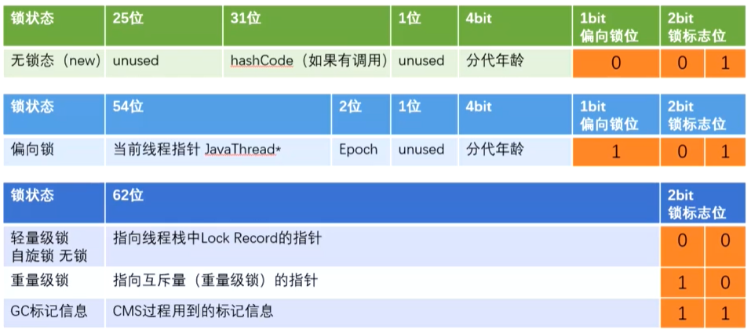

JUC复习笔记（java.util.concurrent）

### 1. 并发的两个关键问题：线程间通信和线程间同步

线程通信机制有两种：

* 共享内存：隐式通信，显式同步；

* 消息传递：显式通信，隐式同步。（Java的并发采用的是共享内存模型。）

### 2. JAVA内存模型：JMM

Java虚拟机规范试图定义一个Java内存模型(JMM)，以屏蔽所有类型的硬件和操作系统内存访问差异，让Java程序在不同的平台上能够达到一致的内存访问效果。简单地说，由于CPU执行指令的速度很快，但是内存访问速度很慢，于是在CPU里加了好几层高速缓存。在Java内存模型中，对上述优化进行了一波抽象。JMM规定所有的变量都在主内存中，类似于上面提到的普通内存，每个线程又包含自己的工作内存，为了便于理解可以看成CPU上的寄存器或者高速缓存。因此，线程的操作都是以工作内存为主，它们只能访问自己的工作内存，并且在工作之前和之后，该值被同步回主内存。JMM是一种抽象的概念，它定义了线程和主内存之间的关系：线程之间的共享变量存储在主内存中，每个线程都有一个私有本地内存，本地内存中存储了该线程读/写共享变量的副本。

  

#### 2.1 JMM与JVM的区别：

* JMM描述的是一组规则，围绕原子性、有序性和可见性展开；
* 相似点：存在共享区域和私有区域

#### 2.2 JMM对于同步的规定：

* 线程解锁前，必须把共享变量的值刷新回主内存。

* 线程加锁前，必须读取主内存的最新值到自己的工作内存。

* 加锁解锁是同一把锁。

由于JVM运行的实体是线程，而每个线程创建时JVM都会为其创建一个工作内存（有些地方称之为栈空间），工作内存是每个线程的私有数据区域。**而Java内存模型规定所有变量都存储在主内存**，主内存是共享内存区域，所有线程都可以访问。但**线程对变量的操作（读取赋值等）必须在工作内存中进行**，首先要将变量从主内存拷贝到自己的内存空间，然后对变量进行操作，操作完成后，再将变量写回主内存，**不能直接操作主内存中的变量**。**各个线程的工作内存中存储着主内存中的变量副本拷贝，因此不同的线程间无法访问对方的工作内存，线程间的通信（传值）必须通过主内存来完成。**

JMM通过控制主内存与每个线程的本地内存之间的交互来为java程序员提供内存可见性保证。

### 3. 指令重排序


编译器和处理器不会对存在数据依赖关系的操作做重排序，因为这种重排序会改变执行结果。**在单线程程序中，对存在控制依赖的操作重排序不会改变执行结果；但在多线程程序中，对存在控制依赖的操作重排序，可能会改变程序的执行结果。**

对于编译器，JMM的编译器会禁止特定类型的编译器重排序。**对于处理器重排序，JMM的处理器重排序规则会要求Java编译器在生成指令序列时，插入特定的内存屏障指令，从而禁止特定类型的处理器重排序。**

* 并发模型分类

  四种内存屏障：LoadLoad, StoreStore, LoadStore, StoreLoad

* 先行发生（happens-before）

  JMM中，如果一个操作执行的结果需要对另一个操作可见，那么这两个操作之间必须存在happens-before关系。

### 4. 原子操作的实现原理

#### 4.1 处理器实现原子操作

（1）通过**总线锁**保证原子性：当一个处理器在**总线上输出LOCK #信号**时，**其他处理器的请求将被阻塞**住，那么该处理器可以**独占共享内存**。

（2）使用**缓存锁**保证原子性：内存区域如果被缓存在处理器的缓存行中，并且在LOCK期间被锁定，那么当他执行锁操作会写到内存时，处理器不在总线上声言LOCK #信号，而是修改内部的内存地址，并允许它的**缓存一致性机制来保证操作的原子性**，因为**缓存一致性机制会阻止同时修改由两个以上处理器缓存的内存区域数据，当其他处理器回写已被锁定的缓存行的数据时，会使缓存行无效**。

#### 4.2 Java实现原子操作（锁和循环CAS）

##### 4.2.1 循环CAS机制(Compare and Swap)  自旋CAS：循环进行CAS操作直至成功为止

CAS (Compare-And-Swap) 是一种硬件对并发的支持，针对多处理器操作而设计的处理器中的一种特殊指令，用于管理对共享数据的并发访问。CAS 是一种无锁的非阻塞算法的实现。  

CAS有3个操作数，内存值V，旧的预期值A，要修改的新值B。当且仅当预期值A和内存值V相同时，将内存值V修改为B，否则什么都不做。
##### 4.2.2 CAS实现原子操作的三大问题：

（1）**ABA问题**：A到B再到A，CAS检查值时会以为没有发生变化，实际却发生了变化。（解决方式：在变量前面追加版本号，时间戳原子引用：AtomicStampedReference类）

（2）**循环时间长开销大**：自旋CAS如果长时间不成功，会给CPU带来非常大的执行开销

（3）**只能保证一个共享变量的原子操作**（此时用锁或者将几个共享变量合并）

##### 锁机制：

偏向锁、轻量级锁和互斥锁，除了偏向锁，另外两种锁都使用了循环CAS机制，即当一个线程进入同步块的时候使用循环CAS的方式 获取锁，当他退出同步块的时候使用循环CAS释放锁。

### 5.死锁

代码示例：

```java
public void deadLock() throw Exception{
    Object A = new Object();
    Object B = new Object();
	new Thread(()->{
        synchronized(A){
        	System.out.println("get LockA");
            try{
                Thread.sleep(1000);
            }catch(InterruptedException e){
                e.printStackTrace();
            }            
        	synchronized(B){
            	System.out.println("get LockA and LockB");
        	}
    	}
    },"thread-1").start();
    new Thread(()->{
        synchronized(B){
        	System.out.println("get LockB");
            try{
                Thread.sleep(1000);
            }catch(InterruptedException e){
                e.printStackTrace();
            }   
        	synchronized(A){
            	System.out.println("get LockB and LockA");
        	}
    	}
    },"thread-2").start();
}
```

#### 避免死锁的几个常见方法：

* 避免一个线程获取多个锁
* 避免一个线程在锁内同时占用多个资源，尽量保证每个锁只占用一个资源
* 尝试使用定时锁，使用lock.tryLock(timeout)来替代使用内部锁机制
* 对于数据库锁，加锁和解锁必须在一个数据库连接里，否则会出现解锁失败的情况

### 6. volatile关键字 

**volatile是一种轻量级的同步方法，只能保证可见性，比synchronized的使用和执行成本更低， 因为它不会引起线程上下文的切换和调度**

#### 6.1 volatile的特性

* **保证了不同线程对这个变量进行操作时的可见性。（实现可见性)**

* **禁止进行指令重排序。（实现有序性）**

* **volatile 只能保证对单次读/写的原子性。i++ 这种操作不能保证原子性。**

#### 6.2 volatile写-读的内存语义

* **写：当写一个volatile变量时，JMM会把线程对应的本地内存中的共享变量值刷新到主内存；**

* **读：当读一个volatile变量时，JMM会把该线程对应的本地内存置为无效。线程接下来从主内存中读取共享变量。**

#### 6.3 内存语义的实现：

为了实现volatile的内存语义，编译器在生成字节码时，会**在指令序列中插入内存屏障来禁止特定类型的处理器重排序**。JMM内存屏障插入策略：

* 在每个volatile写操作前面插入StoreStore屏障；
* 在每个volatile写操作后面插入StoreLoad屏障；
* 在每个volatile读操作后面插入一个LoadLoad、一个LoadStore

#### 6.4 volatile实现原理

**有volatile变量修饰符的共享变量进行写操作的时候会多出一个lock前缀的指令**，lock前缀的指令在多核处理器中引发两件事情

* **将当前处理器缓存行的数据写回内存**
* **这个写回内存的操作会使在其他CPU里缓存了该内存地址的数据无效**

为了提高处理速度，处理器不直接和内存通信，而是先将内存中的数据读到cache中再进行操作，但操作完全不知道何时会写到内存。如果对声明了volatile变量的进行写操作 ，JVM就会向处理器发送一条Lock前缀的指令，将这个变量所在缓存行的数据写回到系统内存。 但是，就算写回到内存，如果其他处理器缓存的值还是旧的，再进行计算操作就会有问题。所以，多处理器下，要实行**缓存一致性协议**，每个处理器通过**嗅探在总线上传播的数据来检查自己缓存的值是不是过期，如果过期，就将当前处理器的缓存行设置成无效状态，当处理器对这个数据进行修改操作的时候，会重新从系统内存中把数据读到处理器缓存中。**

#### 6.5 处理器指令 — Lock前缀：

​	(1) 确保对内存的读-改-写操作原子执行，使用缓存锁定来保证

​	(2) 禁止该指令与之前和之后的读和写指令重排序

​	(3) 把写缓冲区的所有数据刷新到内存中

**解决volatile不保证原子性的办法:  java.util.concurrent.atomic**

#### 6.6 Atomic类

**原子更新基本类型** AtomicBoolean,AtomicInteger,AtomicLong

**原子更新数组**A tomicLongArray,AtomicReferenceArray,AtomicIntegerArray：会将传入的数组复制一份，当其对内部的数组进行修改时，不会影响到传入的数组

**原子更新引用类型** AtomicReference,AtomicReferenceFieldUpdater,AtomicMarkableReference

**原子更新字段类**： AtomicIntegerFieldUpdater, AtomicLongfieldUpdater, AtomicStampedReference，更新类的字段必须使用volatile

### 7. synchronized关键字

> **补充： Object o = new Object();占用多少字节？**
>
> 包含16个字节，包含12个字节对象头（markword8字节，对象指针4个字节）和4个字节对齐（为了成为8的倍数）。
> 一个对象在内存中的布局包括：markword+class pointer+instance data+padding
> 对象头包括：class pointer和markword，markdown包含所有锁信息。
> 对于一个64位计算机，一个指针默认占64位，也就是8个字节，但JVM默认会开启压缩，压缩后占用4个字节.

#### 7.1 synchronized字节码级实现原理：

JVM基于**进入和退出Monitor对象**来实现**方法同步**和**代码块同步**，但两者的表现细节不同。**本质是对一个对象的监视器（monitor）的获取，而这个获取过程是排他的，也就是同一时刻只能有一个线程获取到有synchronized所保护对象的监视器。**任意一个对象都拥有自己的监视器。**任意线程对对象的访问，首先要获得对象的监视器。如果获取失败，线程进入同步队列，线程状态变为BLOCKED。当访问对象的前驱（获得了锁的线程）释放了锁，则该释放操作唤醒阻塞在同步队列中的线程，使其重新尝试对监视器的获取。**

#### 源码分析

**synchronized关键字**和**synchronized方法**的字节码略有不同，可以用`javap -v` 命令查看class文件对应的JVM字节码信息。

  源码：

```java
public class SyncTest {
    public void syncBlock(){
        synchronized (this){
            System.out.println("hello block");
        }
    }
    public synchronized void syncMethod(){
        System.out.println("hello method");
    }
}
```

​		字节码：

```c
{
  public void syncBlock();
    descriptor: ()V
    flags: ACC_PUBLIC
    Code:
      stack=2, locals=3, args_size=1
         0: aload_0
         1: dup
         2: astore_1
         3: monitorenter	  // monitorenter指令进入同步块
         4: getstatic     #2  // Field java/lang/System.out:Ljava/io/PrintStream;
         7: ldc           #3  // String hello block
         9: invokevirtual #4  // Method java/io/PrintStream.println:(Ljava/lang/String;)V
        12: aload_1
        13: monitorexit		  // monitorexit指令退出同步块
        14: goto          22
        17: astore_2
        18: aload_1
        19: monitorexit		  // monitorexit指令退出同步块
        20: aload_2
        21: athrow
        22: return
      Exception table:
         from    to  target type
             4    14    17   any
            17    20    17   any


  public synchronized void syncMethod();
    descriptor: ()V
    flags: ACC_PUBLIC, ACC_SYNCHRONIZED      //添加了ACC_SYNCHRONIZED标记
    Code:
      stack=2, locals=1, args_size=1
         0: getstatic     #2   // Field java/lang/System.out:Ljava/io/PrintStream;
         3: ldc           #5   // String hello method
         5: invokevirtual #4   // Method java/io/PrintStream.println:(Ljava/lang/String;)V
         8: return

}
```

从上面的中文注释处可以看到，

* **对于synchronized关键字而言，javac在编译时，会生成对应的monitorenter和monitorexit指令分别对应synchronized同步块的进入和退出，有两个monitorexit指令的原因是：为了保证抛异常的情况下也能释放锁，所以javac为同步代码块添加了一个隐式的try-finally，在finally中会调用monitorexit命令释放锁。**

* **而对于synchronized方法而言，javac为其生成了一个ACC_SYNCHRONIZED关键字，在JVM进行方法调用时，发现调用的方法被ACC_SYNCHRONIZED修饰，则会先尝试获得锁。**

  在JVM底层，对于这两种synchronized语义的实现大致相同。

  在JDK 1.6之前,synchronized只有传统的锁机制，因此给开发者留下了synchronized关键字相比于其他同步机制性能不好的印象。

  在JDK 1.6引入了两种新型锁机制：**偏向锁**和**轻量级锁**，它们的引入是为了**解决在没有多线程竞争或基本没有竞争的场景下因使用传统锁机制带来的性能开销问题**。

#### 7.2 monitorenter和monitorexit工作原理

每个对象都与一个monitor相关联。当且仅当拥其被拥有时，monitor才会被锁定。执行到monitorenter指令的线程，会尝试去获得对应的monitor：

1. 每个对象维护着一个记录着被锁次数的计数器，**对象未被锁定时**，该**计数器为0**。

2. **线程进入monitor**（执行monitorenter指令）时，会把**计数器设置为1**。

3. 当同一个线程**再次获得该对象的锁**的时候，计数器再次**自增**。

4. 当**其他线程想获得该monitor**的时候，就会**阻塞，直到计数器为0**才能成功。

#### 7.3 ACC_SYNCHRONIZED工作原理

当调用一个设置了ACC_SYNCHRONIZED标志的方法：

1. **执行线程需要先获得monitor锁**，然后开始执行方法，**方法执行之后再释放monitor锁**，当方法不管是正常return还是抛出异常都会释放对应的monitor锁。
2. 在这期间，如果**其他线程来请求执行方法**，会因为无法获得监视器锁而被**阻断**住。
3. 如果在方法**执行过程中，发生了异常**，并且方法内部并没有处理该异常，那么在**异常被抛到方法外面之前监视器锁会被自动释放**。

#### 7.4 Synchronized操作系统实现

JDK中调用的同步程序，最后都会使用jdk中unsafe类的方法。

unsafe中的方法都依赖于native方法实现。

native方法最终都指向unsafe.cpp文件，在cpp文件中通过调用一行汇编指令实现锁。

最后的底层操作为`lock cmpxchg`

对应的硬件实现：lock指令在执行后面指令时会锁定一个北桥信号（不采用锁总线的方式）

#### 7.5 synchronized用的锁存在java对象头里

对象头三种数据：MarkWord（对象hashcode、分代年龄、锁标记位等）、Class元数据地址、数组长度（数组类型的对象才有）。其中可以看到synchronized用的锁存在java对象头里：

* 当对象状态为偏向锁（biasable）时，markword存储的是偏向的线程ID；
* 当状态为轻量级锁（lightweight locked）时，mark word存储的是指向线程栈中LockRecord的指针；
* 当状态为重量级锁（inflated）时，为指向堆中的monitor对象的指针。



#### 7.6 无锁、偏向锁、轻量级锁、重量级锁

锁一共有4中状态，由低到高为：无锁态、偏向锁、轻量级锁、重量级锁，这几个状态会随着竞争情况逐渐升级。 **锁可以升级但不能降级（提高获得锁和释放锁的效率）**
JDK11，打开就是偏向锁，而JDK8默认对象头是无锁。
偏向锁默认是打开的，但是有一个时延，如果要观察到偏向锁，应该设定参数。

**如果计算过对象的hashCode，则对象无法进入偏向状态！**

> 轻量级锁重量级锁的hashCode存在与什么地方？
>
> 答案：线程栈中，轻量级锁的LR中，或是代表重量级锁的ObjectMonitor的成员中

* 偏向锁：(适用于只有一个线程访问同步块的场景)

  原理 : 第一次获得锁时，会有一个CAS操作，锁对象的对象头中会记录当前线程的线程指针，之后该线程再获取锁，只需要执行几个简单的命令。当有另一个线程尝试获得偏向锁，则该偏向锁就会升级成轻量级锁 (不绝对,有批量重偏向)

  优点：加锁解锁不需要额外的消耗

  缺点：如果线程间存在锁竞争，会带来额外的锁撤销的消耗

* 轻量级锁：(追求响应时间，同步块执行速度非常快，同步块中的代码不存在竞争 )

  原理：通过CAS获取锁时，若失败则说明有竞争，膨胀为轻量级锁。线程在自己的线程栈生成LockRecord ，用CAS操作将markword设置为指向自己这个线程的LR的指针，设置成功者得到锁。

  优点：竞争的线程不会阻塞，提高了程序的响应速度

  缺点：如果始终得不到锁竞争的线程，使用自旋会消耗CPU  

- 重量级锁：(追求吞吐量，同步块执行时间较长)自旋超过10次，mutex，操作系统互斥量

  原理：如果竞争加剧，有线程超过10次自旋， -XX:PreBlockSpin， 或者自旋线程数超过CPU核数的一半， 1.6之后，加入自适应自旋 Adapative Self Spinning，升级为重量级锁。利用操作系统底层的同步机制（mutex，操作系统互斥量）去实现Java中的线程同步

  优点：线程竞争不使用自旋，不会消耗CPU

  缺点：线程阻塞，响应时间慢，用户态转内核态申请资源

#### 7.6 总结：

关键字synchronize拥有锁重入的功能，也就是在使用synchronize时，当一个线程的得到了一个对象的锁后，再次请求此对象是可以再次得到该对象的锁。当一个线程请求一个由其他线程持有的锁时，发出请求的线程就会被阻塞，然而，由于内置锁是可重入的，因此如果某个线程试图获得一个已经由她自己持有的锁，那么这个请求就会成功，“重入” 意味着获取锁的 操作的粒度是“线程”，而不是调用。

**Java中的synchronized有偏向锁、轻量级锁、重量级锁三种形式**，分别对应了锁**只被一个线程持有**、**不同线程交替持有锁**、**多线程竞争锁**三种情况。当条件不满足时，锁会**按偏向锁->轻量级锁->重量级锁的顺序升级**。JVM种的锁也是能降级的，只不过条件很苛刻（GC时），不在我们讨论范围之内。

### 8. Lock接口 （ReentrantLock 可重入锁）

#### 8.1 特性

ReentantLock 继承接口 Lock 并实现了接口中定义的方法， 它是一种可重入锁， 除了能完成 synchronized 所能完成的所有工作外，还提供了诸如可响应中断锁、可轮询锁请求、定时锁等
避免多线程死锁的方法。 

* 尝试非阻塞地获取锁：tryLock()，调用方法后立刻返回；
* 能被中断地获取锁：lockInterruptibly()：在锁的获取中可以中断当前线程
* 超时获取锁：tryLock(time,unit)，超时返回

#### 8.2 Condition 类和 Object 类锁方法区别区别

1. Condition 类的 awiat 方法和 Object 类的 wait 方法等效
2. Condition 类的 signal 方法和 Object 类的 notify 方法等效
3. Condition 类的 signalAll 方法和 Object 类的 notifyAll 方法等效
4. ReentrantLock 类可以唤醒指定条件的线程，而 object 的唤醒是随机的

#### 8.3 tryLock 和 lock 和 lockInterruptibly 的区别

1. tryLock 能获得锁就返回 true，不能就立即返回 false， tryLock(long timeout, TimeUnit unit)，可以增加时间限制，如果超过该时间段还没获得锁，返回 false
2. lock 能获得锁就返回 true，不能的话一直等待获得锁
3. lock 和 lockInterruptibly，如果两个线程分别执行这两个方法，但此时中断这两个线程，**lock 不会抛出异常，而 lockInterruptibly 会抛出异常。**  

#### 8.4 与Synchronized区别

* ReentrantLock 通过方法 lock()与 unlock()来进行加锁与解锁操作，与 synchronized 会
  被 JVM 自动解锁机制不同， ReentrantLock 加锁后需要手动进行解锁。**为了避免程序出**
  **现异常而无法正常解锁的情况，使用 ReentrantLock 必须在 finally 控制块中进行解锁操**
  **作。**
* ReentrantLock 相比 synchronized 的优势是**可中断、公平锁、多个锁**。这种情况下需要
  使用 ReentrantLock。  

代码示例

```java
public class MyService {
	private Lock lock = new ReentrantLock();
	//Lock lock=new ReentrantLock(true);//公平锁
	//Lock lock=new ReentrantLock(false);//非公平锁
	private Condition condition=lock.newCondition();//创建 Condition
	public void testMethod() {
		try {
			lock.lock();//lock 加锁
			//1： wait 方法等待：
			//System.out.println("开始 wait");
			condition.await();
			//通过创建 Condition 对象来使线程 wait，必须先执行 lock.lock 方法获得锁
			//:2： signal 方法唤醒
			condition.signal();//condition 对象的 signal 方法可以唤醒 wait 线程
			for (int i = 0; i < 5; i++) {
				System.out.println("ThreadName=" +
				Thread.currentThread().getName()+ (" " + (i + 1)));
			}
		} catch (InterruptedException e) {
			e.printStackTrace();
		}finally{
			lock.unlock();
		}
	}
}
```

#### 8.5 ReentrantLock源码分析

**ReentrantLock的实现依赖于Java同步器框架AbstractQueuedSynchronizer（AQS）**。AQS使用一个整型的volatile变量（命名为state）来维护同步状态。它支持公平锁和非公平锁，两者的实现类似。**AQS使用一个FIFO的队列表示排队等待锁的线程，队列头节点称作“哨兵节点”或者“哑节点”，它不与任何线程关联。其他的节点与等待线程关联，每个节点维护一个等待状态waitStatus。**

ReentrantLock的基本实现可以概括为：**先通过CAS尝试获取锁。如果此时已经有线程占据了锁，那就加入AQS队列并且被挂起。当锁被释放后，排在CLH队列队首的线程会被唤醒，然后CAS再次尝试获取锁。**

> 参考[并发编程——详解 AQS CLH 锁]( https://www.jianshu.com/p/4682a6b0802d )

##### **8.5.1 非公平锁NonfairSync lock()的过程**：

```java
final void lock() {
	if (compareAndSetState(0, 1))//CAS操作，若state为0则将其设为1
    	setExclusiveOwnerThread(Thread.currentThread());
    else
    	acquire(1);
}
```

##### **8.5.2 获取锁失败进入acquire(1)：**

```java
public final void acquire(int arg) {
	if (!tryAcquire(arg) &&acquireQueued(addWaiter(Node.EXCLUSIVE), arg))
		selfInterrupt();
}
```

##### **8.5.3 tryAcquire(arg)：第一步：尝试去获取锁。** 

```java
final boolean nonfairTryAcquire(int acquires) {
	final Thread current = Thread.currentThread();
	int c = getState();//获取state变量值
	if (c == 0) { //没有线程占用锁 ：非公平锁的特点
		if (compareAndSetState(0, acquires)) {//占用锁成功
			setExclusiveOwnerThread(current);//设置独占线程为当前线程
			return true;
		}
	} else if (current == getExclusiveOwnerThread()) { //当前线程已经占用该锁
		int nextc = c + acquires;
		if (nextc < 0) // overflow
		throw new Error("Maximum lock count exceeded");    
		setState(nextc); // 更新state值为新的重入次数
		return true;
	}  
	return false; //获取锁失败
}
```

**非公平锁tryAcquire的流程是：检查state字段，若为0，表示锁未被占用，那么尝试占用，若不为0，检查当前锁是否被自己占用，若被自己占用，则更新state字段，表示重入锁的次数。如果以上两点都没有成功，则获取锁失败，返回false。**

**“非公平”即体现在这里，如果占用锁的线程刚释放锁，state为0，而排队等待锁的线程还未唤醒时，新来的线程就直接抢占了该锁，那么就“插队”了。**

##### **8.5.4 acquireQueued(addWaiter(Node.EXCLUSIVE), arg))  第二步：获取锁失败则入队。**

**addWaiter(Node.EXCLUSIVE)将新节点和当前线程关联并且入队列:** 

```java
private Node addWaiter(Node mode) {
 	//初始化节点,设置关联线程和模式(独占 or 共享)
	Node node = new Node(Thread.currentThread(), mode);  
	Node pred = tail; // 获取尾节点引用  
	if (pred != null) {// 尾节点不为空,说明队列已经初始化过
		node.prev = pred;    
		if (compareAndSetTail(pred, node)) {//CAS,设置新节点为尾节点
			pred.next = node;
			return node;
		}
	}  
	enq(node); // 尾节点为空,说明队列还未初始化
	return node;
}

private Node enq(final Node node) {  
	for (;;) {//开始自旋
		Node t = tail;
		if (t == null) { // 如果tail为空
			if (compareAndSetHead(new Node()))//新建一个head节点
				tail = head; //tail指向head
		} else {
			node.prev = t;      
			if (compareAndSetTail(t, node)) {// tail不为空
				t.next = node; //将新节点入队
				return t;
			}
		}
	}
}
```

##### 8.5.5 acquireQueued(final Node node, int arg)  已经入队的线程尝试获取锁，若失败则会被挂起。

```java
final boolean acquireQueued(final Node node, int arg) {
	boolean failed = true; //标记是否成功获取锁
	try {
		boolean interrupted = false; //标记线程是否被中断过
		for (;;) {
			final Node p = node.predecessor(); //获取前驱节点
			//如果前驱是head,即该结点已成老二，那么便有资格去尝试获取锁
			if (p == head && tryAcquire(arg)) {
				setHead(node); // 获取成功,将当前节点设置为head节点
				p.next = null; // 原head节点出队,在某个时间点被GC
				failed = false; //获取成功
				return interrupted; //返回是否被中断过
			}
			// 判断获取失败后是否可以挂起,若可以则挂起
			if (shouldParkAfterFailedAcquire(p, node) && parkAndCheckInterrupt())
				// 线程若被中断,设置interrupted为true
				interrupted = true;
		}
	} finally {
		if (failed)
		cancelAcquire(node);
	}
}

private static boolean shouldParkAfterFailedAcquire(Node pred, Node node) {
	//前驱节点的状态
	int ws = pred.waitStatus;
	if (ws == Node.SIGNAL)
		// 前驱节点状态为signal,返回true
		return true;
		// 前驱节点状态为CANCELLED
		if (ws > 0) {
		// 从队尾向前寻找第一个状态不为CANCELLED的节点
			do {
				node.prev = pred = pred.prev;
			} while (pred.waitStatus > 0);
				pred.next = node;
			} else {
		// 将前驱节点的状态设置为SIGNAL
		compareAndSetWaitStatus(pred, ws, Node.SIGNAL);
	}
	return false;
}

private final boolean parkAndCheckInterrupt() {
	LockSupport.park(this);// 挂起当前线程,返回线程中断状态并重置
	return Thread.interrupted();
}

```

​		线程入队后能够挂起的前提是，它的前驱节点的状态为SIGNAL，它的含义是“Hi，前面的兄弟，如果你获取锁并且出队后，记得把我唤醒！”。所以shouldParkAfterFailedAcquire会先判断当前节点的前驱是否状态符合要求，若符合则返回true，然后调用parkAndCheckInterrupt，将自己挂起。如果不符合，再看前驱节点是否>0(CANCELLED)，若是那么向前遍历直到找到第一个符合要求的前驱，若不是则将前驱节点的状态设置为SIGNAL。整个流程中，如果前驱结点的状态不是SIGNAL，那么自己就不能安心挂起，需要去找个安心的挂起点，同时可以再尝试下看有没有机会去尝试竞争锁。

##### **8.5.6 非公平锁NonfairSync unlock()的过程：**

```java
public void unlock() {
	sync.release(1);
}

public final boolean release(int arg) {
	if (tryRelease(arg)) {//尝试释放锁
		Node h = head;
		if (h != null && h.waitStatus != 0)//若头结点的状态是SIGNAL
			unparkSuccessor(h);//唤醒头结点下一个节点的关联线程
		return true;
	}
	return false;
}

protected final boolean tryRelease(int releases) {
	int c = getState() - releases; // 计算释放后state值
	// 如果不是当前线程占用锁,那么抛出异常
	if (Thread.currentThread() != getExclusiveOwnerThread())
		throw new IllegalMonitorStateException();
	boolean free = false;
	if (c == 0) {    
		free = true; // 锁被重入次数为0,表示释放成功    
		setExclusiveOwnerThread(null); // 清空独占线程
	}  
	setState(c); // 更新state值
	return free;
}
```

**tryRelease的过程为：当前释放锁的线程若不持有锁，则抛出异常。若持有锁，计算释放后的state值是否为0，若为0表示锁已经被成功释放，并且则清空独占线程，最后更新state值，返回free。**

#### 8.6 公平锁和非公平锁

公平锁和非公平锁释放时，最后都要写一个volatile变量state

公平锁获取时，首先会去读volatile变量，若为0，按队列顺序获取锁

非公平锁获取时，首先会用CAS更新volatile变量，若为0，当前线程可直接抢占 

**tryLock()：线程获取锁失败后，先入等待队列，然后开始自旋，尝试获取锁，获取成功就返回，失败则在队列里找一个安全点把自己挂起直到超时时间过期。**这里为什么还需要循环呢？因为当前线程节点的前驱状态可能不是SIGNAL，那么在当前这一轮循环中线程不会被挂起，然后更新超时时间，开始新一轮的尝试。

#### **8.7 ReentrantReadWriteLock 源码分析**

**ReentrantReadWriteLock包含两个内部类: ReadLock和WriteLock，获取锁和释放锁都是通过AQS来实现的。AQS的状态state是32位的，读锁用高16位，表示持有读锁的线程数(sharedCount)，写锁低16位，表示写锁的重入次数(exclusiveCount)。**

示例代码：

```java
class MyCache {
    private volatile Map<String, Object> map = new HashMap<>();
    private ReadWriteLock rwLock = new ReentrantReadWriteLock();

    public void put(String key, Object value) {
        rwLock.writeLock().lock();
        try {
            System.out.println(Thread.currentThread().getName() + "\t 正在写" + key);
            //暂停一会儿线程
            try {
                TimeUnit.MILLISECONDS.sleep(300);
            } catch (InterruptedException e) {
                e.printStackTrace();
            }
            map.put(key, value);
            System.out.println(Thread.currentThread().getName() + "\t 写完了" + key);
            System.out.println();
        } catch (Exception e) {
            e.printStackTrace();
        } finally {
            rwLock.writeLock().unlock();
        }

    }

    public Object get(String key) {
        rwLock.readLock().lock();
        Object result = null;
        try {
            System.out.println(Thread.currentThread().getName() + "\t 正在读" + key);
            try {
                TimeUnit.MILLISECONDS.sleep(300);
            } catch (InterruptedException e) {
                e.printStackTrace();
            }
            result = map.get(key);
            System.out.println(Thread.currentThread().getName() + "\t 读完了" + result);
        } catch (Exception e) {
            e.printStackTrace();
        } finally {
            rwLock.readLock().unlock();
        }
        return result;
    }
}

public class ReadWriteLockDemo {
	public static void main(String[] args) {
        MyCache myCache = new MyCache();

        for (int i = 1; i <= 5; i++) {
            final int num = i;
            new Thread(() -> {
                myCache.put(num + "", num + "");
            }, String.valueOf(i)).start();
        }
        for (int i = 1; i <= 5; i++) {
            final int num = i;
            new Thread(() -> {
                myCache.get(num + "");
            }, String.valueOf(i)).start();
        }
    }
}
```


##### **8.7.1 线程进入读锁的前提条件：（共享锁）**

* 没有其他线程的拥有写锁，
* 没有写请求或者有写请求，但调用线程和持有读锁的线程是同一个。

##### 8.7.2 线程进入写锁的前提条件：（排他锁/独占锁）

* 没有其他线程的写锁

##### **8.7.3 读写锁有以下三个重要的特性：**

* 公平选择性：支持非公平（默认）和公平的锁获取方式，吞吐量还是非公平优于公平。
* 重进入：读锁和写锁都支持线程重进入。
* 锁降级：遵循获取写锁、获取读锁再释放写锁的次序，写锁能够降级成为读锁。

##### **8.7.4 获取写锁的步骤：**

（1）**判断同步状态state是否为0**。如果state!=0，说明已经有其他线程获取锁，执行(2)；否则执行(5)。

（2）**若读锁此时被其他线程占用，或其他线程获取写锁，则返回false，当前线程不能获取写锁。**

（3）**若当前线程获取写锁超过最大次数，抛异常**，否则更新同步状态，返回true。

（4）**如果state为0，此时读锁或写锁都没有被获取，判断是否需要阻塞**（公平和非公平方式实现不同），在**非公平策略下总是不会被阻塞，在公平策略下会进行判断**（判断同步队列中是否有等待时间更长的线程，若存在，则需要被阻塞，否则，无需阻塞），如果**不需要阻塞，则CAS更新同步状态**，若CAS成功则返回true，失败则说明锁被别的线程抢去了，返回false。如果需要阻塞则也返回false。

（5）**成功获取写锁后，将当前线程设置为占有写锁的线程**，返回true。

##### **8.7.5 释放写锁的步骤：**

（1）**查看当前线程是否为写锁的持有者**，如果不是抛出异常。

（2）**检查释放后写锁的线程数是否为0**，如果为0则表示写锁空闲了，释放锁资源将锁的持有线程设置为null，否则释放仅仅只是一次重入锁而已，并不能将写锁的线程清空。

##### 8.7.6 **获取读锁的步骤：**

（1）若**写锁线程数 != 0 ，且独占锁不是当前线程**，则返回**失败**； 

（2）否则，**判断读线程是否需要被阻塞并且读锁数量是否小于最大值并且CAS设置状态**；

（3）若当前**没有读锁**，则设置**第一个读线程firstReader和firstReaderHoldCount**；若当前线程线程就是第一个读线程，则为**重入**，**增加firstReaderHoldCount**；否则，将设置当前线程对应的HoldCounter对象的值。

##### 8.7.8 **释放读锁的步骤：**

（1）判断**当前线程是否为第一个读线程firstReader**，若是，则**判断第一个读线程占有的资源数**firstReaderHoldCount是否为1，若是，则设置第一个读线程firstReader为空，否则，将第一个读线程占有的资源数firstReaderHoldCount减1；

（2）若当前线程**不是第一个读线程**，那么首先会**获取缓存计数器**（上一个读锁线程对应的计数器），若计数器为空或者tid不等于当前线程的tid值，则获取当前线程的计数器，如果计数器的计数count小于等于1，则移除当前线程对应的计数器，如果计数器的计数count小于等于0，则抛出异常，之后再减少计数即可。无论何种情况，都会进入无限循环，该循环可以确保成功设置状态state。

#### 8.8 **总结：**

**在线程持有读锁的情况下，该线程不能取得写锁(因为获取写锁的时候，如果发现当前的读锁被占用，就马上获取失败，不管读锁是不是被当前线程持有)。**

**在线程持有写锁的情况下，该线程可以继续获取读锁（获取读锁时如果发现写锁被占用，只有写锁没有被当前线程占用的情况才会获取失败）。**

**写锁可以“降级”为读锁；读锁不能“升级”为写锁。**

### 9. 五种单例模式的写法

##### 饿汉式：

```java
public class Singleton{
    private static Singleton instance = new Singleton();
    private Singleton(){}
    public static Singleton getInstance(){
        return instance;
    }
}
```

##### 懒汉式（Synchronized）：

```java
public class Singleton{
	private static Singleton instance;
    private Singleton(){}
    public static synchronized Singleton getInstance(){
        if(instance==null){
            instance=new Singleton();
        }
        return instance;
    }
}
```

##### 懒汉式（双重检查锁DCL，即 double-checked locking）

```java
public class Singleton{
	private static volatile Singleton instance;
    private Singleton(){}
    public static Singleton getInstance(){
        if(instance==null){
        	synchronized(Singleton.class){
            	if(instance==null){
                    instance = new Singleton();
                }
            }
        }
        return instance;
    }    
}
```

###### **在单例的懒汉模式中，必须给实例添加volatile修饰符**

原因：在构造实例时，对象引用指针的操作和初始化操作可能会被重排序， 这就导致在if(instance==null)的时候认为对象已经创建，但这个时候还没有进行初始化

1.分配对象的内存空间2.初始化对象3.设置instance指向内存空间4.初次访问对象

3和2可能会被重排序，导致1342这样的问题。

解决办法：①禁止重排序（volitale）②允许重排序但非构造线程不可见(static class)

##### 懒汉式（静态内部类）

```java
public class Singleton{
    private Singleton(){}
    public static Singleton getInstance(){
        return SingletonHolder.instance;
    } 
    private static class SingletonHolder{
        private static Singleton instance = new Singleton();
    }
}
```

>  虚拟机会保证一个类的\<clinit>()方法在多线程环境中被正确地加锁、同步，如果多个线程同时去初始化一个类，那么只会有一个线程去执行这个类的\<clinit>()方法，其他线程都需要阻塞等待，直到活动线程执行\<clinit>()方法完毕。 （复习JVM类的初始化时机）

##### 懒汉式（枚举）

```java
public enum Singleton {  
    INSTANCE;  
    public void doingSomething() {  
    }  
}
```

优点：不仅能避免多线程同步问题，而且还自动支持序列化机制，**防止反序列化重新创建新的对象**，绝对防止多次实例化 

缺点： **不能通过反射来调用私有构造方法** 

总结： 饿汉方式绝对线程安全。明确要求实现 lazy loading 效果时，使用线程安全的懒汉式。如果**涉及到反序列化创建对象时，可以尝试使用枚举方式**。如果有其他特殊的需求，可以考虑使用双检锁方式。 

### 10.线程的生命周期


* 新建，当程序使用new关键字创建了一个线程之后，该线程就处于新建状态，此时仅由JVM为其分配内存，并初始化其成员变量的值；
* 就绪，当线程对象调用了start()方法之后，该线程处于就绪状态。Java虚拟机会为其创建方法调用栈和程序计数器，等待调度运行；
* 运行，如果处于就绪状态的线程获得了CPU，开始执行run()方法的线程执行体，则该线程处于运行状态；
* 阻塞，在运行状态的时候，可能因为某些原因导致运行状态的线程变成了阻塞状态，比如sleep()、wait()之后线程就处于了阻塞状态，这个时候需要其他机制将处于阻塞状态的线程唤醒，比如调用notify或者notifyAll()方法。唤醒的线程不会立刻执行run方法，它们要再次等待CPU分配资源进入运行状态；
* 销毁：如果线程正常执行完毕后或线程被提前强制性的终止或出现异常导致结束，那么线程就要被销毁，释放资源。

#### 10.1 JAVA中线程的生命周期： 


* NEW（初始化状态）
* READY（可运行 / 运行状态）
* BLOCKED（阻塞状态）
* WAITING（无时限等待）
* TIMED_WAITING（有时限等待）
* TERMINATED（终止状态） 

#### 10.2 线程状态的转换

* RUNNABLE 与 BLOCKED 的状态转换： 只有一种方法，线程获取/等待 synchronized 的隐式锁 

* RUNNABLE 与 WAITING/TIMED_WAITING 的状态转换：
  * wait/notify/notifyAll
  * join
  * sleep  
  * LockSupport.park()    Java 并发包中的锁，都是基于LockSupport 对象实现的 

* 从 RUNNABLE 到 TERMINATED 状态：
  * interrupt() （通知线程，线程有机会执行一些后续操作，同时也可以无视这个通知）stop() （立即杀死线程，**若未释放锁会造成死锁**，弃用）
  * 执行完成
  * 异常中断

**初始化线程**：当前线程就是将要启动线程的父线程；父线程为子线程进行空间分配，子线程继承了父线程的isDaemon(守护线程： 如果程序中所有的用户线程都退出了，那么所有的守护线程就都会被杀死 )、优先级、contextClassLoader、和可继承的线程池并分配一个唯一的ID标识该线程。

**启动线程**：调用start()方法就可以启动这个线程。线程start()方法的含义是：当前线程（即parent线程）同步告知Java虚拟机，只要线程规划器空闲，应立即启动调用start()方法的线程。

**中断**：在Java中，停止一个线程的主要机制是中断，中断并不是强迫终止一个线程，它是一种协作机制，是给线程传递一个取消信号，但是由线程来决定如何以及何时退出。Thread.interrupt() 的作用其实也不是中断线程，而是 通知线程应该中断了。

public boolean isInterrupted();//测试此线程是否已被中断。此方法不影响线程的中断状态

public void interrupt();//中断线程

public static boolean interrupted();//测试此线程是否已被中断，并清空中断标志位

**等待/通知机制** wait()/notify(),notifyAll()，condition

**join()**：一种同步机制，A线程调用B线程.join()，A线程会等待B线程执行完再执行。join在start之前调用没有意义。

### 11. 生产者/消费者模式

#### 11.1 Object中的 wait()/notify()

要点：判断条件时一定要用while()循环

```java 
public class Shop{
    public int count = 0;
    public void produce(){
        count++;
        System.out.println(Thread.currentThread().getName()+" produce product , remain: "+count+"!");
    }

    public void sell(){
        count--;
        System.out.println(Thread.currentThread().getName()+" sell product , remain: "+count+"!");
    }

    public static void main(String[] args){
        Shop shop = new Shop();
        Factory f1 =shop.new Factory(shop);
        Factory f2 = shop.new Factory(shop);
        Consumer c1 =shop.new Consumer(shop);
        Consumer c2 = shop.new Consumer(shop);
        f1.start();
        f2.start();
        c1.start();
        c2.start();
    }

    class Factory extends Thread{
        private Shop shop;
        Factory(Shop shop){
            this.shop=shop;
        }
        @Override
        public void run(){
            while(true) {
                synchronized (shop) {
                    while (shop.count >= 10) {
                        try {
                            shop.wait();
                        } catch (InterruptedException e) {
                            e.printStackTrace();
                        }
                    }
                    shop.produce();
                    shop.notifyAll();
                }

            }
        }
    }

    class Consumer extends Thread{
        private Shop shop;
        Consumer(Shop shop){
            this.shop=shop;
        }
        @Override
        public void run(){
            while(true){
                synchronized (shop) {
                    while (shop.count <= 0) {
                        try {
                            shop.wait();
                        } catch (InterruptedException e) {
                            e.printStackTrace();
                        }
                    }
                    shop.sell();
                    shop.notifyAll();
                }
            }
        }
    }
}
```

#### 11.2 ReentryLock，Condition实现

```java
public class Shop{
    private int count = 0;
    private Lock lock = new ReentrantLock();
    private Condition empty = lock.newCondition();
    private Condition full = lock.newCondition();
    public void produce(){
        count++;
        System.out.println(Thread.currentThread().getName()+" produce product , remain: "+count+"!");
    }

    public void sell(){
        count--;
        System.out.println(Thread.currentThread().getName()+" sell product , remain: "+count+"!");
    }

    public static void main(String[] args){
        Shop shop = new Shop();
        Factory f1 =shop.new Factory(shop);
        Factory f2 = shop.new Factory(shop);
        Consumer c1 =shop.new Consumer(shop);
        Consumer c2 = shop.new Consumer(shop);
        f1.start();
        f2.start();
        c1.start();
        c2.start();
    }

    class Factory extends Thread{
        private Shop shop;
        Factory(Shop shop){
            this.shop=shop;
        }
        @Override
        public void run(){
            while(true) {
                try {
                    Thread.sleep(100);
                } catch (InterruptedException e) {
                    e.printStackTrace();
                }
                lock.lock();
                try {
                    while (shop.count >= 10) {
                        try {
                            full.await();
                        } catch (InterruptedException e) {
                            e.printStackTrace();
                        }
                    }
                    shop.produce();
                    empty.signal();
                } finally {
                    lock.unlock();
                }
            }
        }
    }

    class Consumer extends Thread{
        private Shop shop;
        Consumer(Shop shop){
            this.shop=shop;
        }
        @Override
        public void run(){
            while(true){
                try {
                    Thread.sleep(150);
                } catch (InterruptedException e) {
                    e.printStackTrace();
                }
                lock.lock();
                try {
                    while (shop.count <= 0) {
                        try {
                            empty.await();
                        } catch (InterruptedException e) {
                            e.printStackTrace();
                        }
                    }
                    shop.sell();
                    full.signal();
                } finally {
                    lock.unlock();
                }
            }
        }
    }
}

```

#### 11.3 阻塞队列实现

BlockingQueue即阻塞队列，从阻塞这个词可以看出，在某些情况下对阻塞队列的访问可能会造成阻塞。被阻塞的情况主要有如下两种:

1. 当阻塞队列为空时，从阻塞队列中取数据的操作会被阻塞。
2. 当阻塞队列为满时，往阻塞队列中添加数据的操作会被阻塞。

从上可知，阻塞队列是线程安全的。 

JDK中的七大阻塞队列

|     阻塞队列名称      |                  说明                  |
| :-------------------: | :------------------------------------: |
|  ArrayBlockingQueue   |   一个由数组结构组成的有界阻塞队列。   |
|  LinkedBlockingQueue  |   一个由链表结构组成的有界阻塞队列。   |
| PriorityBlockingQueue |   一个支持优先级排序的无界阻塞队列。   |
|      DelayQueue       | 一个使用优先级队列实现的无界阻塞队列。 |
|   SynchronousQueue    |       一个不存储元素的阻塞队列。       |
|  LinkedTransferQueue  |   一个由链表结构组成的无界阻塞队列。   |
|  LinkedBlockingDeque  |   一个由链表结构组成的双向阻塞队列。   |

**ArrayBlockingQueue:**
基于数组的阻塞队列实现，其内部维护一个定长的数组，用于存储队列元素。线程阻塞的实现是通过ReentrantLock来完成的，数据的插入与取出共用同一个锁，因此ArrayBlockingQueue并不能实现生产、消费同时进行。而且在创建ArrayBlockingQueue时，我们还可以控制对象的内部锁是否采用公平锁，默认采用非公平锁。

**LinkedBlockingQueue:**
 基于单向链表的阻塞队列实现，在初始化LinkedBlockingQueue的时候可以指定对立的大小，也可以不指定，默认类似一个无限大小的容量（Integer.MAX_VALUE），不指队列容量大小也是会有风险的，一旦数据生产速度大于消费速度，系统内存将有可能被消耗殆尽，因此要谨慎操作。另外LinkedBlockingQueue中用于阻塞生产者、消费者的锁是两个（锁分离），因此生产与消费是可以同时进行的。

**BlockingQueue接口的一些方法:**

| 操作 | 抛异常     | 特定值   | 阻塞    | 超时                        |
| :--- | :--------- | :------- | :------ | :-------------------------- |
| 插入 | add(o)     | offer(o) | put(o)  | offer(o, timeout, timeunit) |
| 移除 | remove(o)  | poll(o)  | take(o) | poll(timeout, timeunit)     |
| 检查 | element(o) | peek(o)  |         |                             |

这四类方法分别对应的是：
1 . ThrowsException：如果操作不能马上进行，则抛出异常
2 . SpecialValue：如果操作不能马上进行，将会返回一个特殊的值，一般是true或者false
3 . Blocks:如果操作不能马上进行，操作会被阻塞
4 . TimesOut:如果操作不能马上进行，操作会被阻塞指定的时间，如果指定时间没执行，则返回一个特殊值，一般是true或者false

**代码实现：**

```java
public class Shop{
    private int count = 0;
    private BlockingQueue<Integer> queue = new ArrayBlockingQueue<>(10);

    public void produce() {
        try {
            queue.put(1);
            count++;
        } catch (InterruptedException e) {
            e.printStackTrace();
        }
        System.out.println(Thread.currentThread().getName()+" produce product , remain: "+count+"!");
    }

    public void sell(){
        try {
            queue.take();
            count--;
        } catch (InterruptedException e) {
            e.printStackTrace();
        }
        System.out.println(Thread.currentThread().getName()+" sell product , remain: "+count+"!");
    }

    public static void main(String[] args){
        Shop shop = new Shop();
        Factory f1 =shop.new Factory(shop);
        Factory f2 = shop.new Factory(shop);
        Consumer c1 =shop.new Consumer(shop);
        Consumer c2 = shop.new Consumer(shop);
        f1.start();
        f2.start();
        c1.start();
        c2.start();
    }

    class Factory extends Thread{
        private Shop shop;
        Factory(Shop shop){
            this.shop=shop;
        }
        @Override
        public void run(){
            while(true) {
                try {
                    Thread.sleep(100);
                } catch (InterruptedException e) {
                    e.printStackTrace();
                }
                shop.produce();
            }
        }
    }

    class Consumer extends Thread{
        private Shop shop;
        Consumer(Shop shop){
            this.shop=shop;
        }
        @Override
        public void run(){
            while(true){
                shop.sell();
            }
        }
    }
}
```

#### 一道面试题

>  有4个线程A、B、C、D，分别打印1、2、3、4，请同时启动他们，但是要求按照1234的顺序x循环输出结果 

```java
public class PrintInOrder{
    private static int count = 0;
    public static void main(String[] args){
        PrintInOrder p = new PrintInOrder();
        new Thread(new RunInOrder(1,"A")).start();
        new Thread(new RunInOrder(2,"B")).start();
        new Thread(new RunInOrder(3,"C")).start();
        new Thread(new RunInOrder(4,"D")).start();
    }

    public static class RunInOrder implements Runnable{
        int threadNum;
        String text;

        public RunInOrder(int threadNum, String text){
            this.threadNum=threadNum;
            this.text=text;
        }
        @Override
        public void run(){
            while(true){
                synchronized(PrintInOrder.class){
                    if(threadNum-1==count%4){
                        System.out.println(text);
                        count++;
                        PrintInOrder.class.notifyAll();
                        //如果需要只输出一遍，则加上break;
                    }else{
                        try{
                            PrintInOrder.class.wait();
                        }catch(InterruptedException e){
                            e.printStackTrace();
                        }
                    }
                }
            }
        }
    }
}
```

### 12. 多线程中的HashMap 

#### 12.1 HashMap不安全举例

* Jdk1.7 头插法，多线程扩容时导致HashMap的Entry链表形成环形数据结构，一旦形成环形数据结构，同时也会出现数据丢失的问题。

* Jdk1.8 尾插法，多线程put时会造成数据丢失。

#### 12.2 HashTable与HashMap的区别

* HashTable的底层数组初始大小为11，HashMap要求其必须为$2^{n}$；
* HashTable通过取模求Hash值，HashMap通过位运算求，效率高；
* Hash Map底层用数组+链表+红黑树，HashTable用数组+链表；
* HashTable对HashMap中线程不安全的方法加了Synchronized，但效率低；

#### 12.3 HashTable与Collections.synchronizedMap比较

* 默认 Hashtable 和 synchrnizedMap 都是锁 类实例，synchrnizedMap 可以选择锁其他的 Object（mutex）

* Hashtable 的 synchronized 是方法级别的；synchrnizedMap 的 synchronized 的代码块级别的

* 两者性能相近，但是 synchrnizedMap 可以用 null 作为 key 和 value

#### 12.4 JDK1.7中的ConcurrentHashMap

由Segment数组结构和HashEntry数组结构组成。Segment继承ReentrantLock。

**重要变量**

```java
static final int DEFAULT_INITIAL_CAPACITY = 16;//默认初始容量
static final float DEFAULT_LOAD_FACTOR = 0.75f;//默认负载因子
static final int DEFAULT_CONCURRENCY_LEVEL = 16;//默认并发数量，会影响segments数组的长度(初始化后不能修改)
static final int MAXIMUM_CAPACITY = 1 << 30; //map最大容量
static final int MIN_SEGMENT_TABLE_CAPACITY = 2;// 每个segment中HashEntry[]默认容量
static final int MAX_SEGMENTS = 1 << 16; //最大并发数量
static final int RETRIES_BEFORE_LOCK = 2; //非锁定情况下调用size和contains方法的重试次数,避免由于table连续被修改导致无限重试
final int segmentMask; //计算segment位置的掩码
final int segmentShift; //用于算segment位置时,hash参与运算的位数
final Segment<K,V>[] segments; //segment数组

static final class HashEntry<K,V> {
  final int hash;
  final K key; 
  volatile V value;
  volatile HashEntry<K,V> next;
}
static final class Segment<K,V> extends ReentrantLock implements Serializable {  
  static final int MAX_SCAN_RETRIES =//对segment加锁时,在阻塞之前自旋的次数
 			      Runtime.getRuntime().availableProcessors() > 1 ? 64 : 1;
  transient volatile HashEntry<K,V>[] table;  
  transient int count;
  transient int modCount;
  transient int threshold;// 当table大小超过阈值时扩容,值为(int)(capacity *loadFactor)
  final float loadFactor;//负载因子
}
```

**（1）初始化**

```java
public ConcurrentHashMap(int initialCapacity,float loadFactor,int concurrencyLevel) {
	if (!(loadFactor > 0) || initialCapacity < 0 || concurrencyLevel <= 0)
		throw new IllegalArgumentException();
	if (concurrencyLevel > MAX_SEGMENTS)//并发等级不可大于最大并发度
		concurrencyLevel = MAX_SEGMENTS;
// 第一步，segments数组的长度ssize为大于等于concurrencyLevel的最小的2的最小次方数
	int sshift = 0;//ssize左移的次数
	int ssize = 1;//segment数组长度
	while (ssize < concurrencyLevel) { 
		++sshift; 
		ssize <<= 1;
	}
// 第二步，初始化segmentShift和segmentMask
	this.segmentShift = 32 - sshift; // 用于计算key的hash值参与运算位数
	this.segmentMask = ssize - 1; // 哈希运算的掩码，每位都是1
// 第三步，确定每个segemnt中HashEntry[]的长度
	if (initialCapacity > MAXIMUM_CAPACITY)
		initialCapacity = MAXIMUM_CAPACITY;
	int c = initialCapacity / ssize;// 计算每个segment中table的容量
	if (c * ssize < initialCapacity)
		++c;
 // HashEntry[]默认容量
	int cap = MIN_SEGMENT_TABLE_CAPACITY;
	while (cap < c)
		cap <<= 1;
	for (int i = 0; i < this.segments.length; ++i)
		this.segments[i] = new Segment<K,V>(cap, loadFactor); 
}
```

**要点：确认ConcurrentHashMap的并发度，也就是Segment数组长度，并保证它是2的n次幂；确认HashEntry数组的初始化长度，并保证它是2的n次幂。**

**（2）定位Segment**

```java
final Segment<K,V> segmentFor(int hash) {
	return segments[(hash >>> segmentShift) & segmentMask];
}
```

**要点：取哈希值的高4位参与运算，获得每个key值的定位**

**（3）get操作**

```java
public V get(Object key) {
	int hash = hash(key.hashCode());
	return segmentFor(hash).get(key, hash);
}
```

**要点：get阶段不需要加锁，变量都可以保证可见性。**

**(4)put操作**

**put方法首先需要循环获取锁，获得锁后定位到Segment，然后在Segment里进行插入操作。插入操作需要经历两个步骤，第一步判断是否需要对Segment里的HashEntry数组进行扩容，第二步定位添加元素的位置，然后将其放在HashEntry数组里。**

* **是否需要扩容：**在插入元素前会先判断Segment里的HashEntry数组是否超过容量（threshold），如果超过阈值，则对数组进行扩容。值得一提的是，Segment的扩容判断比HashMap更恰当，因为HashMap是在插入元素后判断元素是否已经到达容量的，如果到达了就进行扩容，但是很有可能扩容之后没有新元素插入，这时HashMap就进行了一次无效的扩容。
* **如何扩容：**在扩容的时候，首先会创建一个容量是原来容量两倍的数组，然后将原数组里的元素进行再散列后插入到新的数组里。为了高效，ConcurrentHashMap不会对整个容器进行扩容，而只对某个segment进行扩容。

**(5)size操作**

**先尝试2次通过不锁住Segment的方式来统计各个Segment大小，如果统计的过程中，容器的count发生了变化，则再采用加锁的方式来统计所有Segment的大小。（modCount）**

#### 12.5 JDK1.8中的ConcurrentHashMap

**重要常量**

```java
	private static final int MAXIMUM_CAPACITY = 1 << 30;
    private static final int DEFAULT_CAPACITY = 16;
    
	static final int MAX_ARRAY_SIZE = Integer.MAX_VALUE - 8;
    private static final int DEFAULT_CONCURRENCY_LEVEL = 16;
    private static final float LOAD_FACTOR = 0.75f;

    static final int TREEIFY_THRESHOLD = 8;
    static final int UNTREEIFY_THRESHOLD = 6;
    static final int MIN_TREEIFY_CAPACITY = 64;
    private static final int MIN_TRANSFER_STRIDE = 16;

	static class Node<K,V> implements Map.Entry<K,V> {
        final int hash;
        final K key;
        volatile V val;
        volatile Node<K,V> next;
    }
```

**(1)初始化**

```java
public ConcurrentHashMap(int initialCapacity) {
    if (initialCapacity < 0)
        throw new IllegalArgumentException();
    int cap = ((initialCapacity >= (MAXIMUM_CAPACITY >>> 1)) ?
					MAXIMUM_CAPACITY :
                    tableSizeFor(initialCapacity + (initialCapacity >>> 1) + 1));
    this.sizeCtl = cap;
}
```

**(2)put()**

* 如果没有初始化就先调用initTable（）方法来进行初始化过程

* 如果没有hash冲突就直接CAS插入

* 如果还在进行扩容操作就先进行扩容

* 如果存在hash冲突，就加锁(synchronized)来保证线程安全，遍历到尾端插入，或按照红黑树结构插入，

* 若该链表的数量大于阈值8，就要先转换成黑红树的结构，break再一次进入循环

* 如果添加成功就调用addCount（）方法统计size，并且检查是否需要扩容

```java
final V putVal(K key, V value, boolean onlyIfAbsent) {
    if (key == null || value == null) throw new NullPointerException();
    //取hashCode
    int hash = spread(key.hashCode());
    int binCount = 0;
    for (Node<K, V>[] tab = table; ; ) {
        Node<K, V> f;
        int n, i, fh;
        if (tab == null || (n = tab.length) == 0)
            tab = initTable();
        else if ((f = tabAt(tab, i = (n - 1) & hash)) == null) {
            if (casTabAt(tab, i, null,
                    new Node<K, V>(hash, key, value, null)))
                break;                   // no lock when adding to empty bin
        } else if ((fh = f.hash) == MOVED)
            tab = helpTransfer(tab, f);
        else {
            V oldVal = null;
            synchronized (f) {
                if (tabAt(tab, i) == f) {
                    if (fh >= 0) {
                        binCount = 1;
                        for (Node<K, V> e = f; ; ++binCount) {
                            K ek;
                            if (e.hash == hash &&
                                    ((ek = e.key) == key ||
                                            (ek != null && key.equals(ek)))) {
                                oldVal = e.val;
                                if (!onlyIfAbsent)
                                    e.val = value;
                                break;
                            }
                            Node<K, V> pred = e;
                            if ((e = e.next) == null) {
                                pred.next = new Node<K, V>(hash, key,
                                        value, null);
                                break;
                            }
                        }
                    } else if (f instanceof TreeBin) {
                        Node<K, V> p;
                        binCount = 2;
                        if ((p = ((TreeBin<K, V>) f).putTreeVal(hash, key,
                                value)) != null) {
                            oldVal = p.val;
                            if (!onlyIfAbsent)
                                p.val = value;
                        }
                    }
                }
            }
            if (binCount != 0) {
                if (binCount >= TREEIFY_THRESHOLD)
                    treeifyBin(tab, i);
                if (oldVal != null)
                    return oldVal;
                break;
            }
        }
    }
    addCount(1L, binCount);
    return null;
}
```

**(2)get()**

* 计算hash值，定位到该table索引位置，如果是首节点符合就返回

* 如果遇到扩容的时候，会调用标志正在扩容节点ForwardingNode的find方法，查找该节点，匹配就返回

* 以上都不符合的话，就往下遍历节点，匹配就返回，否则最后就返回null

```java
public V get(Object key) {
    ConcurrentHashMap.Node<K, V>[] tab;
    ConcurrentHashMap.Node<K, V> e, p;
    int n, eh;
    K ek;
    int h = spread(key.hashCode());
    if ((tab = table) != null && (n = tab.length) > 0 &&
            (e = tabAt(tab, (n - 1) & h)) != null) {
        if ((eh = e.hash) == h) {
            if ((ek = e.key) == key || (ek != null && key.equals(ek)))
                return e.val;
        } else if (eh < 0)
            return (p = e.find(h, key)) != null ? p.val : null;
        while ((e = e.next) != null) {
            if (e.hash == h &&
                    ((ek = e.key) == key || (ek != null && key.equals(ek))))
                return e.val;
        }
    }
    return null;
}
```


#### 12.6 两种实现方式的对比

**JDK1.7：ReentrantLock+Segment+HashEntry， JDK1.8：synchronized+CAS+HashEntry+红黑树**

**JDK1.8的实现降低锁的粒度，JDK1.7版本锁的粒度是基于Segment的，包含多个HashEntry，而JDK1.8锁的粒度就是HashEntry（首节点）**

**JDK1.8版本的数据结构变得更加简单，使得操作也更加清晰流畅，因为已经使用synchronized来进行同步，所以不需要分段锁的概念，也就不需要Segment这种数据结构了，由于粒度的降低，实现的复杂度也增加了；**

**JDK1.8使用红黑树来优化链表；**

### 13. ConcurrentLinkedQueue （循环CAS）

#### 13.1 应用场景：

按照适用的并发强度从低到高排列如下：

* LinkedList/ArrayList  非线程安全，不能用于并发场景（List的方法支持栈和队列的操作，因此可以用List封装成stack和queue）；
* Collections.synchronizedList  使用wrapper class封装，每个方法都用synchronized(mutex:Object)做了同步
* LinkedBlockingQueue  采用了锁分离的设计，避免了读/写操作冲突，且自动负载均衡，可以有界。BlockingQueue在生产-消费模式下首选【Iterator安全，不保证数据一致性】
* ConcurrentLinkedQueue  适用于高并发读写操作，理论上有最高的吞吐量，无界，不保证数据访问实时一致性，Iterator不抛出并发修改异常，采用CAS机制实现无锁访问。

综上：

* 在并发的场景下，如果并发强度较小，性能要求不苛刻，且锁可控的场景下，可使用Collections.synchronizedList，既保证了数据一致又保证了线程安全，性能够用；
* 在大部分高并发场景下，建议使用 LinkedBlockingQueue ，性能与 ConcurrentLinkedQueue 接近，且能保证数据一致性；
* ConcurrentLinkedQueue 适用于超高并发的场景，但是需要针对数据不一致采取一些措施。

#### **13.2 源码分析**

##### 13.2.1 offer(E e)

```java
public boolean offer(E e) {
    checkNotNull(e);
    //创建入队节点
    final Node<E> newNode = new Node<E>(e);
    //t为tail节点，p为尾节点，默认相等，采用失败即重试的方式，直到入队成功
    for (Node<E> t = tail, p = t; ; ) {
        //获得p的下一个节点
        Node<E> q = p.next;
        // 如果下一个节点是null,也就是p节点就是尾节点
        if (q == null) {
            //将入队节点newNode设置为当前队列尾节点p的next节点
            if (p.casNext(null, newNode)) {
                //判断tail节点是不是尾节点，也可以理解为如果插入结点后tail节点和p节点距离达到两个结点
                if (p != t)
                    //如果tail不是尾节点则将入队节点设置为tail。
                    // 如果失败了，那么说明有其他线程已经把tail移动过 
                    casTail(t, newNode);
                return true;
            }
        }
        // 如果p节点等于p的next节点，则说明p节点和q节点都为空，表示队列刚初始化，所以返回                            head节点
        else if (p == q)
            p = (t != (t = tail)) ? t : head;
        else
            //p有next节点，表示p的next节点是尾节点，则需要重新更新p后将它指向next节点
            p = (p != t && t != (t = tail)) ? t : q;
    }
}
```

即定位出尾节点=>CAS入队=>重新定位tail节点。

##### 13.2.2 poll( )

```java
public E poll() {
    // 设置起始点  
    restartFromHead:
    for (; ; ) {
        //p表示head结点，需要出队的节点
        for (Node<E> h = head, p = h, q; ; ) {
            //获取p节点的元素
            E item = p.item;
            //如果p节点的元素不为空，使用CAS设置p节点引用的元素为null
            if (item != null && p.casItem(item, null)) {

                if (p != h) // hop two nodes at a time
                    //如果p节点不是head节点则更新head节点，也可以理解为删除该结点后检查head是否与头结点相差两个结点，如果是则更新head节点
                    updateHead(h, ((q = p.next) != null) ? q : p);
                return item;
            }
            //如果p节点的下一个节点为null，则说明这个队列为空，更新head结点
            else if ((q = p.next) == null) {
                updateHead(h, p);
                return null;
            }
            //结点出队失败，重新跳到restartFromHead来进行出队
            else if (p == q)
                continue restartFromHead;
            else
                p = q;
        }
    }
}
```

即获取head节点的元素 => 判断head节点元素是否为空=>如果为空，表示另外一个线程已经进行了一次出队操作将该节点的元素取走=>如果不为空，则使用CAS的方式将head节点的引用设置成null=>如果CAS成功，则直接返回head节点的元素=>如果CAS不成功，表示另外一个线程已经进行了一次出队操作更新了head节点，导致元素发生了变化，需要重新获取head节点=>如果p节点的下一个节点为null，则说明这个队列为空（此时队列没有元素，只有一个伪结点p），则更新head节点。

#### 13.3 特点

* 访问操作采用了无锁设计
* Iterator的弱一致性，即不保证Iteartor访问数据的实时一致性（与current组的成员与COW成员类似）
* 并发offer/poll

#### 13.4 注意事项

size操作需要遍历整个队列，且如果此时queue正在被修改，size可能返回不准确的数值（仍然是**无法保证数据一致性**），这是一个非常耗时的操作，判断队列是否为空建议使用**isEmpty()**。如果需要保证数据一致性，频繁获取集合对象的size，最好不使用concurrent族的成员。

**批量操作（bulk operations like addAll,removeAll,equals）无法保证原子性**，因为不保证实时性，且没有使用独占锁的设计。例如，在执行addAll的同时，有另外一个线程通过Iterator在遍历，则遍历的线程可能只看到一部分新增的数据。

ConcurrentLinkedQueue **没有实现BlockingQueue接口。当队列为空时，take方法返回null**，此时consumer会需要处理这个情况，consumer会循环调用take来保证及时获取数据，此为**busy waiting**，会持续**消耗CPU资源。**

#### 13.5 与 LinkedBlockingQueue 的对比

* LinkedBlockingQueue 采用了锁分离的设计，put、get锁分离，保证两种操作的并发；
* 当队列为空/满时，某种操作会被挂起；
* 两者的Iterator都不不保证数据一致性，Iterator遍历的是Iterator创建时已存在的节点，创建后的修改不保证能反应出来。
* LinkedBlockingQueue 的size是在内部用一个AtomicInteger保存，执行size操作直接获取此原子量的当前值，时间复杂度O(1)。
  ConcurrentLinkedQueue 的size操作需要遍历（traverse the queue），因此比较耗时，时间复杂度至少为O(n),建议使用isEmpty()。

### 14. CopyOnWrite 

**写时复制， 即在往集合中添加数据的时候，先拷贝一份存储的数组，然后添加元素到这份副本中，然后用副本去替换原先的数组。并发写入的时仍然通过synchronized加锁。**

#### 14.1 特点：

1. 相较于读写锁，写时复制在**读取的时候可以写入的** ，这样省去了读写之间的资源竞争；
2. **无法保证实时一致性**；
3. 每次添加都会进行复制，对性能的消耗有点大，适用于**读多写少**的场合；

#### 14.2 JAVA中的实现

java中提供了两个利用写时复制技术实现的线程安全集合：CopyOnWriteArrayList，CopyOnWriteArraySet。**CopyOnWriteArraySet的底层实现是CopyOnWriteArrayList**。

**源码分析：**

```java
private transient volatile Object[] array;
```

底层是一个volatile类型的Object数组

```csharp
    public E get(int index) {
        return get(getArray(), index);
    }
```

get的方法就是普通集合的get。

```csharp
  public void add(int index, E element) {
        final ReentrantLock lock = this.lock;
        lock.lock();
        try {
            Object[] elements = getArray();
            int len = elements.length;
            if (index > len || index < 0)
                throw new IndexOutOfBoundsException("Index: "+index+
                                                    ", Size: "+len);
            Object[] newElements;
            int numMoved = len - index;
            if (numMoved == 0)
                newElements = Arrays.copyOf(elements, len + 1);
            else {
                newElements = new Object[len + 1];
                System.arraycopy(elements, 0, newElements, 0, index);
                System.arraycopy(elements, index, newElements, index + 1,
                                 numMoved);
            }
            newElements[index] = element;
            setArray(newElements);
        } finally {
            lock.unlock();
        }
    }
```

add方法：ReentrantLock加锁；在setArray的过程中，把新的数组赋值给成员变量array（这里是引用的指向，java保证赋值的过程是一个原子操作）。

### 15. 线程池

#### 15.1 为什么要使用线程池？

* **降低资源消耗**：通过重复利用已创建的线程降低线程创建和销毁造成的消耗

* **提高响应速度**：任务到达时，任务可以不需要等到线程创建就能立即执行

* **提高线程的可管理性**

#### 15.2 线程池的体系结构：

   java.util.concurrent.Executor : 负责线程的使用与调度的根接口

* ExecutorService 子接口: 线程池的主要接口
  * ThreadPoolExecutor 线程池的实现类
  * ScheduledExecutorService 子接口：负责线程的调度
    * ScheduledThreadPoolExecutor ：继承 ThreadPoolExecutor，实现 ScheduledExecutorService

#### 15.3 创建线程池的方法

```java
private static ExecutorService executor = new ThreadPoolExecutor(10, 10,
        60L, TimeUnit.SECONDS, new ArrayBlockingQueue(10));
/***********************************************************************/
public ThreadPoolExecutor(int corePoolSize, //核心池大小大小
                              int maximumPoolSize, //最大容量
                              long keepAliveTime, //线程数大于corePoolSize后，空闲存活时间
                              TimeUnit unit, //存活时间
                              BlockingQueue<Runnable> workQueue, //线程池的等待队列
                              ThreadFactory threadFactory, //线程工场
                              RejectedExecutionHandler handler) {//拒绝策略
    if (corePoolSize < 0 ||
            maximumPoolSize <= 0 ||
            maximumPoolSize < corePoolSize ||
            keepAliveTime < 0)
        throw new IllegalArgumentException();
    if (workQueue == null || threadFactory == null || handler == null)
        throw new NullPointerException();
    this.acc = System.getSecurityManager() == null ?
            null :
            AccessController.getContext();
    this.corePoolSize = corePoolSize;
    this.maximumPoolSize = maximumPoolSize;
    this.workQueue = workQueue;
    this.keepAliveTime = unit.toNanos(keepAliveTime);
    this.threadFactory = threadFactory;
    this.handler = handler;
}   
```

##### 15.3.1 线程池的拒绝策略

等待队列也已经满了，再也塞不下新任务了。同时线程池中的max线程数也达到了，无法继续为新任务服务。这时候我们就需要拒绝策略机制合理的解决这个问题。

* AbortPolicy 默认       抛出RejectedExecutionException异常阻止系统正常运行

* CallerRunsPolicy     该策略既不会抛出任务，也不会抛出异常，而是将某些任务交由调用者完成。

* DiscardOldestPolicy   抛弃队列中等待最久的任务，然后把当前任务加入到队列中尝试再次提交当前任务。

* DiscardPolicy      直接丢弃任务，不予任何处理也不抛出异常。如果允许任务丢失，这是最好的一种方案。

##### 15.3.2 线程池的工作队列

* ArrayBlockingQueue （有界队列）

* LinkedBlockingQueue （无界队列）可以指定对立的大小，也可以不指定，默认类似一个无限大小的容量（Integer.MAX_VALUE）

* SynchronousQueue（同步队列） 不存储元素，每个插入操作必须等到另一个线程调用移除操作，否则插入操作一直处于阻塞状态， 吞吐量通常要高于LinkedBlockingQueue

* DelayQueue（延迟队列） 一个任务定时周期的延迟执行的队列。根据指定的执行时间从小到大排序，否则根据插入到队列的先后排序

* PriorityBlockingQueue（优先级队列）

有界队列即长度有限，满了以后ArrayBlockingQueue会插入阻塞。无界队列就是里面能放无数的东西而不会因为队列长度限制被阻塞，但是可能会出现OOM异常。

#### 15.4 线程池的提交与关闭方法

* threadPool.execute(Runnable task) 提交无返回值的方法
* threadPool.submit(Callable task) 提交有返回值的方法，返回一个future对象
* threadPool.shutdown() 等待任务执行完关闭
* threadPool.shutdownNow() 立即关闭

#### 15.5 线程池的底层工作原理              

* 在创建线程池后，等待提交过来的任务请求。

* 调用execute()方法提交一个新任务到线程池，处理流程：
  * 判断核心线程池里的线程是否都在执行任务。如果不是，则创建一个新的工作线程执行任务。
  * 判断工作队列是否已满，如果工作队列没有满，则将新提交的任务存储在这个工作队列里。
  * 判断线程池的线程是否都处于工作状态。如果没有，则创建新的工作线程来执行任务。如果满了，则交给饱和策略来处理这个任务。

* 当一个线程完成任务时，它会从队列中取下一个任务来执行。

* 当一个线程无事可做超过一定的时间（keepAliveTime）时，线程池会判断：

* 如果当前运行的线程数大于corePoolSize，那么这个线程就被停掉。

* 所以当线程池的所有任务完成后，它最终会收缩到corePoolSize的大小。

以ThreadPoolExecutor执行execute方法举例，分为4种情况：

* 如果当前运行线程数少于corePoolSize，则创建新线程来执行任务

* 如果运行的线程等于或多余corePoolSize，则将任务加入BlockingQueue

* 如果BlockingQueue已满，则创建新的线程来处理任务

* 如果创建新线程将使当前运行的线程超出maximumPoolSize，任务将被拒绝，并调用对应的策略

工作线程：线程池创建线程时，会将线程封装成工作线程Worker，Worker在执行完任务后，还会循环获取工作队列里 的任务来执行。

#### 15.6 使用线程池的风险

* 死锁：线程池引入了另一种死锁可能，所有池程都在执行已阻塞的等待队列中另一任务的执行结果的任务，但这一任务却因为没有未被占用的线程而不能运行。
* 资源不足
* 并发错误
* 线程泄漏：当从池中一个线程执行任务后该线程却没有返回池时，会发生这种情况。
* 请求过载

#### 15.7 创建线程池的工具类 : Executors 

| 线程池种类                |                             特点                             |
| :------------------------ | :----------------------------------------------------------: |
| newFixedThreadPool()      | 创建固定大小的线程池，核心线程数和最大线程数大小一样，keepAliveTime为0，阻塞队列是LinkedBlockingQueue，处理CPU密集型的任务。 |
| newCachedThreadPool()     | 核心线程数为0，最大线程数为Integer.MAX_VALUE，keepAliveTime为60s，阻塞队列是SynchronousQueue，并发执行大量短期的小任务。 |
| newSingleThreadExecutor() | 创建单个线程池。核心线程数和最大线程数大小一样且都是1，keepAliveTime为0，阻塞队列是LinkedBlockingQueue，按添加顺序串行执行任务。 |
| newScheduledThreadPool()  | 创建固定大小的线程，最大线程数为Integer.MAX_VALU，阻塞队列是DelayedWorkQueue |

注意：

* FixedThreadPool 和 SingleThreadPool允许的请求队列（底层实现是LinkedBlockingQueue）长度为Integer.MAX_VALUE，可能会堆积大量的请求，从而导致OOM
* CachedThreadPool 和 ScheduledThreadPool 允许的创建线程数量为Integer.MAX_VALUE，可能会创建大量的线程，从而导致OOM。

### 16. fork/join

Fork/Join框架是Java 7提供的一个用于并行执行任务的框架，是一个把大任务分割成若干个小任务，最终汇总每个小任务结果后得到大任务结果的框架。  

#### 16.1work-stealing算法

工作窃取（work-stealing）算法是指某个线程从其他队列里窃取任务来执行。对于一个比较大的任务，可以把这个任务分割为若干互不依赖的子任务，为了减少线程间的竞争，把这些子任务分别放到不同的队列里，并为每个
队列创建一个单独的线程来执行队列里的任务，线程和队列一一对应。当某些线程完成了自己的任务，就会而其他线程对应的队列里还有任务等待处理。这是它就会去其他线程的队列里窃取一个任务来执行。而在这时它们会访问同一个队列，所以为了减少窃取任务线程和被窃取任务线程之间的竞争，通常会**使用双端队列**，被**窃取任务线程永远从双端队列的头部拿任务执行，而窃取任务的线程永远从双端队列的尾部拿任务执行**。  

#### 16.2Fork/Join框架的设计

在Java的Fork/Join框架中，使用两个类完成上述操作

* ForkJoinTask：我们要使用Fork/Join框架，首先需要创建一个ForkJoinTask。该类提供了在任务中执行fork和join的机制。通常情况下我们不需要直接集成ForkJoinTask类，只需要继承它的子类，Fork/Join框架提供了两个子类：
  * RecursiveAction：用于没有返回结果的任务
  * RecursiveTask:用于有返回结果的任务
* ForkJoinPool：ForkJoinTask需要通过ForkJoinPool来执行

任务分割出的子任务会添加到当前工作线程所维护的双端队列中，进入队列的头部。当一个工作线程的队列里暂时没有任务时，它会随机从其他工作线程的队列的尾部获取一个任务(工作窃取算法)。

```java
public class CountTask extends RecursiveTask<Integer> {
    private static final int THRESHOLD = 1000; // 阈值
    private int start;
    private int end;
    public CountTask(int start, int end) {
        this.start = start;
        this.end = end;
    }

    @Override
    protected Integer compute() {
        int sum = 0;
        // 如果任务足够小就计算任务
        boolean canCompute = (end - start) <= THRESHOLD;
        if (canCompute) {
            for (int i = start; i <= end; i++) {
                System.out.println(Thread.currentThread().getName()+": "+ i);
                sum += i;
            }
        } else {
            // 如果任务大于阈值，就分裂成两个子任务计算
            int middle = (start + end) / 2;
            CountTask leftTask = new CountTask(start, middle);
            CountTask rightTask = new CountTask(middle + 1, end);
            // 执行子任务
            leftTask.fork();
            rightTask.fork();
            // 等待子任务执行完，并得到其结果
            int leftResult=leftTask.join();
            int rightResult=rightTask.join();
            // 合并子任务
            sum = leftResult + rightResult;
        }
        return sum;
    }

    public static void main(String[] args) {
        ForkJoinPool forkJoinPool = new ForkJoinPool();
        // 生成一个计算任务，负责计算1+2+3+4
        CountTask task = new CountTask(1, 1000000);
        // 执行一个任务
        Future<Integer> result = forkJoinPool.submit(task);
        try {
            System.out.println(result.get());
        } catch (InterruptedException e) {
        } catch (ExecutionException e) {
        }
    }
}
```

#### 16.3 Fork/Join框架的实现原理

ForkJoinPool由ForkJoinTask数组和ForkJoinWorkerThread数组组成，ForkJoinTask数组负责将存放程序提交给ForkJoinPool，而ForkJoinWorkerThread负责执行这些任务。

> ForkJoinTask是RecursiveAction与RecursiveTask的父类， ForkJoinTask中使用了模板模式进行设计 ,将ForkJoinTask的执行相关的代码进行隐藏，通过提供抽象类暴露用户的实际业务处理。

ForkJoinTask的Fork方法的实现原理：

* 当我们调用ForkJoinTask的fork方法时，程序会把任务放在ForkJoinWorkerThread的pushTask的**workQueue**中，异步地执行这个任务，然后立即返回结果。pushTask方法把当前任务存放在ForkJoinTask数组队列里。然后再调用ForkJoinPool的signalWork()方法唤醒或创建一个工作线程来执行任务.

ForkJoinTask的join方法实现原理 : 

* Join方法的主要作用是阻塞当前线程并等待获取结果。

#### 16.4 ForJoin注意点

使用ForkJoin将相同的计算任务通过多线程的进行执行。从而能提高数据的计算速度。在google的中的大数据处理框架mapreduce就通过类似ForkJoin的思想。通过多线程提高大数据的处理。但是我们需要注意：

- 使用这种多线程带来的数据共享问题，在处理结果的合并的时候如果涉及到数据共享的问题，我们尽可能使用JDK为我们提供的并发容器。
- 在使用JVM的时候我们要考虑OOM的问题，如果我们的任务处理时间非常耗时，并且处理的数据非常大的时候。会造成OOM。
- ForkJoin也是通过多线程的方式进行处理任务。那么我们不得不考虑是否应该使用ForkJoin。因为当数据量不是特别大的时候，我们没有必要使用ForkJoin。因为多线程会涉及到上下文的切换。所以数据量不大的时候使用串行比使用多线程快。

### 17.JUC中的工具类：CountDownLatch/CyclicBarrier/Semaphore 

#### 17.1 CountDownLatch（减少计数）

**让一些线程阻塞直到另外一些完成后才被唤醒。**

CountDownLatch主要有两个方法，当一个或多个线程调用await方法时,调用线程会被阻塞.其他线程调用countDown方法计数器减1(调用countDown方法时线程不会阻塞)，当计数器的值变为0，因调用await方法被阻塞的线程会被唤醒，继续执行

```java
public class CountDownLatchDemo {
    public static void main(String[] args) throws Exception {
        closeDoor();
    }

   /**
     * 关门案例
     * @throws InterruptedException
     */
    private static void closeDoor() throws InterruptedException {
        CountDownLatch countDownLatch = new CountDownLatch(6);
        for (int i = 1; i <= 6; i++) {
            new Thread(() -> {
                System.out.println(Thread.currentThread().getName() + "\t" + "上完自习");
                countDownLatch.countDown();
            }, String.valueOf(i)).start();
        }
        countDownLatch.await();
        System.out.println(Thread.currentThread().getName() + "\t班长锁门离开教室");
    }
} 
```

#### 17.2 CyclicBarrier（循环栅栏）

CyclicBarrier的字面意思是可循环（Cyclic）使用的屏障（Barrier）。它要做的事情是，让一组线程到达一个屏障（也可以叫同步点）时被阻塞，直到最后一个线程到达屏障时，屏障才会开门，所有被屏障拦截的线程才会继续干活。线程进入屏障通过CyclicBarrier的await()方法。

```java
public class CyclicBarrierDemo
{
  private static final int NUMBER = 7;
  
  public static void main(String[] args)
  {
     //CyclicBarrier(int parties, Runnable barrierAction) 
     
     CyclicBarrier cyclicBarrier = new CyclicBarrier(NUMBER, ()->{System.out.println("*****集齐7颗龙珠就可以召唤神龙");}) ;
     
     for (int i = 1; i <= 7; i++) {
       new Thread(() -> {
          try {
            System.out.println(Thread.currentThread().getName()+"\t 星龙珠被收集 ");
            cyclicBarrier.await();
          } catch (InterruptedException | BrokenBarrierException e) {
            // TODO Auto-generated catch block
            e.printStackTrace();
          }       
       }, String.valueOf(i)).start();
     } 
  }
}
```

#### 17.3 Semaphore（信号灯）

在信号量上我们定义两种操作：acquire（获取） 当一个线程调用acquire操作时，它要么通过成功获取信号量（信号量减1），要么一直等下去，直到有线程释放信号量，或超时。release（释放）实际上会将信号量的值加1，然后唤醒等待的线程。信号量主要用于两个目的，一个是用于多个共享资源的互斥使用，另一个用于并发线程数的控制。

```java
public class SemaphoreDemo
{
  public static void main(String[] args)
  {
     Semaphore semaphore = new Semaphore(3);//模拟3个停车位
     
     for (int i = 1; i <=6; i++) //模拟6部汽车
     {
       new Thread(() -> {
          try 
          {
            semaphore.acquire();
            System.out.println(Thread.currentThread().getName()+"\t 抢到了车位");
            TimeUnit.SECONDS.sleep(new Random().nextInt(5));
            System.out.println(Thread.currentThread().getName()+"\t------- 离开");
          } catch (InterruptedException e) {
            e.printStackTrace();
          }finally {
            semaphore.release();
          }
       }, String.valueOf(i)).start();
     }
  }
}
```

### 18. Callable接口

获得多线程的方法：Thread，Runnable，Callable，ThreadPool

```java
class MyThread2 implements Callable<Integer>{
	@Override
 	public Integer call() throws Exception {
  		return 200;
 	} 
}
```

#### 18.1 callable接口与runnable接口的区别？

* 是否有返回值
* 是否抛异常
* 落地方法不一样，一个是run，一个是call

#### 18.2 FutureTask类

在主线程中需要执行比较耗时的操作时，但又不想阻塞主线程时，可以把这些作业交给Future对象在后台完成，
当主线程将来需要时，就可以通过Future对象获得后台作业的计算结果或者执行状态。

一般**FutureTask多用于耗时的计算**，主线程可以在完成自己的任务后，再去获取结果。

**仅在计算完成时才能检索结果**；如果**计算尚未完成，则阻塞 get 方法**。一旦计算完成，就不能再重新开始或取消计算（只计算一次）。get方法而获取结果只有在计算完成时获取，否则会一直阻塞直到任务转入完成状态，然后会返回结果或者抛出异常。 

```java
class MyThread implements Runnable{
    @Override
    public void run() {
    }
}
class MyThread2 implements Callable<Integer>{
    @Override
    public Integer call() throws Exception {
        System.out.println(Thread.currentThread().getName()+"come in callable");
        return 200;
    }
}


public class CallableDemo {

    public static void main(String[] args) throws Exception {

        //FutureTask<Integer> futureTask = new FutureTask(new MyThread2());
        FutureTask<Integer> futureTask = new FutureTask(()->{
            System.out.println(Thread.currentThread().getName()+"  come in callable");
            TimeUnit.SECONDS.sleep(4);
            return 1024;
        });
        FutureTask<Integer> futureTask2 = new FutureTask(()->{
            System.out.println(Thread.currentThread().getName()+"  come in callable");
            TimeUnit.SECONDS.sleep(4);
            return 2048;
        });

        new Thread(futureTask,"zhang3").start();
        new Thread(futureTask2,"li4").start();

        //System.out.println(futureTask.get());
        //System.out.println(futureTask2.get());
        //1、一般放在程序后面，直接获取结果
        //2、只会计算结果一次

        while(!futureTask.isDone()){
            System.out.println("***wait");
        }
        System.out.println(futureTask.get());
        System.out.println(Thread.currentThread().getName()+" come over");
    }
}
```


### 19. ThreadLocal

#### 19.1 ThreadLocal简介

ThreadLocal不是Thread，是一个线程内部的数据存储类，通过它可以在指定的线程中存储数据，对数据存储后，只有在线程中才可以获取到存储的数据，对于其他线程来说是无法获取到数据。ThreadLocal和Synchonized都用于解决多线程并发访问。但是ThreadLocal与synchronized有本质的区别。

#### 19.2 ThreadLocal与synchronized的比较

**Synchronized用于线程间的数据共享，而ThreadLocal则用于线程间的数据隔离。**在同步机制中，通过对象的锁机制保证同一时间只有一个线程访问变量。这时该变量是多个线程共享的，使用同步机制要求程序慎密地分析什么时候对变量进行读写，什么时候需要锁定某个对象，什么时候释放对象锁等繁杂的问题，程序设计和编写难度相对较大。ThreadLocal是线程局部变量，是一种多线程间并发访问变量的解决方案。和synchronized等加锁的方式不同，ThreadLocal完全不提供锁，而使用以空间换时间的方式，为每个线程提供变量的独立副本，以保证线程的安全。

```java
public class ThreadLocalTest {
    private static ThreadLocal<String> tl = new ThreadLocal<>();
    public static void main(String[] args) {
        new Thread(()->{
            for (int i = 0; i < 100; i++) {
                tl.set(i+"");
                System.out.println(Thread.currentThread().getName()+"==="+tl.get());
            }
        },"thread-1").start();
        new Thread(()->{
            for (int i = 0; i < 100; i++) {
                System.out.println(Thread.currentThread().getName()+"==="+tl.get());            }
        },"thread-2").start();
    }
}
```

通过测试类我们可以看出，在不同的线程中，访问的是同一个ThreadLocal对象，但是获取的值却是不一样的。

#### 19.3 ThreadLocal原理

* 首先Thread类中有一个ThreadLocalMap成员变量threadLocals

  ```java
  /* ThreadLocal values pertaining to this thread. This map is maintained 
   * by the ThreadLocal class.
   */
  ThreadLocal.ThreadLocalMap threadLocals = null;
  ```

* 当我们在程序中调用`tl.set(i+"");`时，会进入ThreadLocal类的set方法

  ```java
  	public void set(T value) {
          Thread t = Thread.currentThread();//首先获取当前线程
          ThreadLocalMap map = getMap(t);//找到这个线程中持有的ThreadMaps，赋值给map
          if (map != null)
              map.set(this, value);//如果map不为空，则将tl作为键，value作为值，插入
          else
              createMap(t, value);//map为空，则传入线程与值，初始化
      }
  ```

* 我们要弄清楚ThreadLocal是如何做到每一个线程维护一个变量的，那就必须先弄清楚ThreadLocal.ThreadLocalMap这个内部类。

```java
    static class ThreadLocalMap {

        static class Entry extends WeakReference<ThreadLocal<?>> {
            /** The value associated with this ThreadLocal. */
            Object value;
            Entry(ThreadLocal<?> k, Object v) {
                super(k);
                value = v;
            }
        }
    }
```

Entry是一个包含key和value的一个对象，ThreadLocal<?>为key，要保存的线程局部变量的值为value，通过`super(k);`调用 WeakReference的构造函数，将ThreadLocal对象变成一个弱引用的对象，这样做是为了在线程销毁的时候，对应的实体会被回收，不会出现内存泄漏。

**当仅仅只有ThreadLocalMap中的Entry的key指向ThreadLocal的时候，ThreadLocal会进行回收的！！！**

ThreadLocal被垃圾回收后，在ThreadLocalMap里对应的Entry的键值会变成null，但是Entry是强引用，那么Entry里面存储的Object，并没有办法进行回收，所以ThreadLocalMap 做了一些额外的回收工作。

**把ThreadLocal定义为static还有一个好处就是，由于ThreadLocal有强引用在，那么在ThreadLocalMap里对应的Entry的键会永远存在，那么执行remove的时候就可以正确进行定位到并且删除！！！** 

#### 19.4 Thread和ThreadLocalMap的关系

简单来说：每一个Thread中都保存着自己的一个ThreadLocalMap，一个ThreadLoaclMap中可以有多个ThreadLocal对象，也可以说同一个线程下不同的ThreadLocal对象共用一个ThreadLocalMap，其中一个ThreadLocal对象对应着map中的一个Entry（即ThreadLocalMap的key是ThreadLocal的对象，value是独享数据）

#### 19.5 ThreadLocal可能引起的OOM内存溢出问题简要分析

刚刚我们也说了，ThreadLocal可能导致内存泄漏，那么具体的原因是为什么呢？

因为ThreadLocal的原理是操作**Thread内部的一个ThreadLocalMap，这个Map的Entry继承了WeakReference**，即Entry中的key是弱引用。java中的弱引用会在下次GC的时候会被回收掉，所以key会被回收，**但是value并不会被回收掉**。这样导致key为null，value有值。线程如果销毁，value也会被回收，但是如果在线程池中，线程执行完之后是返回线程池中，并不是销毁，同时**GC的时候把key清除了，那么这个value永远不会被清除**，久而久之就会内存溢出。所以jdk开发者针对这一情况也做了优化。也就是我们上面说的expungeStaleEntry()这个方法。但是这样做也只能说尽可能避免内存泄漏， 但并不会完全解决内存泄漏这个问题。比如极端情况下我们只创建ThreadLocal但不调用set、get、remove方法等。

##### 怎么解决这个内存泄漏问题

**JDK本身的优化：**

set和get方法做了key==null的擦除value的操作 `expungeStaleEntry(i);` 

**开发者优化：**

每次使用完ThreadLocal都调用它的remove()方法清除数据。因为它的remove方法会主动将当前的key和value(Entry)进行清除。

##### 弱引用如果有内存泄漏危险，那为什么key不设置为强引用

强引用更不行，因为如果key是强引用，当TreadLocal对象要被回收时。但是TreadLocalMap中依然保持这个ThreadLocal对象的强引用，而ThreadLocalMap又被当前线程Thread强引用，也就是说当线程不销毁的时候，ThreadLocalMap就不会被回收，从而导致ThreadLocal也不会被回收，除非手动删除key

弱引用会在下一次GC的时候强制回收。虽然也会导致内存溢出，但是最起码也有set、get、removede方法操作对null key进行擦除的补救措施， 方案上略胜一筹。

#### 19.6 总结

（1）ThreadLocal只是操作Thread中的ThreadLocalMap对象的集合；
（2）ThreadLocalMap变量属于线程的内部属性，不同的线程拥有完全不同的ThreadLocalMap变量；
（3）线程中的ThreadLocalMap变量的值是在ThreadLocal对象进行set或者get操作时创建的；
（4）使用当前线程的ThreadLocalMap的关键在于使用当前的ThreadLocal的实例作为key来存储value值；
（5） ThreadLocal模式至少从两个方面完成了数据访问隔离，即纵向隔离(线程与线程之间的ThreadLocalMap不同)和横向隔离(不同的ThreadLocal实例之间的互相隔离)；
（6）一个线程中的所有的局部变量其实存储在该线程自己的同一个map属性中；
（7）线程死亡时，线程局部变量会自动回收内存；
（8）线程局部变量时通过一个 Entry 保存在map中，该Entry 的key是一个 WeakReference包装的ThreadLocal, value为线程局部变量，key 到 value 的映射是通过：ThreadLocal.threadLocalHashCode & (INITIAL_CAPACITY - 1) 来完成的；
（9）当线程拥有的局部变量超过了容量的2/3(没有扩大容量时是10个)，会涉及到ThreadLocalMap中Entry的回收；

对于多线程资源共享的问题，同步机制采用了“以时间换空间”的方式，而ThreadLocal采用了“以空间换时间”的方式。前者仅提供一份变量，让不同的线程排队访问，而后者为每一个线程都提供了一份变量，因此可以同时访问而互不影响。

##### spring中ThreadLocal的应用

ThreadLocal天生为解决相同变量的访问冲突问题， 所以这个对于spring的默认单例bean的多线程访问是一个完美的解决方案。spring也确实是用了ThreadLocal来处理多线程下相同变量并发的线程安全问题。

spring 如何保证数据库事务在同一个连接下执行的

> 要想实现jdbc事务， 就必须是在同一个连接对象中操作， 多个连接下事务就会不可控， 需要借助分布式事务完成。那spring 如何保证数据库事务在同一个连接下执行的呢？

**DataSourceTransactionManager** 是spring的数据源事务管理器， 它会在你调用getConnection()的时候从数据库连接池中获取一个connection， 然后将其与ThreadLocal绑定， 事务完成后解除绑定。这样就保证了事务在同一连接下完成。