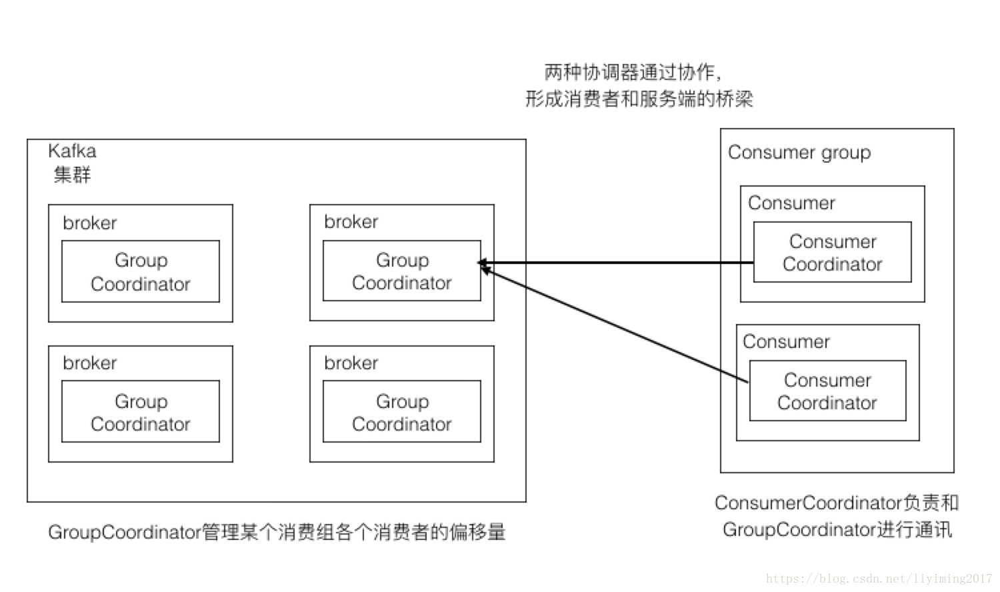
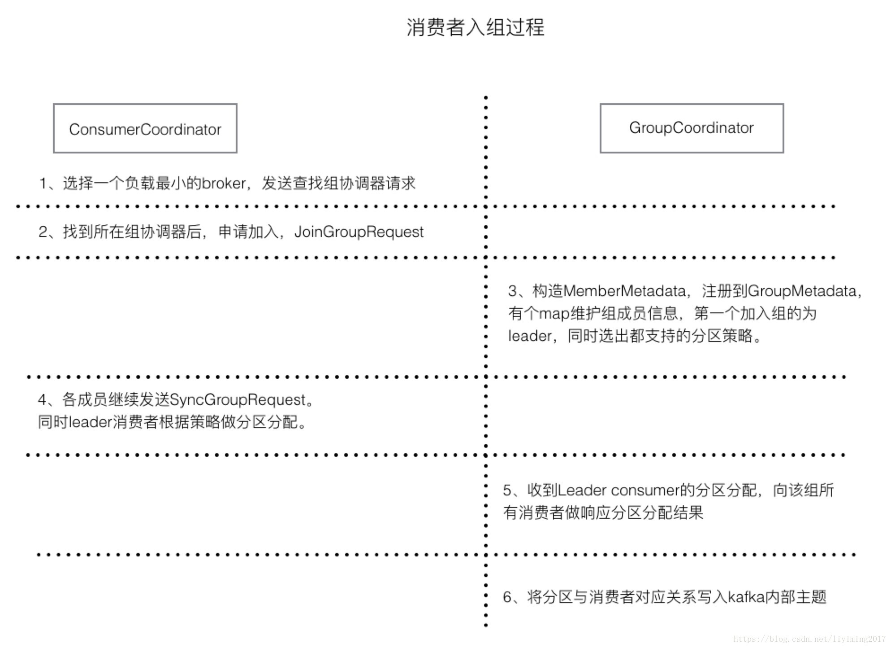
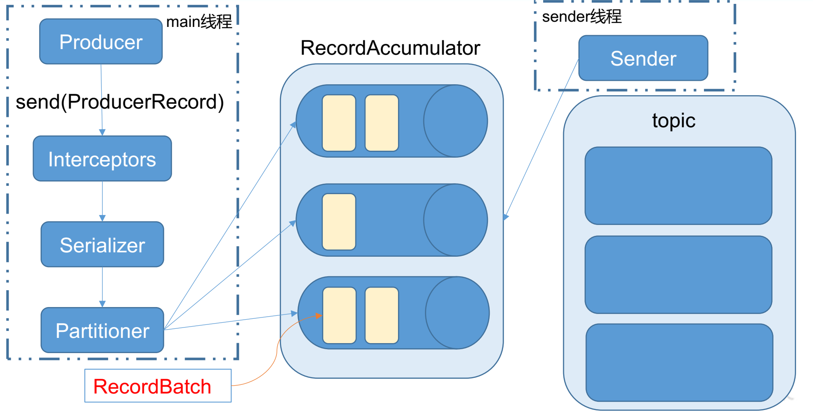
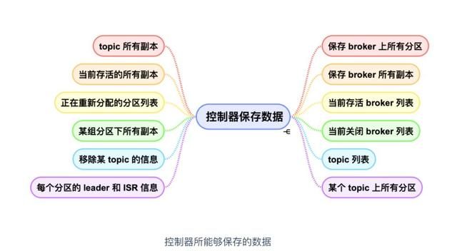
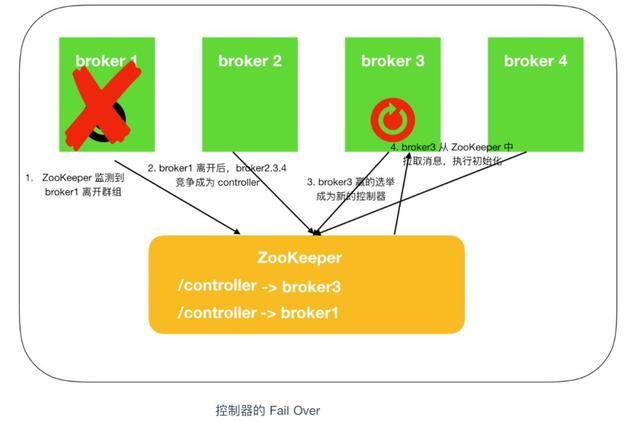
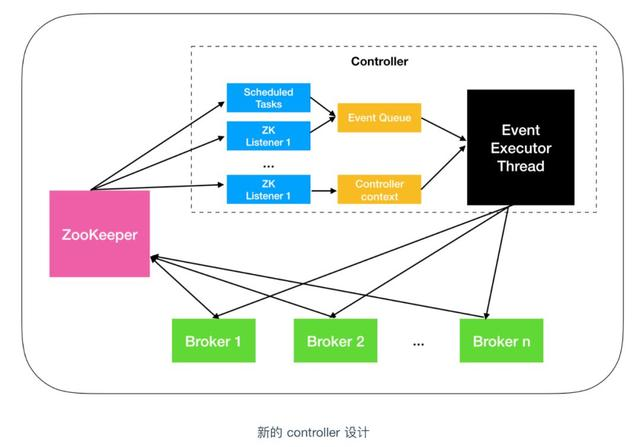

# Kafka知识点梳理

[TOC]


## 一、Kafka简介与架构

### 1. kafka定义

Kafka是一个基于发布订阅模式的分布式消息队列，它具有以下特点：

- 支持消息的发布和订阅，类似于 RabbtMQ、ActiveMQ 等消息队列；
- 支持数据离线和实时处理；
- 能保证消息的可靠性投递；
- 支持消息的持久化存储，并通过多副本分布式的存储方案来保证消息的容错，时间效率O(1)；
- 高吞吐率，单 Broker 可以轻松处理数千个分区以及每秒百万级的消息量。
- 支持在线水平扩展

### 2. 消息队列的优点

* **解耦：**两边数据处理过程独立，可任意修改，只要遵从相同的接口约束
* **可恢复性：**系统的一部分组件失效时，不会影响到整个系统。即使一个处理消息的进程挂掉，加入队列中的消息仍可在系统恢复后处理
* **缓冲：**控制优化数据流经过系统的速度，解决生产消费速度不一致的问题
* **削峰平谷：**访问量剧增的情况可以避免系统因超负荷的请求而崩溃
* **异步通信：**提供了异步处理机制

### 3. Kafka与其他消息队列的对比

*  **RabbitMQ** 

  RabbitMQ是使用Erlang编写的一个开源的消息队列，本身支持很多的协议：AMQP，XMPP, SMTP, STOMP，也正因如此，它非常重量级，更适合于企业级的开发。同时实现了Broker构架，这意味着消息在发送给客户端时先在中心队列排队。对路由，负载均衡或者数据持久化都有很好的支持。 

*  **Redis**
  Redis是一个基于Key-Value对的NoSQL数据库，开发维护很活跃。虽然它是一个Key-Value数据库存储系统，但它本身支持MQ功能，所以完全可以当做一个轻量级的队列服务来使用。对于RabbitMQ和Redis的入队和出队操作，各执行100万次，每10万次记录一次执行时间。测试数据分为128Bytes、512Bytes、1K和10K四个不同大小的数据。实验表明：入队时，当数据比较小时Redis的性能要高于RabbitMQ，而如果数据大小超过了10K，Redis则慢的无法忍受；出队时，无论数据大小，Redis都表现出非常好的性能，而RabbitMQ的出队性能则远低于Redis。 

### 4. 消息对列的两种模式

#### 4.1 点对点模式

消费者主动拉取数据，消息收到后清除

#### 4.2 发布/订阅模式

生产者将消息发布到topic中，同时有多个消费者订阅该消息

### 5. Kafka的基本架构

#### 5.1 消息、批次

Kafka中的基本数据单元称为消息（Message）在磁盘中保存为log， 为减少网络开销，提高效率，**多个消息会被放入同一批次 (Batch) 中后再写入** 

#### 5.2 主题、分区、副本

Kafka中的消息根据主题（Topic）来分类，为了使Kafka的吞吐率可以线性提高，每个主题又分为不同的分区（Partition），每个分区可以有多个副本（Replica）。每个分区中消息的内容不同，不同分区可以部署在不同的服务器上，每个分区也可以有多份副本，分为Leader和Follower，每个副本必须放在不同的服务器中，保证集群中的某个节点发生故障时，该节点上的 partition 数据不丢失 。但由于**消息保存在不同的分区中，也就无法实现整个主题中消息的有序，只在分区内保证有序性**。

#### 5.3 生产者、消费者、消费者组

生产者（Producer）既是向Kafka集群发送消息的客户端；
消费者（Consumer）既是向Kafka集群拉取消息的客户端；
消费者组（Consumer Group）有多个消费者组成，消费者组中每个消费者负责消费不同的分区，不可重复消费。

#### 5.4 Broker、集群

每一台独立的Kafka服务器均被称为Broker，有不同的BrokerId。
集群（Cluster）由Broker组成，每个集群都有一个Controller负责将分区分配给Broker和监控Broker。　

## 二、Kafka数据存储机制

### 1. Kafka文件存储机制

Kafka中的消息是以topic进行分类的，topic是逻辑上的概念，而partition是物理上的概念。每个partition对应一个log文件，存储的就是producer生产的数据。Producer生产的每条数据都会追加到文件的末端（**顺序写磁盘，所以效率很高**），每条数据都有自己的offset，消费者组的每个消费者都会实时记录自己消费到哪个offset。

为防止log文件过大导致数据定位效率低下，Kafka采用了分段和索引机制，将每个partition分为多个segment，每个segment对应两个文件——“.index” “.log”，分别保存索引和数据。索引文件中保存数据文件中message的offset。


### 2. Kafka副本机制

为了保证高可用，Kafka的每个分区都是多副本的。其中，一个副本是leader replica，其他副本是follower replica。当一个首领副本不可用时，其中一个跟随着副本将成为新首领。

#### 2.1 ISR（in-sync Replica）机制

每个分区都维护一个isr列表，用于维护所有同步的可用的副本，对应跟随着副本来说，他必须满足以下条件才能被认为是同步副本：

* 定时向Zookeeper发送心跳；
* 在规定的时间内从leader处低延迟的获取过消息。

如果长时间follower未向leader同步数据，则该follower将被踢出isr，改时间阈值由`replica.time.max.ms`设定。

#### 2.2 不完全的首领选举

对于副本机制，在broker级别有一个可选的配置参数`unclean.leader.election.enable`，默认禁止，这是针对leader挂掉且isr中没有其他可用副本时，是否允许某个不完全同步的副本成为首领副本。

#### 2.3 最少同步副本

在broker或topic级别，可以配置`min.insync.replicas`，代表当isr队列中可用副本的最小值，如果isr副本数量小于该值时，就认为整个分区处于不可用状态。

#### 2.4 数据保留规则

保留数据是 Kafka 的一个基本特性， 但是 Kafka 不会一直保留数据，也不会等到所有消费者都读取了消息之后才删除消息。相反， Kafka 为每个主题配置了数据保留期限，规定数据被删除之前可以保留多长时间，或者清理数据之前可以保留的数据量大小。分别对应以下四个参数：

- `log.retention.bytes` ：删除数据前允许的最大数据量；默认值-1，代表没有限制；
- `log.retention.ms`：保存数据文件的毫秒数，如果未设置，则使用 `log.retention.minutes` 中的值，默认为 null；
- `log.retention.minutes`：保留数据文件的分钟数，如果未设置，则使用 `log.retention.hours` 中的值，默认为 null；
- `log.retention.hours`：保留数据文件的小时数，默认值为 168，也就是一周。

### 3. 数据请求

#### 3.1 元数据请求机制

所有副本中，只有leader副本才可以进行消息的读写处理。由于不同分区的leader可能在不同的broker上，Kafka提供了元数据请求机制。

集群中的每个broker都会缓存所有主题的分区副本信息，客户端会定期发送元数据请求，将元数据缓存。这样客户端就知道了leader副本所在的broker。

#### 3.2 零拷贝(Kafka高性能的原因之一)

“零拷贝”通常是指计算机在网络上发送文件时，不需要将文件内容拷贝到用户空间（User Space）而直接在内核空间（Kernel Space）中传输到网络的方式。
Kafka所有数据的写如何读取都是通过零拷贝实现的。

##### 优势

- 减少甚至完全避免不必要的CPU拷贝，从而让CPU解脱出来去执行其他的任务
- 减少内存带宽的占用
- 通常零拷贝技术还能够减少用户空间和操作系统内核空间之间的上下文切换

##### 传统I/O：四次拷贝与四次上下文切换

以将磁盘文件发送到网络为例，传统模式下系统调用如下：

```c
read(file,tmp_buf,len)
write(socket,tmp_buf,len)
```

* 程序使用read()系统调用。系统由用户态转换为内核态(第一次上下文切换)，磁盘中的数据由DMA（Direct Memory Access)的方式读取到内核缓冲区(kernel buffer)。DMA过程中CPU不需要参与数据的读写，而是DMA处理器直接将硬盘数据通过总线传输到内存中。
* 系统由内核态转换为用户态（第二次上下文切换），当程序要读取的数据已经完成写入内核缓冲区以后，程序会将数据由内核缓存区，写入用户缓存区），这个过程需要CPU参与数据的读写。
* 程序使用write()系统调用。系统由用户态切换到内核态(第三次上下文切换)，数据从用户态缓冲区写入到网络缓冲区(Socket Buffer)，这个过程需要CPU参与数据的读写。
* 系统由内核态切换到用户态（第四次上下文切换），网络缓冲区的数据通过DMA的方式传输到网卡的驱动(存储缓冲区)中(protocol engine)

**传统的I/O方式会经过4次用户态和内核态的切换(上下文切换)，两次CPU中内存中进行数据读写的过程。这种拷贝过程相对来说比较消耗资源。** 

##### 内存映射方式I/O：两次拷贝与四次上下文切换

```c
tmp_buf = mmap(file, len);
write(socket, tmp_buf, len);
```

这是使用的系统调用方法，这种方式的I/O原理就是将用户缓冲区（user buffer）的内存地址和内核缓冲区（kernel buffer）的内存地址做一个映射，也就是说系统在用户态可以直接读取并操作内核空间的数据。

1. mmap()系统调用首先会使用DMA的方式将磁盘数据读取到内核缓冲区，然后通过内存映射的方式，使用户缓冲区和内核读缓冲区的内存地址为同一内存地址，也就是说不需要CPU再讲数据从内核读缓冲区复制到用户缓冲区。
2. 当使用write()系统调用的时候，cpu将内核缓冲区（等同于用户缓冲区）的数据直接写入到网络发送缓冲区（socket buffer），然后通过DMA的方式将数据传入到网卡驱动程序中准备发送。

可以看到这种内存映射的方式减少了CPU的读写次数，但是用户态到内核态的切换（上下文切换）依旧有四次，同时需要注意在**进行这种内存映射的时候，有可能会出现并发线程操作同一块内存区域而导致的严重的数据不一致问题**，所以需要进行合理的并发编程来解决这些问题。

##### 零拷贝：两次拷贝与两次上下文切换

```c
sendfile(socket, file, len);
```

CPU已经不参与数据的拷贝过程，也就是说完全通过其他硬件和中断的方式来实现数据的读写过程吗，但是这样的过程需要硬件的支持才能实现。

> 借助于硬件上的帮助，我们是可以办到的。之前我们是把页缓存的数据拷贝到socket缓存中，实际上，我们仅仅需要把缓冲区描述符传到socket缓冲区，再把数据长度传过去，这样DMA控制器直接将页缓存中的数据打包发送到网络中就可以了。

1. 系统调用sendfile()发起后，磁盘数据通过DMA方式读取到内核缓冲区，内核缓冲区中的数据通过DMA聚合网络缓冲区，然后一齐发送到网卡中。

可以看到在这种模式下，是没有一次CPU进行数据拷贝的，所以就做到了真正意义上的零拷贝，这种模式实现起来需要硬件的支持。

## 三、Kafka生产者

### 1. Kafka生产者发送消息的过程

- **Kafka 会将发送消息包装为 ProducerRecord 对象**， ProducerRecord 对象包含了目标主题和要发送的内容，同时还可以指定键和分区。在发送 ProducerRecord 对象前，生产者会**先把键和值对象序列化成字节数组**，这样它们才能够在网络上传输。
- 接下来，**数据被传给分区器**。如果之前已经在 ProducerRecord 对象里指定了分区，那么分区器就不会再做任何事情。如果没有指定分区 ，那么分区器会**根据 ProducerRecord 对象的键来选择一个分区**，紧接着，这条记录被**添加到一个记录批次里，这个批次里的所有消息会被发送到相同的主题和分区上**。有一个独立的线程负责把这些记录批次发送到相应的 broker 上。
- **服务器在收到这些消息时会返回一个响应**。如果消息成功写入 Kafka，就**返回一个 RecordMetaData 对象**，它**包含了主题和分区信息，以及记录在分区里的偏移量**。如果写入失败，则会返回一个错误。生产者在收到错误之后会尝试重新发送消息，如果达到指定的重试次数后还没有成功，则直接抛出异常，不再重试。

### 2. 分区策略

#### 2.1 分区原因

* 提高并发
* 方便集群中扩展

#### 2.2 分区策略

* 可指定partition；
* 有key值的情况下，将key的hash值与topic的partition数取余；
* 第一次调用随机生成一个整数（后面每次调用时在这个数上自增），再对partition数取余。

### 3. 数据可靠性保证

为保证 producer 发送的数据，能可靠的发送到指定的 topic， topic 的每个 partition 收到producer 发送的数据后， 都需要向 producer 发送 ack（acknowledgement 确认收到） ，如果producer 收到 ack， 就会进行下一轮的发送，否则重新发送数据。  

#### 3.1 三种可靠性级别

* acks=0：producer不等待broker的ack，当broker故障时会丢失数据；
* acks=1：producer等待leader收到数据后返回ack，如果在producer同步完成前leader故障，会丢失数据。
* acks=-1(all)：producer等待partition的leader和所有follower成功同步后返回ack，如果返回ack前故障，会造成数据重复。

#### 3.2 故障处理

**LEO（Log End Offset）**：每个副本的最后一个offset

**HW（High Watermark）**：所有副本的最小LEO

##### 3.2.1 follower故障

follower会被踢出isr，恢复后，follower读取本地磁盘记录的上次的HW，并将log文件高于HW的部分截取掉，从HW开始向leader进行同步，等follower的LEO大于等于该partition的HW后，就可以重新加入isr。

##### 3.2.2 leader故障

leader 发生故障之后，会从 ISR 中选出一个新的 leader，之后，为保证多个副本之间的，  数据一致性， 其余的 follower 会先将各自的 log 文件高于 HW 的部分截掉，然后从新的 leader同步数据。  

#### 4. Exactly Once 语义（生产时的幂等性）

将服务器的 ACK 级别设置为-1，可以保证 Producer 到 Server 之间不会丢失数据，即 At Least Once 语义。相对的，将服务器 ACK 级别设置为 0，可以保证生产者每条消息只会被发送一次，即 At Most Once 语义。At Least Once 可以保证数据不丢失，但是不能保证数据不重复；相对的， **At Least Once可以保证数据不重复，但是不能保证数据不丢失**。 但是，对于一些非常重要的信息，比如说交易数据，下游数据消费者**要求数据既不重复也不丢失，即 Exactly Once 语义**。 

在 0.11 版本以前的 Kafka，对此是无能为力的，只能保证数据不丢失，再在下游消费者对数据做全局去重。对于多个下游应用的情况，每个都需要单独做全局去重，这就对性能造成了很大影响。0.11 版本的 Kafka，引入了一项重大特性：**幂等性**。所谓的幂等性就是指 Producer 不论向 Server 发送多少次重复数据， Server 端都只会持久化一条。幂等性结合 At Least Once 语义，就构成了 Kafka 的 Exactly Once 语义。即：**At Least Once + 幂等性 = Exactly Once**。

要启用幂等性，只需要将 Producer 的参数中 enable.idompotence 设置为 true 即可。 **Kafka的幂等性实现其实就是将原来下游需要做的去重放在了数据上游**。

为了实现幂等语义，Kafka引入了`Producer ID`（即`PID`）和`Sequence Number`。每个新的Producer在初始化的时候会被分配一个唯一的PID，该PID对用户完全透明而不会暴露给用户。

对于每个PID，该Producer发送数据的每个<Topic, Partition>都对应一个从0开始单调递增的Sequence Number。

类似地，Broker端也会为每个<PID, Topic, Partition>维护一个序号，并且每次Commit一条消息时将其对应序号递增。对于接收的每条消息，如果其序号比Broker维护的序号（即最后一次Commit的消息的序号）大1，则Broker会接受它，否则将其丢弃：

- 如果消息序号比Broker维护的序号大一以上，说明中间有数据尚未写入，也即乱序，此时Broker拒绝该消息，Producer抛出`InvalidSequenceNumber`
- 如果消息序号小于等于Broker维护的序号，说明该消息已被保存，即为重复消息，Broker直接丢弃该消息，Producer抛出`DuplicateSequenceNumber`

上述设计解决了0.11.0.0之前版本中的两个问题：

- Broker保存消息后，发送ACK前宕机，Producer认为消息未发送成功并重试，造成数据重复
- 前一条消息发送失败，后一条消息发送成功，前一条消息重试后成功，造成数据乱序

## 四、Kafka消费者

### 1. 消费方式 Push vs Pull　　

作为一个消息系统，Kafka遵循了传统的方式，选择由Producer向broker push消息并由Consumer从broker pull消息。一些logging-centric system，比如Facebook的Scribe和Cloudera的Flume，采用push模式。事实上，push模式和pull模式各有优劣。
push模式很难适应消费速率不同的消费者，因为消息发送速率是由broker决定的。**push模式的目标是尽可能以最快速度传递消息，但是这样很容易造成Consumer来不及处理消息，典型的表现就是拒绝服务以及网络拥塞。而pull模式则可以根据Consumer的消费能力以适当的速率消费消息**。
对于Kafka而言，pull模式更合适。**pull模式可简化broker的设计，Consumer可自主控制消费消息的速率，同时Consumer可以自己控制消费方式——即可批量消费也可逐条消费，同时还能选择不同的提交方式从而实现不同的传输语义**。
**pull模式的不足在于，如果Kafka没有数据，消费者可能会陷入循环中，一直返回空数据**。

### 2. 分区分配策略

Kafka保证同一Consumer Group中只有一个Consumer会消费某条消息，实际上，Kafka保证的是稳定状态下每一个Consumer实例只会消费某一个或多个特定Partition的数据，而某个Partition的数据只会被某一个特定的Consumer实例所消费。也就是说Kafka对消息的分配是以Partition为单位分配的，而非以每一条消息作为分配单元。这样设计的劣势是无法保证同一个Consumer Group里的Consumer均匀消费数据，优势是每个Consumer不用都跟大量的Broker通信，减少通信开销，同时也降低了分配难度，实现也更简单。另外，因为同一个Partition里的数据是有序的，这种设计可以保证每个Partition里的数据可以被有序消费。 

一个Consumer Group中的多个consumer是如何消费不同的partition？

#### 2.1 Kafka有两种分配策略。

* RangeAssignor，默认

  Range 范围分区策略是对每个 topic 而言的。首先对同一个 topic 里面的分区按照序号进行排序，并对消费者按照字母顺序进行排序。假如现在有 10 个分区，3 个消费者，排序后的分区将会是0,1,2,3,4,5,6,7,8,9；消费者排序完之后将会是C1-0,C2-0,C3-0。通过 partitions数/consumer数来决定每个消费者应该消费几个分区。如果除不尽，那么前面几个消费者将会多消费 1 个分区。

  **Range 范围分区的弊端：**

  针对 1 个 topic 而言，C1-0消费者多消费1个分区影响不是很大。如果有 N 多个 topic，那么针对每个 topic，消费者 C1-0 都将多消费 1 个分区，topic越多，C1-0 消费的分区会比其他消费者明显多消费 N 个分区。这就是 Range 范围分区的一个很明显的弊端了

* RoundRobinAssignor

  RoundRobin 轮询分区策略，是把所有的 partition 和所有的 consumer 都列出来，然后按照 hashcode 进行排序，最后通过轮询算法来分配 partition 给到各个消费者。 

  如果想要使用RoundRobin 轮询分区策略，必须满足如下两个条件：

  * 每个消费者订阅的主题，必须是相同的
  * 每个主题的消费者实例都是相同的。(即：上面的第一种情况，才优先使用 RoundRobin 轮询分区策略)

#### 2.2 什么时候触发分区分配策略

当出现以下几种情况时，Kafka 会进行一次分区分配操作，即 Kafka 消费者端的 Rebalance 操作

* 同一个 consumer 消费者组 group.id 中，新增了消费者进来，会执行 Rebalance 操作
* 消费者离开当期所属的 consumer group组。比如 主动停机  或者  宕机
* 分区数量发生变化时(即 topic 的分区数量发生变化时)
* 消费者主动取消订阅

Kafka 消费端的 Rebalance 机制，规定了一个 Consumer group 下的所有 consumer 如何达成一致来分配订阅 topic 的每一个分区。而具体如何执行分区策略，就是上面提到的 Range 范围分区 和 RoundRobin 轮询分区 两种内置的分区策略。

因为群组里的消费者共同读取主题的分区，所以当一个消费者被关闭或发生崩溃时，它就离开了群组，原本由它读取的分区将由群组里的其他消费者来读取。同时在主题发生变化时 ， 比如添加了新的分区，也会发生分区与消费者的重新分配，分区的所有权从一个消费者转移到另一个消费者，这样的行为被称为再均衡。正是因为再均衡，所以消费费者群组才能保证高可用性和伸缩性。Consumer Rebalance的算法如下：

- 将目标Topic下的所有Partirtion排序，存于$P_T$
- 对某Consumer Group下所有Consumer排序，存于$C_G$，第i个Consumer记为$C_i$
- $N=size(P_T)/size(C_G)$，向上取整
- 解除$C_i$对原来分配的Partition的消费权（i从0开始）
- 将第$i∗N_i$到第$(i+1)*N-1$个Partition分配给$C_i$

### 3. 协调器

顾名思义，协调器负责协调工作。本节所讲的协调器，是用来协调消费者工作分配的。简单点说，就是消费者启动后，到可以正常消费前，这个阶段的初始化工作。消费者能够正常运转起来，全有赖于协调器。

主要的协调器有如下两个：

* 消费者协调器（ConsumerCoordinator）

* 组协调器（GroupCoordinator）

此外还有任务管理协调器（WorkCoordinator），用作kafka connect的works管理。

kafka引入协调器有其历史过程，原来consumer信息依赖于zookeeper存储，当代理或消费者发生变化时，引发消费者平衡，此时消费者之间是互不透明的，每个消费者和zookeeper单独通信，容易造成羊群效应和脑裂问题。

为了解决这些问题，kafka引入了协调器。服务端引入组协调器（GroupCoordinator），消费者端引入消费者协调器（ConsumerCoordinator）。每个broker启动的时候，都会创建GroupCoordinator实例，管理部分消费组（集群负载均衡）和组下每个消费者消费的偏移量（offset）。每个consumer实例化时，同时实例化一个ConsumerCoordinator对象，负责同一个消费组下各个消费者和服务端组协调器之前的通信。



#### 3.1 消费者协调器（ConsumerCoordinator）

消费者协调器主要负责如下工作：

* 更新消费者缓存的MetaData

* 向组协调器申请加入组
* 消费者加入组后的相应处理
* 请求离开消费组
* 向组协调器提交偏移量
* 通过心跳，保持组协调器的连接感知。
* 被组协调器选为leader的消费者的协调器，负责消费者分区分配。分配结果发送给组协调器。
* 非leader的消费者，通过消费者协调器和组协调器同步分配结果。 

#### 3.2 组协调器（GroupCoordinator）

组协调器负责处理消费者协调器发过来的各种请求。它主要提供如下功能：

* 在与之连接的消费者中选举出消费者leader
* 下发leader消费者返回的消费者分区分配结果给所有的消费者
* 管理消费者的消费偏移量提交，保存在kafka的内部主题中
* 和消费者心跳保持，知道哪些消费者已经死掉，组中存活的消费者是哪些。
* 组协调器在broker启动的时候实例化，每个组协调器负责一部分消费组的管理。

#### 3.3 消费者入组过程

下图展示了消费者启动选取leader、入组的过程。



消费者入组的过程，很好的展示了消费者协调器和组协调器之间是如何配合工作的。leader consumer会承担分区分配的工作，这样kafka集群的压力会小很多。同组的consumer通过组协调器保持同步。消费者和分区的对应关系持久化在kafka内部主题。 
————————————————
版权声明：本文为CSDN博主「稀有气体」的原创文章，遵循 CC 4.0 BY-SA 版权协议，转载请附上原文出处链接及本声明。
原文链接：https://blog.csdn.net/liyiming2017/article/details/82867765

### 4. offset的维护

#### 4.1 offset的作用

由于 consumer 在消费过程中可能会出现断电宕机等故障， consumer 恢复后，需要从故
障前的位置的继续消费，所以 consumer 需要实时记录自己消费到了哪个 offset，以便故障恢复后继续消费。  

Kafka 0.9 版本之前， consumer 默认将 offset 保存在 Zookeeper 中，从 0.9 版本开始，
consumer 默认将 offset 提交到Kafka 一个内置的 topic 中，该 topic 为__consumer_offsets。如果有消费者退出或者新分区加入，此时就会触发再均衡。完成再均衡之后，每个消费者可能分配到新的分区，而不是之前处理的那个。为了能够继续之前的工作，消费者需要读取每个分区最后一次提交的偏移量，然后从偏移量指定的地方继续处理。 因为这个原因，所以如果不能正确提交偏移量，就可能会导致数据丢失或者重复出现消费，比如下面情况：

- 如果提交的偏移量小于客户端处理的最后一个消息的偏移量 ，那么处于两个偏移量之间的消息就会被重复消费；
- 如果提交的偏移量大于客户端处理的最后一个消息的偏移量，那么处于两个偏移量之间的消息将会丢失。

#### 4.2 offset的提交

Kafka 支持自动提交和手动提交偏移量两种方式。

* 自动提交方式：只需要将消费者的 `enable.auto.commit` 属性配置为 `true` 即可完成自动提交的配置。 此时每隔固定的时间，消费者就会把 `poll()` 方法接收到的最大偏移量进行提交，提交间隔由 `auto.commit.interval.ms` 属性进行配置，默认值是 5s。

  使用自动提交是存在隐患的，假设我们使用默认的 5s 提交时间间隔，在最近一次提交之后的 3s 发生了再均衡，再均衡之后，消费者从最后一次提交的偏移量位置开始读取消息。这个时候偏移量已经落后了 3s ，所以在这 3s 内到达的消息会被重复处理。可以通过修改提交时间间隔来更频繁地提交偏移量，减小可能出现重复消息的时间窗，不过这种情况是无法完全避免的。

* 手动提交方式：基于这个原因，Kafka 也提供了手动提交偏移量的 API，使得用户可以更为灵活的提交偏移量。用户可以通过将 `enable.auto.commit` 设为 `false`，然后手动提交偏移量。基于用户需求手动提交偏移量可以分为两大类：

  - 手动提交当前偏移量：即手动提交当前轮询的最大偏移量；
  - 手动提交固定偏移量：即按照业务需求，提交某一个固定的偏移量。

  手动提交也分为同步提交和异步提交：

  * 同步提交： 通过调用 `consumer.commitSync()` 来进行同步提交，不传递任何参数时提交的是当前轮询的最大偏移量。  如果某个提交失败，同步提交还会进行重试，这可以保证数据能够最大限度提交成功，但是同时也会降低程序的吞吐量。 
  
  * 异步提交：异步提交可以提高程序的吞吐量，因为此时你可以尽管请求数据，而不用等待 Broker 的响应。异步提交存在的问题是，在提交失败的时候不会进行自动重试，实际上也不能进行自动重试。  基于这个原因，某些情况下，需要同时组合同步和异步两种提交方式。 
  
  * 同步加异步提交：
  
    * 即在正常的轮询中使用异步提交来保证吞吐量
    * 如果程序报错，finally中，提交偏移量，采用同步方式，确保提交成功
    * 再均衡前的回调方法中，提交偏移量，采用同步方式，确保提交成功
  
    这样既保证了吞吐量，也保证了提交偏移量的安全性。另外由于再均衡前提交偏移量，降低了重复消费可能。

### 5. 独立的消费者

因为 Kafka 的设计目标是高吞吐和低延迟，所以在 Kafka 中，消费者通常都是从属于某个群组的，这是因为单个消费者的处理能力是有限的。但是某些时候你的需求可能很简单，比如可能只需要一个消费者从一个主题的所有分区或者某个特定的分区读取数据，这个时候就不需要消费者群组和再均衡了， 只需要把主题或者分区分配给消费者，然后开始读取消息井提交偏移量即可。在这种情况下，就不需要订阅主题， 取而代之的是消费者为自己分配分区。 一个消费者可以订阅主题（井加入消费者群组），或者为自己分配分区。

## 五、Kafka事务

  Kafka 从 0.11 版本开始引入了事务支持。事务可以保证 Kafka 在 Exactly Once 语义的基础上，生产和消费可以跨分区和会话，要么全部成功，要么全部失败。

### 1. Producer 事务

为了实现跨分区跨会话的事务，需要引入一个全局唯一的 Transaction ID，并将 Producer获得的PID 和Transaction ID 绑定。这样当Producer 重启后就可以通过正在进行的 TransactionID 获得原来的 PID。
为了管理 Transaction， Kafka 引入了一个新的组件 Transaction Coordinator。 Producer 就是通过和 Transaction Coordinator 交互获得 Transaction ID 对应的任务状态。 TransactionCoordinator 还负责将事务所有写入 Kafka 的一个内部 Topic，这样即使整个服务重启，由于事务状态得到保存，进行中的事务状态可以得到恢复，从而继续进行。

### 2. Consumer 事务

上述事务机制主要是从 Producer 方面考虑，对于 Consumer 而言，事务的保证就会相对较弱，尤其时无法保证 Commit 的信息被精确消费。这是由于 Consumer 可以通过 offset 访问任意信息，而且不同的 Segment File 生命周期不同，同一事务的消息可能会出现重启后被删除的情况。  

## 六、常见问题

#### 1. Kafka 中的 ISR(InSyncRepli)、 OSR(OutSyncRepli)、 AR(AllRepli)代表什么？  

**ISR**：In-Sync Replicas 副本同步队列
**AR**：Assigned Replicas 所有副本
ISR是由leader维护，follower从leader同步数据有一些延迟（包括延迟时间replica.lag.time.max.ms和延迟条数replica.lag.max.messages两个维度, 当前最新的版本0.10.x中只支持replica.lag.time.max.ms这个维度），任意一个超过阈值都会把follower剔除出ISR, 存入OSR（Outof-Sync Replicas）列表，新加入的follower也会先存放在OSR中。AR=ISR+OSR。

#### 2.Kafka 中的 HW、 LEO 等分别代表什么？

**LEO（Log End Offset）**：每个副本的最后一个offset
**HW（High Watermark）**：所有副本的最小LEO

follower故障时：follower会被踢出isr，恢复后，follower读取本地磁盘记录的上次的HW，并将log文件高于HW的部分截取掉，从HW开始向leader进行同步，等follower的LEO大于等于该partition的HW后，就可以重新加入isr。

leader故障时：leader 发生故障之后，会从 ISR 中选出一个新的 leader，之后，为保证多个副本之间的，  数据一致性， 其余的 follower 会先将各自的 log 文件高于 HW 的部分截掉，然后从新的 leader同步数据。  

#### **3. Kafka 中是怎么体现消息顺序性的？**

kafka每个partition中的消息在写入时都是有序的，消费时，每个partition只能被每一个group中的一个消费者消费，保证了消费时也是有序的。
整个topic不保证有序。如果为了保证topic整个有序，那么将partition调整为1. 

#### 4. Kafka 中的分区器、序列化器、拦截器是否了解？它们之间的处理顺序是什么？

**分区器：**可以给消息指定传入分区
**序列化器：**将生产者消息序列化，可以被网络传输
**拦截器：**可以在消息传入Kafka前和producer回调函数返回前对消息进行简单的处理

#### 5. Kafka 生产者客户端的整体结构是什么样子的？使用了几个线程来处理？分别是什么？



main线程负责：拦截器—>序列化器—>分区器
sender线程负责：将分区后的数据发送给对于分区

#### 6. “消费组中的消费者个数如果超过 topic 的分区，那么就会有消费者消费不到数据”这句话是否正确？

正确，这样会浪费资源。

#### 7.消费者提交消费位移时提交的是当前消费到的最新消息的 offset 还是 offset+1？

offset+1

#### 8.有哪些情形会造成重复消费？那些情景会造成消息漏消费  ？

**重复消费**：先处理数据，再提交offset
**消息漏消费**：先提交offset，再处理数据

Kafka消息消费有两个consumer接口，Low-level API和High-level API：

Low-level API：消费者自己维护offset等值，可以实现对Kafka的完全控制；
High-level API：封装了对parition和offset的管理，使用简单；

如果使用高级接口High-level API，可能存在一个问题就是当消息消费者从集群中把消息取出来、并提交了新的消息offset值后，还没来得及消费就挂掉了，那么下次再消费时之前没消费成功的消息就“诡异”的消失了；

消息的重复消费，即要解决**消费时的幂等性**。解决思路：

* 生产者生产数据时，添加一个全局唯一的id，处理时如果发现一个id已经被处理，那就忽略这条消息
* 如果消费操作是向数据库中插入数据，可以利用数据库的唯一键

**生产时的幂等性如何解决？**

#### 9. 当你使用 kafka-topics.sh 创建（删除）了一个 topic 之后， Kafka 背后会执行什么逻辑？

* 会在 zookeeper 中的/brokers/topics 节点下创建一个新的 topic 节点，如：/brokers/topics/first
* 触发 Controller 的监听程序
* kafka Controller 负责 topic 的创建工作，并更新 metadata cache

#### 10. topic 的分区数可不可以增加？可不可以减少？为什么？

**分区数可以增加，不可以减少**

按照Kafka现有的代码逻辑而言，此功能完全可以实现，不过也会使得代码的复杂度急剧增大。实现此功能需要考虑的因素很多，比如**删除掉的分区中的消息该作何处理**？如果随着分区一起消失则**消息的可靠性**得不到保障；如果需要保留则又需要考虑**如何保留**。直接存储到现有分区的尾部，**消息的时间戳**就不会递增，如此对于Spark、Flink这类需要消息时间戳（事件时间）的组件将会受到影响；如果分散插入到现有的分区中，那么在消息量很大的时候，**内部的数据复制会占用很大的资源**，而且在复制期间，此**主题的可用性**又如何得到保障？与此同时，顺序性问题、事务性问题、以及分区和副本的状态机切换问题都是不得不面对的。反观这个功能的收益点却是很低，如果真的需要实现此类的功能，完全可以重新创建一个分区数较小的主题，然后将现有主题中的消息按照既定的逻辑复制过去即可。

虽然分区数不可以减少，但是分区对应的副本数是可以减少的，这个其实很好理解，你关闭一个副本时就相当于副本数减少了。不过正规的做法是使用kafka-reassign-partition.sh脚本来实现，具体用法可以自行搜索。

#### 11. Kafka 有内部的 topic 吗？如果有是什么？有什么所用？

consumer 默认将 offset 提交到Kafka 一个内置的 topic 中，该 topic 为__consumer_offsets。

#### 12. Kafka 分区分配的概念？

Kafka有两种分配策略。

* RangeAssignor，默认

  Range 范围分区策略是对每个 topic 而言的。首先对同一个 topic 里面的分区按照序号进行排序，并对消费者按照字母顺序进行排序。假如现在有 10 个分区，3 个消费者，排序后的分区将会是0,1,2,3,4,5,6,7,8,9；消费者排序完之后将会是C1-0,C2-0,C3-0。通过 partitions数/consumer数来决定每个消费者应该消费几个分区。如果除不尽，那么前面几个消费者将会多消费 1 个分区。

  **Range 范围分区的弊端：**

  针对 1 个 topic 而言，C1-0消费者多消费1个分区影响不是很大。如果有 N 多个 topic，那么针对每个 topic，消费者 C1-0 都将多消费 1 个分区，topic越多，C1-0 消费的分区会比其他消费者明显多消费 N 个分区。这就是 Range 范围分区的一个很明显的弊端了

* RoundRobinAssignor

  RoundRobin 轮询分区策略，是把所有的 partition 和所有的 consumer 都列出来，然后按照 hashcode 进行排序，最后通过轮询算法来分配 partition 给到各个消费者。 

  如果想要使用RoundRobin 轮询分区策略，必须满足如下两个条件：

  * 每个消费者订阅的主题，必须是相同的
  * 每个主题的消费者实例都是相同的。(即：上面的第一种情况，才优先使用 RoundRobin 轮询分区策略)

* 什么时候触发分区分配策略
  
  当出现以下几种情况时，Kafka 会进行一次分区分配操作，即 Kafka 消费者端的 Rebalance 操作
  
  * 同一个 consumer 消费者组 group.id 中，新增了消费者进来，会执行 Rebalance 操作
  * 消费者离开当期所属的 consumer group组。比如 主动停机  或者  宕机
  * 分区数量发生变化时(即 topic 的分区数量发生变化时)
  * 消费者主动取消订阅
  
  Kafka 消费端的 Rebalance 机制，规定了一个 Consumer group 下的所有 consumer 如何达成一致来分配订阅 topic 的每一个分区。而具体如何执行分区策略，就是上面提到的 Range 范围分区 和 RoundRobin 轮询分区 两种内置的分区策略。
  Kafka 对于分区分配策略这块，也提供了可插拔式的实现方式，除了上面两种分区分配策略外，我们也可以创建满足自己使用的分区分配策略，即：自定义分区策略。

#### 13. 简述 Kafka 的日志目录结构？如果我指定了一个 offset， Kafka Controller 怎么查找到对应的消息？

.index   .log
通过二分查找找到对应的index文件，通过扫描index文件找到对应数据在log文件中的偏移量

#### 14. 聊一聊 Kafka Controller 的作用？

Controller这个角色是在kafka 0.8以后添加的,它负责的功能很多，包括Topic的创始, Partition leader的选取, Partition的增加, PartitionReassigned, PreferredReplicaElection, Topic的删除等。

 Kafka Rebalance 重平衡的时候，提过一个群组协调器，负责协调群组间的关系，那么 broker 之间也有一个控制器组件（Controller），它是 Kafka 的核心组件。它的主要作用是**在 ZooKeeper 的帮助下管理和协调整个 Kafka 集群，**在 Kafka 集群启动后，只有一个 broker 会成为 Controller 。

* Zookeeper简介

  ZooKeeper 的数据是保存在节点上的，每个节点也被称为znode，znode 节点是一种树形的文件结构，它很像 Linux 操作系统的文件路径，ZooKeeper 的根节点是 /。

  znode 根据数据的持久化方式可分为临时节点和持久性节点。持久性节点不会因为 ZooKeeper 状态的变化而消失，但是临时节点会随着 ZooKeeper 的重启而自动消失。

  znode 节点有一个 Watcher 机制：当数据发生变化的时候， ZooKeeper 会产生一个 Watcher 事件，并且会发送到客户端。Watcher 监听机制是 Zookeeper 中非常重要的特性，我们基于 Zookeeper 上创建的节点，可以对这些节点绑定监听事件，比如可以监听节点数据变更、节点删除、子节点状态变更等事件，通过这个事件机制，可以基于 ZooKeeper 实现分布式锁、集群管理等功能。

* Controller的选举

  Kafka 当前选举控制器的规则是：**Kafka 集群中第一个启动的 broker 通过在 ZooKeeper 里创建一个临时节点 /controller 让自己成为 controller 控制器**。其他 broker 在启动时也会尝试创建这个节点，但是由于这个节点已存在，所以后面想要创建 /controller 节点时就会收到一个节点已存在 的异常。然后**其他 broker 会在这个控制器上注册一个 ZooKeeper 的 watch 对象**，/controller 节点发生变化时，其他 broker 就会收到节点变更通知。这种方式可以确保只有一个控制器存在。那么**只有单独的节点一定是有个问题的，那就是单点问题**。

  如果控制器关闭或者与 ZooKeeper 断开链接，ZooKeeper 上的临时节点就会消失。集群中的其他节点收到 watch 对象发送控制器下线的消息后，其他 broker 节点都会尝试让自己去成为新的控制器。其他节点的创建规则和第一个节点的创建原则一致，都是第一个在 ZooKeeper 里成功创建控制器节点的 broker 会成为新的控制器，那么其他节点就会收到节点已存在的异常，然后在新的控制器节点上再次创建 watch 对象进行监听。

* Controller的作用

  Kafka 被设计为一种模拟状态机的多线程控制器，它可以作用有下面这几点：

  * 控制器相当于部门（集群）中的部门经理（broker controller），用于管理部门中的部门成员（broker）
  * 控制器是所有 broker 的一个监视器，用于监控 broker 的上线和下线在 
  * broker 宕机后，控制器能够选举新的分区 Leader
  *  控制器能够和 broker 新选取的 Leader 发送消息 

  具体分为如下 5 点

  * 主题管理 : Kafka Controller 可以帮助我们完成对 Kafka 主题创建、删除和增加分区的操作，简而言之就是对分区拥有最高行使权。换句话说，当我们执行kafka-topics 脚本时，大部分的后台工作都是控制器来完成的。
  * 分区重分配: 分区重分配主要是指，kafka-reassign-partitions 脚本提供的对已有主题分区进行细粒度的分配功能。这部分功能也是控制器实现的。
  * Prefered 领导者选举 : Preferred 领导者选举主要是 Kafka 为了避免部分 Broker 负载过重而提供的一种换 Leader 的方案。
  * 集群成员管理: 主要管理 新增 broker、broker 关闭、broker 
  * 宕机数据服务: 控制器的最后一大类工作，就是向其他 broker 提供数据服务。控制器上保存了最全的集群元数据信息，其他所有 broker 会定期接收控制器发来的元数据更新请求，从而更新其内存中的缓存数据。

  当控制器发现一个 broker 离开集群（通过观察相关 ZooKeeper 路径），控制器会收到消息：这个 broker 所管理的那些分区需要一个新的 Leader。控制器会依次遍历每个分区，确定谁能够作为新的 Leader，然后向所有包含新 Leader 或现有 Follower 的分区发送消息，该请求消息包含谁是新的 Leader 以及谁是 Follower 的信息。随后，新的 Leader 开始处理来自生产者和消费者的请求，Follower 用于从新的 Leader 那里进行复制。

  当控制器发现一个 broker 加入集群时，它会使用 broker ID 来检查新加入的 broker 是否包含现有分区的副本。如果有控制器就会把消息发送给新加入的 broker 和 现有的 broker。

* broker controller 数据存储

  

  上面我们介绍到 broker controller 会提供数据服务，用于保存大量的 Kafka 集群数据。主要分为三类：

  * broker 上的所有信息，包括 broker 中的所有分区，broker 所有分区副本，当前都有哪些运行中的 broker，哪些正在关闭中的 broker 。
  * 所有主题信息，包括具体的分区信息，比如领导者副本是谁，ISR 集合中有哪些副本等。
  * 所有涉及运维任务的分区。包括当前正在进行 Preferred 领导者选举以及分区重分配的分区列表。Kafka 是离不开 ZooKeeper的，所以这些数据信息在 ZooKeeper 中也保存了一份。每当控制器初始化时，它都会从 ZooKeeper 上读取对应的元数据并填充到自己的缓存中。

* broker controller 故障转移

  

  broker controller 只有一个，那么必然会存在单点失效问题。kafka 为考虑到这种情况提供了故障转移功能，也就是 Fail Over。

  最一开始，broker1 会抢先注册成功成为 controller，然后由于网络抖动或者其他原因致使 broker1 掉线，ZooKeeper 通过 Watch 机制觉察到 broker1 的掉线，之后所有存活的 brokers 开始竞争成为 controller，这时 broker3 抢先注册成功，此时 ZooKeeper 存储的 controller 信息由 broker1 -> broker3，之后，broker3 会从 ZooKeeper 中读取元数据信息，并初始化到自己的缓存中。

  注意：ZooKeeper 中存储的不是缓存信息，broker 中存储的才是缓存信息。

* **broker controller 存在的问题**

  在 Kafka 0.11 版本之前，控制器的设计是相当繁琐的。我们上面提到过一句话：Kafka controller 被设计为一种模拟状态机的多线程控制器，这种设计其实是存在一些问题的。controller 状态的更改由不同的监听器并发执行，因此需要进行很复杂的同步，并且容易出错而且难以调试。状态传播不同步，broker 可能在时间不确定的情况下出现多种状态，这会导致不必要的额外的数据丢失。controller 控制器还会为主题删除创建额外的 I/O 线程，导致性能损耗。controller 的多线程设计还会访问共享数据，我们知道，多线程访问共享数据是线程同步最麻烦的地方，为了保护数据安全性，控制器不得不在代码中大量使用ReentrantLock 同步机制，这就进一步拖慢了整个控制器的处理速度。

* **broker controller 内部设计原理**

  

  在 Kafka 0.11 之后，Kafka controller 采用了新的设计，把多线程的方案改成了单线程加事件队列的方案。主要所做的改变有下面这几点：

  第一个改进是增加了一个 Event Executor Thread，事件执行线程，从图中可以看出，不管是 Event Queue 事件队列还是 Controller context 控制器上下文都会交给事件执行线程进行处理。将原来执行的操作全部建模成一个个独立的事件，发送到专属的事件队列中，供此线程消费。

  第二个改进是将之前同步的 ZooKeeper 全部改为异步操作。ZooKeeper API 提供了两种读写的方式：同步和异步。之前控制器操作 ZooKeeper 都是采用的同步方式，这次把同步方式改为异步，据测试，效率提升了10倍。

  第三个改进是根据优先级处理请求，之前的设计是 broker 会公平性的处理所有 controller 发送的请求。什么意思呢？公平性难道还不好吗？在某些情况下是的，比如 broker 在排队处理 produce 请求，这时候 controller 发出了一个 StopReplica 的请求，你会怎么办？还在继续处理 produce 请求吗？这个 produce 请求还有用吗？此时最合理的处理顺序应该是，赋予 StopReplica 请求更高的优先级，使它能够得到抢占式的处理。

#### 15.Kafka 中有那些地方需要选举？这些地方的选举策略又有哪些？

Kafka中的选举大致可以分为三大类：控制器的选举、分区leader的选举以及消费者相关的选举，这里还可以具体细分为7个小类。我们一一来过一下，本文只是简单罗列下大致的内容，至于内部具体的细节逻辑就需要靠读者自己去探索啦。虐人还是被虐就靠你的自驱力了。

##### 控制器的选举

在Kafka集群中会有一个或多个broker，其中有一个broker会被选举为控制器（Kafka Controller），它负责管理整个集群中所有分区和副本的状态等工作。比如当某个分区的leader副本出现故障时，由控制器负责为该分区选举新的leader副本。再比如当检测到某个分区的ISR集合发生变化时，由控制器负责通知所有broker更新其元数据信息。

Kafka Controller的选举是依赖Zookeeper来实现的，在Kafka集群中哪个broker能够成功创建/controller这个临时（EPHEMERAL）节点他就可以成为Kafka Controller。

这里需要说明一下的是Kafka Controller的实现还是相当复杂的，涉及到各个方面的内容，如果你掌握了Kafka Controller，你就掌握了Kafka的“半壁江山”。篇幅所限，这里就不一一展开了，有兴趣的读者可以查阅一下《深入理解Kafka》中第6章的相关内容。

##### 分区leader的选举

这里不说什么一致性协议（PacificA）相关的内容，只讲述具体的选举内容。

分区leader副本的选举由Kafka Controller 负责具体实施。当创建分区（创建主题或增加分区都有创建分区的动作）或分区上线（比如分区中原先的leader副本下线，此时分区需要选举一个新的leader上线来对外提供服务）的时候都需要执行leader的选举动作。

基本思路是按照AR集合中副本的顺序查找第一个存活的副本，并且这个副本在ISR集合中。一个分区的AR集合在分配的时候就被指定，并且只要不发生重分配的情况，集合内部副本的顺序是保持不变的，而分区的ISR集合中副本的顺序可能会改变。注意这里是**根据AR的顺序**而不是ISR的顺序进行选举的。这个说起来比较抽象，有兴趣的读者可以手动关闭/开启某个集群中的broker来观察一下具体的变化。

还有一些情况也会发生分区leader的选举，比如当分区进行重分配（reassign）的时候也需要执行leader的选举动作。这个思路比较简单：从重分配的AR列表中找到第一个存活的副本，且这个副本在目前的ISR列表中。

再比如当发生优先副本（preferred replica partition leader election）的选举时，直接将优先副本设置为leader即可，AR集合中的第一个副本即为优先副本。

还有一种情况就是当某节点被优雅地关闭（也就是执行ControlledShutdown）时，位于这个节点上的leader副本都会下线，所以与此对应的分区需要执行leader的选举。这里的具体思路为：从AR列表中找到第一个存活的副本，且这个副本在目前的ISR列表中，与此同时还要确保这个副本不处于正在被关闭的节点上。

##### 消费者相关的选举

组协调器GroupCoordinator需要为消费组内的消费者选举出一个消费组的leader，这个选举的算法也很简单，分两种情况分析。如果消费组内还没有leader，那么第一个加入消费组的消费者即为消费组的leader。如果某一时刻leader消费者由于某些原因退出了消费组，那么会重新选举一个新的leader，这个重新选举leader的过程又更“随意”了，相关代码如下：

```scala
//scala code
private val members = new mutable.HashMap[String, MemberMetadata]
var leaderId = members.keys.head
```

解释一下这2行代码：在GroupCoordinator中消费者的信息是以HashMap的形式存储的，其中key为消费者的member_id，而value是消费者相关的元数据信息。leaderId表示leader消费者的member_id，它的取值为HashMap中的第一个键值对的key，这种选举的方式基本上和随机无异。总体上来说，消费组的leader选举过程是很随意的。

#### 16. Kafka 的哪些设计让它有如此高的性能？  

* **批量处理**
  传统消息中间件的消息发送和消费整体上是针对单条的。对于生产者而言，它先发一条消息，然后broker返回ACK表示已接收，这里产生2次rpc；对于消费者而言，它先请求接受消息，然后broker返回消息，最后发送ACK表示已消费，这里产生了3次rpc（有些消息中间件会优化一下，broker返回的时候返回多条消息）。而Kafka采用了批量处理：**生产者聚合了一批消息，然后再做2次rpc将消息存入broker**，这原本是需要很多次的rpc才能完成的操作。假设需要发送1000条消息，每条消息大小1KB，那么传统的消息中间件需要2000次rpc，而Kafka可能会把这1000条消息包装成1个1MB的消息，采用2次rpc就完成了任务。这一改进举措一度被认为是一种“作弊”的行为，然而在微批次理念盛行的今日，其它消息中间件也开始纷纷效仿。

* **客户端优化**
  这里接着批量处理的概念继续来说，**新版生产者客户端**摒弃了以往的单线程，而**采用了双线程**：主线程和Sender线程。主线程负责将消息置入客户端缓存，Sender线程负责从缓存中发送消息，而这个缓存会聚合多个消息为一个批次。有些消息中间件会把消息直接扔到broker。

* 消息压缩
  Kafka支持多种消息压缩方式（gzip、snappy、lz4）。对消息进行压缩可以极大地减少网络传输 量、降低网络 I/O，从而提高整体的性能。消息压缩是一种使用时间换空间的优化方式，**如果对时延有一定的要求，则不推荐对消息进行压缩。**

* **建立索引**，方便快速定位查询
  每个日志分段文件对应了两个索引文件，主要用来提高查找消息的效率，这也是提升性能的一种方式。

* **分布式架构**
  很多人会忽略掉这个因素，其实分区也是提升性能的一种非常有效的方式，这种方式所带来的效果会比前面所说的日志编码、消息压缩等更加的明显。分区在其他分布式组件中也有大量涉及，至于为什么分区能够提升性能这种基本知识在这里就不在赘述了。

* **顺序写盘**
  操作系统可以针对线性读写做深层次的优化，比如预读(read-ahead，提前将一个比较大的磁盘块读入内存) 和后写(write-behind，将很多小的逻辑写操作合并起来组成一个大的物理写操作)技术。**Kafka 在设计时采用了文件追加的方式来写入消息，即只能在日志文件的尾部追加新的消息**，并且也不允许修改已写入的消息，这种方式属于典型的顺序写盘的操作，所以就算 Kafka 使用磁盘作为存储介质，它所能承载的吞吐量也不容小觑。

* **页缓存**
  为什么Kafka性能这么高？当遇到这个问题的时候很多人都会想到上面的顺序写盘这一点。其实在顺序斜盘前面还有页缓存（PageCache）这一层的优化。

  页缓存是操作系统实现的一种主要的磁盘缓存，以此用来减少对磁盘 I/O 的操作。具体 来说，就是把磁盘中的数据缓存到内存中，把对磁盘的访问变为对内存的访问。为了弥补性 能上的差异，现代操作系统越来越“激进地”将内存作为磁盘缓存，甚至会非常乐意将所有可用的内存用作磁盘缓存，这样当内存回收时也几乎没有性能损失，所有对于磁盘的读写也 将经由统一的缓存。

  当一个进程准备读取磁盘上的文件内容时，操作系统会先查看待读取的数据所在的页 (page)是否在页缓存(pagecache)中，如果存在(命中)则直接返回数据，从而避免了对物理磁盘的 I/O 操作;如果没有命中，则操作系统会向磁盘发起读取请求并将读取的数据页存入页缓存，之后再将数据返回给进程。同样，如果一个进程需要将数据写入磁盘，那么操作系统也会检测数据对应的页是否在页缓存中，如果不存在，则会先在页缓存中添加相应的页，最后将数据写入对应的页。被修改过后的页也就变成了脏页，操作系统会在合适的时间把脏页中的 数据写入磁盘，以保持数据的一致性。

  对一个进程而言，它会在进程内部缓存处理所需的数据，然而这些数据有可能还缓存在操 作系统的页缓存中，因此同一份数据有可能被缓存了两次。并且，除非使用 Direct I/O 的方式， 否则页缓存很难被禁止。此外，用过 Java 的人一般都知道两点事实：对象的内存开销非常大， 通常会是真实数据大小的几倍甚至更多，空间使用率低下；Java 的垃圾回收会随着堆内数据的增多而变得越来越慢。基于这些因素，使用文件系统并依赖于页缓存的做法明显要优于维护一 个进程内缓存或其他结构，至少我们可以省去了一份进程内部的缓存消耗，同时还可以通过结构紧凑的字节码来替代使用对象的方式以节省更多的空间。如此，我们可以在 32GB 的机器上使用 28GB 至 30GB 的内存而不用担心 GC 所带来的性能问题。此外，即使 Kafka 服务重启， 页缓存还是会保持有效，然而进程内的缓存却需要重建。这样也极大地简化了代码逻辑，因为 维护页缓存和文件之间的一致性交由操作系统来负责，这样会比进程内维护更加安全有效。

  Kafka 中大量使用了页缓存，这是 Kafka 实现高吞吐的重要因素之一。虽然消息都是先被写入页缓存，然后由操作系统负责具体的刷盘任务的。

  **零拷贝**
  Kafka使用了Zero Copy技术提升了消费的效率。前面所说的Kafka将消息先写入页缓存，如果消费者在读取消息的时候如果在页缓存中可以命中，那么可以直接从页缓存中读取，这样又节省了一次从磁盘到页缓存的copy开销。另外对于读写的概念可以进一步了解一下什么是写放大和读放大。
  ————————————————
  版权声明：本文为CSDN博主「朱小厮」的原创文章，遵循 CC 4.0 BY-SA 版权协议，转载请附上原文出处链接及本声明。
  原文链接：https://blog.csdn.net/u013256816/article/details/93772377