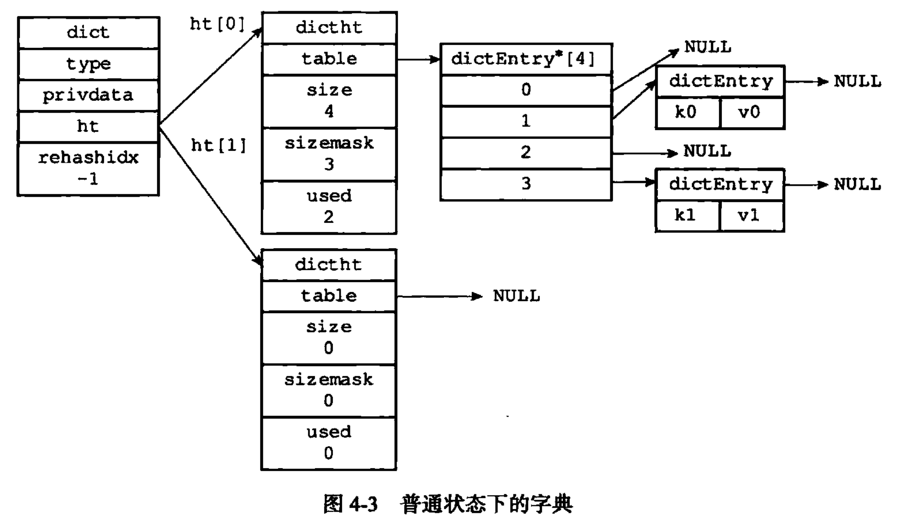

# Redis

## CAP与ACID

### 关系型数据库的ACID规则

事务在英文中是transaction，和现实世界中的交易很类似，它有如下四个特性：

#### 1. A (Atomicity) 原子性

原子性很容易理解，也就是说事务里的所有操作要么全部做完，要么都不做，事务成功的条件是事务里的所有操作都成功，只要有一个操作失败，整个事务就失败，需要回滚。比如银行转账，从A账户转100元至B账户，分为两个步骤：1）从A账户取100元；2）存入100元至B账户。这两步要么一起完成，要么一起不完成，如果只完成第一步，第二步失败，钱会莫名其妙少了100元。

#### 2. C (Consistency) 一致性

一致性也比较容易理解，也就是说数据库要一直处于一致的状态，事务的运行不会改变数据库原本的一致性约束。

#### 3. I (Isolation) 独立性

所谓的独立性是指并发的事务之间不会互相影响，如果一个事务要访问的数据正在被另外一个事务修改，只要另外一个事务未提交，它所访问的数据就不受未提交事务的影响。比如现有有个交易是从A账户转100元至B账户，在这个交易还未完成的情况下，如果此时B查询自己的账户，是看不到新增加的100元的

#### 4. D (Durability) 持久性

持久性是指一旦事务提交后，它所做的修改将会永久的保存在数据库上，即使出现宕机也不会丢失。

### 分布式事务的CAP理论

* **C：Consistency（强一致性），** 写操作之后的读操作，必须返回该值 
* **A：Availability（可用性），** 只要收到用户的请求，服务器就必须给出回应。 
* **P：Partition tolerance（分区容错性）**  分区间通信可能失败。 

CAP理论就是说在分布式存储系统中，由于当前的网络硬件肯定会出现延迟丢包等问题，强一致性和可用性一定是矛盾的，而分区容错性是我们必须需要实现的。所以我们只能在一致性和可用性之间进行权衡，没有NoSQL系统能同时保证这三点。

* CA ：传统Oracle数据库

* AP ：大多数网站架构的选择

* CP ：Redis、Mongodb

 注意：分布式架构的时候必须做出取舍。一致性和可用性之间取一个平衡。多余大多数web应用，其实并不需要强一致性。因此牺牲C换取P，这是目前分布式数据库产品的方向

#### 一致性与可用性的决择

对于web2.0网站来说，关系数据库的很多主要特性却往往无用武之地。

* 数据库事务一致性需求 

  很多web实时系统并不要求严格的数据库事务，对读一致性的要求很低， 有些场合对写一致性要求并不高。允许实现最终一致性。

* 数据库的写实时性和读实时性需求
  对关系数据库来说，插入一条数据之后立刻查询，是肯定可以读出来这条数据的，但是对于很多web应用来说，并不要求这么高的实时性，比方说发一条消息之后，过几秒乃至十几秒之后，我的订阅者才看到这条动态是完全可以接受的。

* 对复杂的SQL查询，特别是多表关联查询的需求 
  任何大数据量的web系统，都非常忌讳多个大表的关联查询，以及复杂的数据分析类型的报表查询，特别是SNS类型的网站，从需求以及产品设计角 度，就避免了这种情况的产生。往往更多的只是单表的主键查询，以及单表的简单条件分页查询，SQL的功能被极大的弱化了。

#### NoSQL的分类

CAP理论的核心是：一个分布式系统不可能同时很好的满足一致性，可用性和分区容错性这三个需求，最多只能同时较好的满足两个。因此，根据 CAP 原理将 NoSQL 数据库分成了满足 CA 原则、满足 CP 原则和满足 AP 原则三 大类：
CA - 单点集群，满足一致性，可用性的系统，通常在可扩展性上不太强大。
CP - 满足一致性，分区容忍性的系统，通常性能不是特别高。
AP - 满足可用性，分区容忍性的系统，通常可能对一致性要求低一些。

#### BASE

BASE就是为了解决关系数据库强一致性引起的问题而引起的可用性降低而提出的解决方案。

BASE其实是下面三个术语的缩写：
    基本可用（Basically Available）
    软状态（Soft state）
    最终一致（Eventually consistent）

它的思想是通过让系统放松对某一时刻数据一致性的要求来换取系统整体伸缩性和性能上改观。为什么这么说呢，缘由就在于大型系统往往由于地域分布和极高性能的要求，不可能采用分布式事务来完成这些指标，要想获得这些指标，我们必须采用另外一种方式来完成，这里BASE就是解决这个问题的办法。


## Redis基础

Redis : Remote Dictionary Server(远程字典服务器)

#### Redis的特点

* Redis支持数据的持久化，可以将内存中的数据保持在磁盘中，重启的时候可以再次加载进行使用(RDB，AOF)
* Redis不仅仅支持简单的key-value类型的数据，同时还提供list，set，zset，hash等数据结构的存储
* Redis支持数据的备份，即master-slave模式的数据备份

#### Redis文件目录

* Redis-check-aof：修复有问题的AOF文件，rdb和aof后面讲
* Redis-check-dump：修复有问题的dump.rdb文件
* Redis-cli：客户端，操作入口
* Redis-sentinel : Redis集群使用
* Redis-server : Redis服务器启动命令

```shell
redis-server ./redis.conf  
redis-cli -h 127.0.0.1 -p 6379 -a #默认16个数据库，默认使用零号库
```

#### Redis为什么这么快

##### 单进程单线程

Redis采用的是基于内存的**单进程单线程**模型的 **KV 数据库**，**由C语言编写**。 对读写等事件的响应是**通过对epoll函数的包装**来做到的。Redis的实际处理速度完全依靠主进程的执行效率。因为Redis是基于内存的操作，CPU不是Redis的瓶颈，Redis的瓶颈最有可能是机器内存的大小或者网络带宽。

1. 操作的瓶颈在于网络的I/O，I/O操作的步骤分为：
   * 数据通过网关到达内核，内核准备好数据
   * 数据从内核缓存写入到用户程序数据

2. **单进程单线程的优势**：
   * 避免上下文的切换：**上下文**其实不难理解，它**就是CPU寄存器和程序计数器**。主要的作用就是**存放没有被分配到资源的线程**，多线程操作的时候，不是每一个线程都能够直接获取到CPU资源的，我们之所以能够看到我们电脑上能够运行很多的程序，是应为多线程的执行和CPU不断对多线程的切换。但是总有线程获取到资源，也总有线程需要等待获取资源，这个时候，等待获取资源的线程就需要被挂起，也就是我们的寄存。这个时候我们的上下文就产生了，当我们的上下文再次被唤起，得到资源的时候，就是我们上下文的切换。
   * 避免竞争资源：竞争资源相对来说比较好理解，CPU对上下文的切换其实就是一种资源分批，但是在切换之前，到底切换到哪一个上下文，就是资源竞争的开始。在Redis中由于是单线程的，所以所有的操作都不会涉及到资源的竞争。
   * 避免锁的消耗：对于多线程的情况来讲，不能回避的就是锁的问题。如果说多线程操作出现并发，有可能导致数据不一致，或者操作达不到预期的效果。这个时候我们就需要锁来解决这些问题。当我们的线程很多的时候，就需要不断的加锁，释放锁，该操作就会消耗掉我们很多的时间。

##### Redis为什么这么快

* **完全基于内存**，绝大部分请求是纯粹的内存操作，非常快速。数据存在内存中，类似于HashMap，HashMap的优势就是查找和操作的时间复杂度都是O(1)；

* 数据结构简单，对数据操作也简单，Redis中的数据结构是专门进行设计的；

* **采用单线程，避免了不必要的上下文切换和竞争条件**，也不存在多进程或者多线程导致的切换而消耗 CPU，不用去考虑各种锁的问题，不存在加锁释放锁操作，没有因为可能出现死锁而导致的性能消耗；

* **使用多路I/O复用模型，非阻塞IO；**

* 使用底层模型不同，它们之间底层实现方式以及与客户端之间通信的应用协议不一样，Redis直接自己构建了VM 机制 ，因为一般的系统调用系统函数的话，会浪费一定的时间去移动和请求；

##### 多路 I/O 复用模型

对于I/O阻塞可能有很多人不知道，I/O操作的阻塞到底是怎么引起的，Redis又是怎么解决的呢？

- I/O操作的阻塞：当用户线程发出IO请求之后，内核会去查看数据是否就绪，如果没有就绪就会等待数据就绪，而用户线程就会处于阻塞状态，用户线程交出CPU。当数据就绪之后，内核会将数据拷贝到用户线程，并返回结果给用户线程，用户线程才解除block状态。

**多路I/O复用模型**是利用 select、poll、epoll 可以同时监察多个流的 I/O 事件的能力，在空闲的时候，会把当前线程阻塞掉，当有一个或多个流有 I/O 事件时，就从阻塞态中唤醒，于是程序就会轮询一遍所有的流（epoll 是只轮询那些真正发出了事件的流），并且只依次顺序的处理就绪的流，这种做法就避免了大量的无用操作。

**这里“多路”指的是多个网络连接，“复用”指的是复用同一个线程。**采用多路 I/O 复用技术可以让单个线程高效的处理多个连接请求（尽量减少网络 IO 的时间消耗），且 Redis 在内存中操作数据的速度非常快，也就是说内存内的操作不会成为影响Redis性能的瓶颈，主要由以上几点造就了 Redis 具有很高的吞吐量。


#### 总结

因为**Redis是基于内存的操作，CPU不是Redis的瓶颈，Redis的瓶颈最有可能是机器内存的大小或者网络带宽**。既然单线程容易实现，而且CPU不会成为瓶颈，那就顺理成章地采用单线程的方案了，**Redis利用队列技术将并发访问变为串行访问**
1）**绝大部分请求是纯粹的内存操作（非常快速）**
2）**采用单线程，避免了不必要的上下文切换和竞争条件**
3）**非阻塞IO**

**优点：**
**速度快**，因为数据存在内存中，类似于HashMap，HashMap的优势就是查找和操作的时间复杂度都是O(1)
**支持丰富数据类型**，支持string，list，set，sorted set，hash
**支持事务，操作都是原子性**，所谓的原子性就是对数据的更改要么全部执行，要么全部不执行
**丰富的特性：**可用于缓存，消息，按key设置过期时间，过期后将会自动删除

**如何解决redis的并发竞争key问题**

Reids之所以单线程还如此之快的原因就是因为内部采用了I/O多路复用机制模型，但是这种机制不是什么情况下都是使用的，应用于大量的链接，处理时间又不是很长的业务，连接数最好是大于1000，并发程度不高或者局域网环境下NIO并没有显著的性能优势。

## Redis数据结构

**String：**一对一，get，set....

**List：**链表，一对多，从头尾操作效率高，lpush，lpop，lrange...

 			做简单的消息队列的功能,先入先出，生产者消费者

**Set：**集合，一对多，sadd，srem，sdiff，sinter，sunion...

 			全局去重的功能，交并集功能

**Hash：**哈希表，一对（一些KV对），hset，hmset，hget，hgetall，hexist...

​			 存放的是结构化的对象 

**Zset：**有序集合，在set基础上加了score值，zset1 k1 score1 v1 k2 score2 v2，...

​			TopN，排行榜

### Simple Dynamic String (SDS)

Redis以一个结构体包含String的数据，包括len、free、buff。

```c
struct sdshdr{
    int len; //SDS已使用长度
    int free; //SDS未使用长度
    char buf[]; //字节数组,保存数据。
}
```

#### SDS的动态扩容策略

Redis作为数据库，对速度要求严苛，如果每次对数据进行修改时都要执行一次内存重分配，会对性能造成很大的影响。SDS通过未使用空间解除了字符串和底层数组的长度关联：在SDS中，buf数组的长度为len+free+1（末尾以‘\0’结尾）。
通过未使用空间，SDS实现了空间预分配和惰性空间释放两种优化策略。

##### 空间预分配

* SDS修改之后，若长度（len）小于1MB时，程序会分配与len相同大小的free空间；
* SDS修改之后，若长度（len）大于等于1MB时，程序将分配１MB的free空间

##### 惰性空间释放

SDS缩短字符串时，程序并不立即使用内存重分配来回收缩短之后多出来的字节，而是利用free进行管理，等待将来使用。

#### 区别

* SDS**获取长度**直接读取len即可，**O(1)复杂度**，而C语言必须遍历一遍才能获取。
* SDS具有free空间，对字符串改动时**无需频繁对内存进行重分配**。
* SDS**杜绝了缓冲区溢出**的问题，当free空间不够时，SDS会扩展空间再使用。
* SDS是**二进制安全**的，可以保存文本和图片、视频等二进制数据，而C语言中的string只能保存文本数据（c语言遇到'\0'就认为结束，而SDS通过len管理长度）。
* SDS可以重用部分<string.h>库中的函数

### 链表

Redis构建了自己的链表结构

```c
typedef struct listNode{
	struct listNode *prev;
    struct listNode *next;
    void *value;
}listNode;

typedef struct list{
	struct listNode *head;
    struct listNode *tail;
    unsigned long len;
    void *(*dup)(void *ptr); //节点复制函数
    void *(*free)(void *ptr); //节点释放函数
    int (*match)(void *ptr, void *key); //节点值对比函数
}list;
```

#### 特性

* 双端，带头尾指针和前后节点指针
* 无环，对表的访问以NULL为终点
* 带长度计数器
* 多态，使用void指针保存节点值，可用于保存不同类型的值

### 字典（dist）

又称map、table，用于保存键值对。Redis底层就是用字典实现的。

#### 底层实现

字典底层使用哈希表实现。

##### 哈希表

```c
typedef struct dictht{
    dictEntry **table;		//哈希表数组
    unsigned long size;		//哈希表大小，即table数组大小
    unsigned long sizemask;	//哈希表大小掩码，总是等于size-1
    unsigned long used;		//已有节点数量
}dictht;

```

##### 哈希表节点

```c
typedef struct dictEntry{
    void *key;
    union{
        void *val;
        uint64_tu64;
        int64_ts64;
    }v;
    struct dictEntry *next; //指向另一个哈希表节点指针，解决Hash冲突
}dictEntry;
```

##### 字典

```c
typedef struct dict{
    dictType *type;		//类型特定函数
    void *privdata;		//私有数据
    dictht ht[2];		//哈希表
    int rehashidx;		//rehash索引，rehash不在进行时，值为-1
}dict;
```

* type属性指向dictType结构，每个dictType保存了一组用于操作特定类型键值对的函数；
* privdata属性保存了需要传给这些函数的可选参数。
* ht属性包含了两个哈希表，一般只会用ht[0]，ht[1]只会在rehash时使用。
* rehashidx记录了rehash的进度，没有rehash时值为-1。



#### 哈希算法

```c
hash = dict->type->hashFunction(key);	//算出key的哈希值
index = hash & dict->ht[x].sizemask;	//与掩码与运算
```

##### 解决hash冲突

单向链表的方式，头插法。

##### rehash

负载因子：load_factor = ht[0].used / ht[0].size

###### rehash的条件

* 服务器目前没有执行BGSAVE命令或BGREWRITEAOP命令，且负载因子大于等于1；
* 服务器目前正在执行BGSAVE命令或BGREWRITEAOP命令，且负载因子大于等于5；

###### 步骤

* 为ht[1]分配空间：
  * 如果执行的是扩展操作，那么ht[1]的大小为第一个大于等于`ht[0].used*2`的2的n次方幂；
  * 如果执行的是收缩操作，那么ht[1]的大小为第一个大于等于`ht[0].used`的2的n次方幂
* 将ht[0]中所有的键值对rehash到ht[1]上；
* 释放ht[0]，将ht[1]设为ht[0]，并在ht[1]上创建一个空白哈希表。

###### 渐进式rehash

* 为ht[1]分配空间，让字典同时持有ht[0]，ht[1]两个hash表。
* 字典中维持一个索引计数器变量rehashidx，并将值设为0，表示rehash开始。
* 在rehash期间，每次对字典执行添加、删除、查找或更新操作时，程序除了执行指定操作以外，还会顺带将ht[0]哈希表在rehashidx索引上的所有键值对rehash到ht[1]，当rehash工作完成后，程序将rehashidx属性增1；
* 随着字典操作不断执行，最终在某个时间点上，ht[0]的所有键值对都会被rehash到ht[1]，这时rehashidx置为-1。

渐进式rehash过程中，字典查找一个键，会先在ht[0]中查找，若果没找到，就在ht[1]中查找，而增加操作只会在ht[1]中完成。

### 跳跃表（SkipList）

一种有序的数据结构，平均O(logN)的查找，用于实现有序集合键和在集群节点中用作内部数据结构。

#### 底层实现

```c
//跳跃表节点
typedef struct zskiplistNode{
    //层
    struct zskiplistLevel{
        struct zskiplistNode *forward;		//前进指针
        unsigned int span;					//跨度
    }level[];
    struct zskiplistNode *backward;			//后退指针
    double score;							//分值
    robj *obj;								//成员对象
} zskiplistNode;
```

* 层：level数组可以包含多个元素，每个元素都包含指向其他节点的指针。程序根据幂次定律随机生成**介于1到32的值作为层高**；
  * 前进指针：指向表尾方向的前进指针；
  * 跨度：两个节点间的距离；
* 后退指针：每个节点只有一个，跨度为1，指向前一个结点；
* 分值：用于从小到大排序；
* obj：成员对象指针，指向一个字符串，分值相同的对象会按字符串字典序排序。

```c
typedef struct zkskiplist{
	structz skiplistNode *header, *tail;	//头尾节点
    unsigned long length;					//长度
    int level;								//不含header的最大层数
}
```

### 整数集合 ( intset )

整数集合是集合键的底层实现之一，当一个集合只包含整数，且元素数量不多时，Redis就会使用就整数集合作为集合键的底层实现。

#### 底层实现

```c
typedef struct intset{
    uint32_t encoding;		//编码方式
    uint32_t length;		//元素数量
    int8_t conntents[];		//元素数组
}intset;
```

intset中可以保存16位，32位和64位的整数值，并且保证集合中数不会重复。

contents数组是整数集合的底层实现，各个数在数组中按值的大小从小到大排序。

虽然contents属性声明为int8_t，但contents数组并不保存int8_t的值，它的类型取决于encoding的值。

#### 升级

当一个新元素添加进整数集合，且其长度比encoding指定的类型要长时，整数集合需要先进行升级：

* 根据新元素类型，扩展底层数组空间大小；
* 将底层数组现有元素依次移动到合适位置，转换成新的类型；
* 将新元素添加进首位或末尾。

##### 升级的好处

* 提升整数集合灵活性
* 节约内存

整数集合不支持降级。

### 压缩列表

压缩列表是Redis为了节约内存开发的，由一系列特殊编码的连续内存块组成的顺序型数据结构。

#### 底层实现

压缩列表是顺序型结构，其从头到尾由以下部分组成：

* zlbytes：uint32_t，记录**整个压缩列表占用的字节数**，内存重分配或计算zlend时使用；
* zltail：uint32_t，**尾节点起始地址的字节偏移量**，可以很快找到尾节点的地址；
* zllen：uint16_t，**节点数量**，这个属性的值小于UINT16_MAX（65536）时就是节点的数量，否则任然需要遍历整个列表才能得出；
* entry：**列表节点**，每个列表节点可以保存一个字节数组或一个整数值
  * previous_entry_length：记录压缩列表**前一个节点的长度**，可以用于反向遍历，占用长度为1字节或5字节；
  * encoding：**记录contents中保存的是整数还是字节数组、以及他们的长度，占用一字节、两字节或五字节**
  * content：**保存节点的值**
* zlend：uint8_t，特殊值0xFF，**标记压缩列表末尾**。

#### 连锁更新

由于前一节点长度小于254字节，previous_entry_length属性只需一个字节，那么当有一组连续的长度介于250字节到253字节的节点在压缩列表中，我们将一个长度大于等于254字节的新节点插入它们前面。后续每一个节点的previous_entry_length属性都一次需要额外4个字节，导致连锁的空间重分配操作，最坏复杂度O(N^2)。

但这种情况发生的条件很苛刻，ziplistPush的平均复杂度仅为O(N)。

### 对象

Redis基于不同的数据结构创建对象系统，其包含字符串、列表、哈希、集合、有序集合。

```c
typedef struct redisObject{
    unsigned type;
    unsigned encoding;
    void *ptr;
    //...
}robj;
```


#### 字符串对象

字符串对象的编码可以是int，embstr，raw

SET number 10086

* 当value是可以用long表示的整数时，redis使用int编码；
* 当value是小于32字节的字符串时，redis使用embstr编码；
* 当value是大于32字节的字符串时，redis使用str编码；

emb编码的字符串没有任何修改程序，因此一旦对emb编码的字符串执修改操作，redis会将其转换为raw编码的字符串。

#### 列表对象

列表对象的编码可以是ziplist或linkedlist。

RPUSH number 1 “three” 5

当满足：

* 列表对象保存的所有字符串元素的长度都小于64字节
* 列表对象保存的元素数量小于512个

列表对象使用ziplist编码。
否则使用linkedlist。

#### 哈希对象

哈希对象的编码可以是ziplist与hashtable。

使用ziplist编码的哈希对象，每当有新的键值对加入哈希对象时，程序会先将保存了键的节点推入表尾，再将保存了值的节点推入表尾。因此

* 一个键值对总是挨在一起，键在前，值在后；

* 先添加到哈希对象中的键值对在前，后添加的在后。

使用hashtable编码的哈希对象使用字典作为底层实现，键、值都作为一个字符串对象。

**编码转换**：

当满足：

* 列表对象保存的所有字符串元素的长度都小于64字节
* 列表对象保存的元素数量小于512个

列表对象使用ziplist编码。
否则使用hashtable编码。

#### 集合对象

集合对象的编码是intset或hashtable。

当集合保存的所有元素都是整数，且元素数量不超过512个时，使用intset编码。

#### 有序集合对象

有序集合对象的编码是ziplist或skiplist。

使用ziplist编码的有序集合使用两个紧挨在一起的压缩列表节点来保存，第一个节点保存元素成员，第二个节点保存分值。

使用skiplist编码的有序集合底层实现是zset对象。**一个zset对象同时包含一个字典和一个跳跃表**。字典结构保存的是从成员到分值的映射，实现O(1)的查找，跳跃表实现O(N)的遍历。**跳跃表和字典会通过指针共享相同的成员和分值，不会浪费额外的内存。**

**编码转换**

有序集合对象同时满足：

* 元素数量小于128个
* 所有元素成员小于64字节

使用ziplist编码，否则使用skiplist编码。

#### 对象操作

##### 内存回收

**Redis基于引用计数实现了内存回收机制**。

##### 对象共享

**Redis会对包含整数值的字符串对象进行共享。当数据库键指向一个现有值对象时，被共享的值对象引用计数增一。**

**目前来说，Redis会在初始化服务器时，创建一万个字符串对象，包含从0到9999的所有整数值。**

##### 对象的空转时长

对象redisObject的最后一个属性lru记录对象最后一次被访问的时间。Redis配置内存回收算法为volatile-lru或allkeys-lru时，当服务器占用的内存数超过mexmemory选项所设置的上限值，空转时长较高的键会被优先释放，回收内存。

## Redis 内部结构

Redis是一种key/value型数据库，其中，每个key和value都是使用对象表示的。每个Key都是一个字符串对象, 每个value是一个redisObject对象。

* **SDS(simple dynamic string)，简单动态字符串**  sds就等同于char * 它可以存储任意二进制数据，不能像C语言字符串那样以字符’\0’来标识字符串的结 束，因此它必然有个长度字段。
* **链表** 链表是一种比较常见的数据结构，易于插入和删除，但随机访问困难。列表list的底层实现就是链表(quicklist=链表+ziplist)，此外，Redis的发布和订阅，慢查询，监视器等也都用到链表。
* **ziplist** 压缩表 ziplist是一个编码后的列表，是由一系列特殊编码的连续内存块组成的顺序型数据结构，节省内存。
* **dict，字典** 。dict 本质上是为了解决算法中的查找问题（Searching）是一个用于维护key和value映射关系的数据结构，与很多语言中的Map或dictionary类似。每个字典自带两个hash表，一个平时使用，一个用来rehash。与HashMap原理一样，重要的属性包含（size数组容量大小,Entry<K,V>数组,usedSize已使用数组大小,maskSize用于取模定位槽位)，Entry(key,value,next)  
* **skiplist** （跳跃表） 跳表是一种实现起来很简单，单层多指针的链表，它查找效率很高，堪比优化过的二叉平衡树，且比平衡树的实现。它是Zset的底层实现之一。

## Redis数据库中的键

Redis中的数据库的引用都保存再内部的一个数组中，默认有16个数据库。

Redis是一个键值对数据库，内部通过一个dict字典保存所有key（称为键空间）。

#### Redis的键过期设置

Redis通过expires字典保存数据库中所有键的过期时间（过期字典）。过期字典的键指向键空间的某个键对象，值是一个long类型的整数。

#### 过期键删除策略

* 定时删除：通过设定一个定时器
* 惰性删除：每次从数据库中获取时检查
* 定期删除：每隔一段时间检查一次

Redis通过定期删除+惰性删除的方式删除过期键：

* 每次操作数据库时进行检查；
* 规定的时间内，分多次遍历各个数据库，从过期字典中随机检查一部分键的过期时间

#### Redis持久化对过期键的处理

* RDB文件不会保存过期键，RDB文件载入Redis主服务器时不会载入过期键
* AOF文件重写时会对过期键进行检查

Redis运行在从服务器模式下时，不会对过期间主动做任何处理，只有主服务器删除时，从服务器才会删除。

## Redis的持久化

### RDB（Redis DataBase）

**RDB即在指定的时间间隔内将内存中的数据集快照写入磁盘**，也就是Snapshot快照，它恢复时是将快照文件直接读到内存里。

**Redis会单独创建（fork）一个子进程来进行持久化**，会先将数据写入到一个临时文件中，待持久化过程都结束了，再用这个临时文件替换上次持久化好的文件。整个过程中，主进程是不进行任何IO操作的，这就确保了极高的性能。如果需要进行大规模数据的恢复，且对于数据恢复的完整性不是非常敏感，那RDB方式要比AOF方式更加的高效。RDB的缺点是最后一次持久化后的数据可能丢失。

**配置方法：save \<seconds> \<changes>  （配置文件中）即记录上次备份XXX秒且改变XXX次后触发备份**

```shell
save 900 1
save 300 10
save 60 10000
```

**手动指令**：SAVE（阻塞式备份）/ BGSAVE（派生子进程备份）

服务器维护一个dirty计数器和lastsave属性。dirty计数器记录上次SAVE后数据库的更改次数，lastsave记录上次SAVE后经过的时间。

**内存数据保存为：dump.rdb**

**文件结构**：REDIS| db_version|databases|EOF|check_sum

* 最开头为REDIS，长5字节，保存'REDIS'五个字符，用于载入文件时查看是否为RDB文件。
* db_version长度4字节，值是一个字符串表示的整数，记录版本号
* database部分保存数据
* EOF常量长度1字节，标识正文内容结束
* check_sum长8字节，对前四个部分校验

databases部分结构：SELECTDB|db_number|key_value_pairs

* SELECTDB部分长1个字节
* db_number保存数据库号码
* key_value_pairs保存实际键值对

key_value_pairs部分结构：TYPE|key|value 或 EXPIRETIME_MS|ms|TYPE|key|value

**优点：**

* 适合大规模数据恢复
* 对数据完整性和数据一致性要求不高
* 父进程只需要fork一个子进程即可，工作只由子进程来做，最大化Redis的性能

**缺点：**

* 每隔一段时间做一次备份，会有可能丢失最后一次快照后的数据
* Fork时，内存数据会膨胀一倍，且耗时

### AOF（Append Only File）

以日志的形式来记录每个写操作，将Redis执行过的所有写指令记录下来(读操作不记录)，只许追加文件但不可以改写文件，redis启动之初会读取该文件重新构建数据，换言之，redis重启的话就根据日志文件的内容将写指令从前到后执行一次以完成数据的恢复工作。

**AOF持久化功能的实现**：命令追加，文件写入，文件同步

命令追加：服务器在执行一个写命令后，会将写命令追加到aof_buf缓冲区的末尾；

文件写入：Redis服务器进程就是一个事件循环，每一个事件循环前都会将aof_buf的内容写入AOF文件中，但此时不一定真正写入硬盘，操作系统为了提高效率，会将数据暂时保存在一个内存缓冲区中；

文件同步：利用系统提供的fsync和fdatasync函数，强制让操作系统立即将缓冲区中数据写入硬盘。

**三种同步策略**：

* 每修改同步（appendfsync always）同步持久化，每次发生数据变更会被立即记录到磁盘 ，性能较差但数据完整性比较好；
* 每秒同步：appendfsync everysec    异步操作，每秒同步一次，如果一秒内宕机，有数据丢失；（默认）
* 不同步：appendfsync no   不主动同步，何时同步数据由操作系统决定。

**配置方法：appendonly yes （默认为no）aof保存的是appendonly.aof文件**

**异常恢复：Redis-check-aof --fix**

AOF采用文件追加方式，文件会越来越大，为避免出现此种情况，新增了重写机制，当AOF文件的大小超过所设定的阈值时，Redis就会启动AOF文件的内容压缩，只保留可以恢复数据的最小指令集。

**原理：**AOF文件持续增长而过大时，会**fork出一条新进程来将文件重写**(也是先写临时文件最后再rename)，遍历新进程的内存中数据，每条记录有一条的Set语句。**重写aof文件的操作，并没有读取旧的aof文件，而是将整个内存中的数据库内容用命令的方式重写了一个新的aof文件**，这点和快照有点类似Redis会记录上次重写时的AOF大小，**默认配置是当AOF文件大小是上次rewrite后大小的一倍且文件大于64M时触发**。

**缺点：**

* 相同数据集的数据而言aof文件要远大于rdb文件，恢复速度慢于rdb

* Aof运行效率要慢于rdb,每秒同步策略效率较好，不同步效率和rdb相同

### 总结

* RDB持久化方式能够在指定的时间间隔能对你的数据进行快照存储；
* AOF持久化方式记录每次对服务器写的操作,当服务器重启的时候会重新执行这些命令来恢复原始的数据,AOF命令以redis协议追加保存每次写的操作到文件末尾.Redis还能对AOF文件进行后台重写,使得AOF文件的体积不至于过大；
* 同时开启两种持久化方式：在这种情况下，当redis重启的时候会优先载入AOF文件来恢复原始的数据，
  因为在通常情况下AOF文件保存的数据集要比RDB文件保存的数据集要完整.

* 性能建议：
  * 因为RDB文件只用作后备用途，建议只在Slave上持久化RDB文件，而且只要15分钟备份一次就够了，只保留save 900 1这条规则。
  * 如果Enalbe AOF，好处是在最恶劣情况下也只会丢失不超过两秒数据，启动脚本较简单只load自己的AOF文件就可以了。代价一是**带来了持续的IO**，二是AOF rewrite的最后将rewrite过程中产生的新数据写到新文件造成的**阻塞几乎是不可避免**的。只要硬盘许可，应该尽量**减少AOF rewrite的频率**，AOF重写的基础大小默认值64M太小了，可以**设到5G以上。默认超过原大小100%大小时重写可以改到适当的数值。**
  * 如果不Enable AOF ，**仅靠Master-Slave Replication 实现高可用性也可以**。能省掉一大笔IO也减少了rewrite时带来的系统波动。**代价是如果Master/Slave同时倒掉，会丢失十几分钟的数据**，启动脚本也要比较两个Master/Slave中的RDB文件，载入较新的那个。新浪微博就选用了这种架构。

## Redis事件

Redis服务器是一个事件驱动程序，分为：

* 文件事件：Redis服务器通过套接字与客户端进行连接，文件事件就是服务器对套接字操作的抽象。
* 时间事件：时间事件就是服务器对定时操作的抽象

### 文件事件

Redis基于Reactor模式开发了自己的网络事件处理器：即文件事件处理器（file event handler）

* 文件事件处理器使用I/O多路复用程序来同时监听多个套接字
* 当响应的套接字准备好执行accept、read、write、close等操作时，文件事件处理器就会调用套接字关联好的时间处理器来处理这些事件。

#### 文件事件处理器构成

文件事件处理器包括：套接字、I/O多路复用程序、文件事件分派器、事件处理器

其中，I/O多路复用程序负责监听多个套接字，并向文件事件分派器传送那些产生了事件的套接字。尽管多个文件事件会并发的出现，但I/O多路复用程序总会将产生的套接字都放到一个队列中，然后通过这个队列有序、同步地向文件事件分派器传送套接字。

##### I/O多路复用的实现

Redis的I/O多路复用程序是通过包装常见的select、epoll、evport和kqueue这些I/O多路复用函数库实现的。程序会自动选择系统中性能最高的I/O多路复用方法

##### 事件的类型

* READABLE：套接字可读时（客户端写套接字，关闭连接）或有新的可应答套接字出现时，产生READABLE事件；
* WRITABLE：套接字可写时（客户段读套接字），产生WRITEABLE事件；

当一个套接字同时发生这两种事件，那么会优先处理READABLE事件。

### 时间事件

#### 实现

服务器将所有的时间事件都放在一个无序链表中，每当时间事件执行器运行时，他就遍历整个链表，查找所有已到达时间事件，并调用相应的事件处理器。

## Redis事务

Redis事务功能是通过MULTI、EXEC、DISCARD和WATCH 四个原语实现的

* MULTI命令用于开启一个事务，它总是返回OK。 MULTI执行之后，客户端可以继续向服务器发送任意多条命令，这些命令不会立即被执行，而是被放到一个队列中，当EXEC命令被调用时，所有队列中的命令才会被执行。
* EXEC：执行所有事务块内的命令。返回事务块内所有命令的返回值，按命令执行的先后顺序排列。 当操作被打断时，返回空值 nil 。
* 通过调用DISCARD，客户端可以清空事务队列，并放弃执行事务， 并且客户端会从事务状态中退出。
* WATCH 命令可以为 Redis 事务提供 check-and-set （CAS）行为。 可以监控一个或多个键，一旦其中有一个键被修改（或删除），之后的事务就不会执行，监控一直持续到EXEC命令。

#### Redis事务的特点：

* Redis会将一个事务中的所有命令序列化，然后按顺序执行。
  * redis 不支持回滚“Redis 在事务失败时不进行回滚，而是继续执行余下的命令”， 所以 Redis 的内部可以保持简单且快速。
  * 如果在一个事务中的命令出现错误，那么所有的命令都不会执行；
  * 如果在一个事务中出现运行错误，那么正确的命令会被执行。（**不保证原子性**）

* 单独的隔离操作：事务中的所有命令都会序列化、按顺序地执行。事务在执行的过程中，不会被其他客户端发送来的命令请求所打断。
* 没有隔离级别的概念：队列中的命令没有提交之前都不会实际的被执行，因为事务提交前任何指令都不会被实际执行，也就不存在”事务内的查询要看到事务里的更新，在事务外查询不能看到”这个让人万分头痛的问题

## Redis中的发布订阅

进程间的一种消息通信模式：发送者(pub)发送消息，订阅者(sub)接收消息。

先订阅后发布后才能收到消息：

* 可以一次性订阅多个，SUBSCRIBE c1 c2 c3

* 消息发布，PUBLISH c2 hello-redis

* 订阅多个，通配符\*， PSUBSCRIBE new*
* 收取消息， PUBLISH new1 redis2015

## Redis主从复制

主机数据更新后根据配置和策略，自动同步到备机的master/slaver机制，Master以写为主，Slave以读为主。

**读写分离，容灾恢复**

#### 配置方法

从库配置：slaveof  主库IP 主库端口（每次与master断开之后，都需要重新连接，除非你配置进redis.conf文件）
主库无需配置
查看主从信息： info replication

Redis的主从结构可以采用一主多从或者级联结构，Redis主从复制可以根据是否是全量分为全量同步和增量同步。

#### 特点

* 一个master可以有多个slave

* 一个slave只能有一个master

* 数据流向是单向的，master到slave

#### 原理

* Slave启动成功连接到master后会发送一个sync命令

* Master接到命令启动后台的存盘进程，同时收集所有接收到的用于修改数据集命令，在后台进程执行完毕之后，master将传送整个数据文件到slave，以完成一次完全同步

* **全量复制**，**Redis全量复制一般发生在Slave初始化阶段，这时Slave需要将Master上的所有数据都复制一份**。具体步骤如下： 
  * 从服务器连接主服务器，发送SYNC命令； 
  * 主服务器接收到SYNC命名后，开始执行BGSAVE命令生成RDB文件并使用缓冲区记录此后执行的所有写命令； 
  * 主服务器BGSAVE执行完后，向所有从服务器发送快照文件，并在发送期间继续记录被执行的写命令； 
  * 从服务器收到快照文件后丢弃所有旧数据，载入收到的快照； 
  * 主服务器快照发送完毕后开始向从服务器发送缓冲区中的写命令； 
  * 从服务器完成对快照的载入，开始接收命令请求，并执行来自主服务器缓冲区的写命令； 

* **增量复制**， **Redis增量复制是指Slave初始化后开始正常工作时主服务器发生的写操作同步到从服务器的过程**。 增量复制的过程主要是主服务器每执行一个写命令就会向从服务器发送相同的写命令，从服务器接收并执行收到的写命令。 

* **从redis 2.8版本以前，并不支持部分同步，当主从服务器之间的连接断掉之后，master服务器和slave服务器之间都是进行全量数据同步**，但是从**redis 2.8开始，即使主从连接中途断掉，也不需要进行全量同步**，因为从这个版本开始融入了部分同步的概念。

* **部分同步的实现由三个部分组成：复制偏移量，复制积压缓冲区，服务器运行ID**

  * 执行复制的双方会维护一个复制偏移量，分别记录发送的字节数和接收的字节数；
  * 复制积压缓冲区是由主服务器维护的一个固定长度的先进先出队列，默认1MB。里面会保存一部分最近传播的写命令，并且复制积压缓冲区回味队列中的每个字节记录相应的复制偏移量；
  * 服务器运行ID，主从服务器都有自己的随机40位运行ID，初次复制时，主服务器会将自己的运行ID发送给从服务器，当从服务器重新连接上一个主服务器时，会校验保存的主服务器ID。

  当主从连接断掉之后，slave服务器隔断时间（默认1s）主动尝试和master服务器进行连接，如果从服务器携带的复制偏移量标识还在master服务器上的复制积压缓冲区中，且从服务器保存的主服务器运行ID与连接上的主服务器ID相同时，那么就从slave发送的偏移量开始继续上次的同步操作，如果slave发送的偏移量已经不再master的同步备份日志中（可能由于主从之间断掉的时间比较长或者在断掉的短暂时间内master服务器接收到大量的写操作），或ID校验失败，则必须进行一次全量更新。在部分同步过程中，master会将本地记录的同步备份日志中记录的指令依次发送给slave服务器从而达到数据一致。

**Redis主从同步策略**
主从刚刚连接的时候，进行全量同步；全同步结束后，进行增量同步。当然，如果有需要，slave 在任何时候都可以发起全量同步。redis 策略是，无论如何，首先会尝试进行增量同步，如不成功，要求从机进行全量同步。

#### 主从复制的特点

* **Redis使用异步复制**。但从Redis 2.8开始，从服务器会周期性的应答从复制流中处理的数据量。
* **一个主服务器可以有多个从服务器**。
* **从服务器也可以接受其他从服务器的连接**。除了多个从服务器连接到一个主服务器之外，**多个从服务器也可以连接到一个从服务器上**，形成一个图状结构。
* **Redis主从复制不阻塞主服务器端**。也就是说当若干个从服务器在进行初始同步时，主服务器仍然可以处理请求。
* 主从复制也不阻塞从服务器端。当从服务器进行初始同步时，它使用旧版本的数据来应对查询请求，假设你在redis.conf配置文件是这么配置的。否则的话，你可以配置当复制流关闭时让从服务器给客户端返回一个错误。但是，**当初始同步完成后，需要删除旧的数据集和加载新的数据集，在这个短暂的时间内，从服务器会阻塞连接进来的请求**。
* 主从复制可以用来**增强扩展性**，使用**多个从服务器来处理只读的请求**（比如，繁重的排序操作可以放到从服务器去做），也可以简单的用来做数据冗余。
* 从Redis 2.6开始，**从服务器支持只读模式，并且是默认模式。**这个行为是由**Redis.conf文件中的slave-read-only 参数控制**的，可以在运行中通过CONFIG SET来启用或者禁用。只读的从服务器会拒绝所有写命令，所以对从服务器不会有误写操作。
* 为了**避免主redis服务器写磁盘压力带来的开销**，可以配置让主redis不在将数据持久化到磁盘，而是通过连接让一个配置的从redis服务器及时的将相关数据持久化到磁盘，不过这样会存在一个问题，就是**主redis服务器一旦重启，因为主redis服务器数据为空，这时候通过主从同步可能导致从redis服务器上的数据也被清空**；

#### 哨兵模式(哨兵集群模式)

哨兵模式是redis高可用的实现方式之一。使用一个或者多个哨兵(Sentinel)实例组成的系统，对redis节点进行监控，在主节点出现故障的情况下，能将从节点中的一个升级为主节点，进行故障转义，保证系统的可用性。

##### 配置方法

sentinel.conf下配置：sentinel monitor 名字 127.0.0.1 6379 1（ \#主节点 名称 IP 端口号 选举次数 ）
启动哨兵：redis-sentinel /myredis/sentinel.conf 
建议使用奇数个哨兵 

##### 原理

* **哨兵们是怎么感知整个系统中的所有节点(主节点/从节点/哨兵节点)的**

  * 首先主节点的信息是配置在哨兵(Sentinel)的配置文件中
  * 哨兵节点会和配置的主节点建立起两条连接命令连接和订阅连接
  * 哨兵会通过命令连接每10s发送一次INFO命令，通过INFO命令，主节点会返回自己的run_id和自己的从节点信息
  * 哨兵会对这些从节点也建立两条连接命令连接和订阅连接
  * 哨兵通过命令连接向从节点发送INFO命令，获取到他的一些信息，包括 run_id，role，从服务器的复制偏移量 offset等
  * 因为哨兵对与集群中的其他节点(主从节点)当前都有两条连接，命令连接和订阅连接：
    * 通过命令连接向服务器的\_sentinel:hello频道发送一条消息，内容包括自己的ip端口、run_id、配置纪元(后续投票的时候会用到)等
    * 通过订阅连接对服务器的_sentinel:hello频道做了监听，所以所有的向该频道发送的哨兵的消息都能被接受到
    * 解析监听到的消息，进行分析提取，就可以知道还有那些别的哨兵服务节点也在监听这些主从节点了，更新结构体将这些哨兵节点记录下来
    * 向观察到的其他的哨兵节点建立命令连接----没有订阅连接

* **哨兵模式下的故障迁移**

  * 主观下线：哨兵(Sentinel)节点会每秒一次的频率向建立了命令连接的实例发送PING命令，如果在down-after-milliseconds毫秒内没有做出有效响应包括(PONG/LOADING/MASTERDOWN)以外的响应，哨兵就会将该实例在本结构体中的状态标记为SRI_S_DOWN主观下线

  * 客观下线：当一个哨兵节点发现主节点处于主观下线状态是，会向其他的哨兵节点发出询问，该节点是不是已经主观下线了。如果超过配置参数quorum个节点认为是主观下线时，该哨兵节点就会将自己维护的结构体中该主节点标记为SRI_O_DOWN客观下线
    询问命令SENTINEL is-master-down-by-addr \<ip> \<port> <current_epoch> <run_id>

  * leader选举：在认为主节点客观下线的情况下，哨兵节点节点间会发起一次选举，命令还是上面的命令SENTINEL is-master-down-by-addr \<ip> \<port> <current_epoch> <run_id>，只是run_id这次会将自己的run_id带进去，希望接受者将自己设置为主节点。如果超过半数以上的节点返回将该节点标记为leader的情况下，会有该leader对故障进行迁移

  * 故障迁移
    在从节点中挑选出新的主节点

    * 通讯正常
    * 优先级排序（slave节点号越小，优先级越高）
    * 优先级相同是选择offset最大的

    当竞选出新的主节点后，被选为新的主节点的从节点的配置信息会被sentinel改写为旧的主节点的配置信息。完成改写后，再将新主节点的配置广播给所有的从节点。

  * 集群中的所有sentinel不会并发着去对同一个主节点进行故障转移。故障转移只会从第一个sentinel开始，当第一个故障转移失败后，才会尝试下一个。当选择一个从节点作为新的主节点后，故障转移即成功了(而不会等到所有的从节点配置了新的主节点后)。这过程中，如果重启了旧的主节点，那么就会出现无主节点的情况，这种情况下，只能重启集群。

* **优缺点**
  优点：高可用，在主节点故障时能实现故障的转移
  缺点：由于所有的写操作都是先在Master上操作，然后同步更新到Slave上，所以从Master同步到Slave机器有一定的延迟，当系统很繁忙的时候，延迟问题会更加严重，Slave机器数量的增加也会使这个问题更加严重。

## Redis缓存

**缓存的处理流程**：前台请求，后台先从缓存中取数据，取到直接返回结果，取不到时从数据库中取，数据库取到更新缓存，并返回结果，数据库也没取到，那直接返回空结果。 

### **缓存雪崩**

由于原有缓存失效，新缓存未到期间(例如：我们设置缓存时采用了相同的过期时间，在同一时刻出现大面积的缓存过期)，所有原本应该访问缓存的请求都去查询数据库了，而对数据库CPU和内存造成巨大压力，严重的会造成数据库宕机。从而形成一系列连锁反应，造成整个系统崩溃。

#### **解决办法：**

* 随机均匀设置失效时间
* 设置过期标志更新缓存（给每一个缓存数据增加相应的缓存标记，如果缓存标记失效，则更新数据缓存）
* 并发量不是特别多的时候，加锁排队（如果缓存中没有则加锁访问数据库）（高并发不适用）
* 二级缓存，或者双缓存策略。A1为原始缓存，A2为拷贝缓存，A1失效时，可以访问A2，A1缓存失效时间设置为短期，A2设置为长期。
* 热点数据永不过期。

### 缓存穿透

缓存穿透是指用户查询数据，在数据库没有，自然在缓存中也不会有。这样就导致用户查询的时候，在缓存中找不到，每次都要去数据库再查询一遍，然后返回空（相当于进行了两次无用的查询）。这样请求就绕过缓存直接查数据库，这也是经常提的缓存命中率问题。

#### **解决办法：**

* 采用布隆过滤器，将所有可能存在的数据哈希到一个足够大的bitmap中，一个一定不存在的数据会被这个bitmap拦截掉，从而避免了对底层存储系统的查询压力。
* 如果一个查询返回的数据为空（不管是数据不存在，还是系统故障），我们仍然把这个空结果进行缓存，但它的过期时间会很短，最长不超过五分钟。通过这个直接设置的默认值存放到缓存，这样第二次到缓冲中获取就有值了，而不会继续访问数据库。

##### 布隆过滤器

本质上布隆过滤器是一种数据结构，比较巧妙的概率型数据结构（probabilistic data structure），特点是高效地插入和查询，可以用来告诉你 “某样东西一定不存在或者可能存在”。 

**原理：**引入了k(k>1)个相互独立的哈希函数，对于每一个可能被查询的对象，经过这k个哈希函数，会被映射到布隆过滤器的不同位上（这些位 置为1）。当查询一个对象，其经过哈希后映射到布隆过滤器不为1的位上，则其肯定不在可能被查询对象的集合上。它的优点是空间效率和查询时间都远远超过一般的算法，缺点是有一定的误识别率和删除困难。Bloom-Filter一般用于在大数据量的集合中判定某元素是否存在。

**注意：**Redis 因其支持 setbit 和 getbit 操作，且纯内存性能高等特点，因此天然就可以作为布隆过滤器来使用。但是布隆过滤器的不当使用极易产生大 Value，增加 Redis 阻塞风险，因此生成环境中建议对体积庞大的布隆过滤器进行拆分。拆分的形式方法多种多样，但是本质是不要将 Hash(Key) 之后的请求分散在多个节点的多个小 bitmap 上，而是应该拆分成多个小 bitmap 之后，对一个 Key 的所有哈希函数都落在这一个小 bitmap 上。

[参考：详解布隆过滤器的原理、使用场景和注意事项](https://www.jianshu.com/p/2104d11ee0a2)

### 缓存预热

缓存预热就是系统上线后，将相关的缓存数据直接加载到缓存系统。这样就可以避免在用户请求的时候，先查询数据库，然后再将数据缓存的问题。用户直接查询事先被预热的缓存数据。

#### 解决思路：

* 直接写个缓存刷新页面，上线时手工操作下；
* 数据量不大，可以在项目启动的时候自动进行加载；
* 定时刷新缓存；

### 缓存更新

除了缓存服务器自带的缓存失效策略之外（Redis默认的有6中策略可供选择），我们还可以根据具体的业务需求进行自定义的缓存淘汰，常见的策略有两种：

* 定时去清理过期的缓存；
* 当有用户请求过来时，再判断这个请求所用到的缓存是否过期，过期的话就去底层系统得到新数据并更新缓存。

两者各有优劣，第一种的缺点是维护大量缓存的key是比较麻烦的，第二种的缺点就是每次用户请求过来都要判断缓存失效，逻辑相对比较复杂。

### 缓存降级

当访问量剧增、服务出现问题（如响应时间慢或不响应）或非核心服务影响到核心流程的性能时，仍然需要保证服务还是可用的，即使是有损服务。系统可以根据一些关键数据进行自动降级，也可以配置开关实现人工降级。
降级的最终目的是保证核心服务可用，即使是有损的。而且有些服务是无法降级的（如加入购物车、结算）。
以参考日志级别设置预案：
（1）一般：比如有些服务偶尔因为网络抖动或者服务正在上线而超时，可以自动降级；
（2）警告：有些服务在一段时间内成功率有波动（如在95~100%之间），可以自动降级或人工降级，并发送告警；
（3）错误：比如可用率低于90%，或者数据库连接池被打爆了，或者访问量突然猛增到系统能承受的最大阀值，此时可以根据情况自动降级或者人工降级；
（4）严重错误：比如因为特殊原因数据错误了，此时需要紧急人工降级。

服务降级的目的，是为了防止Redis服务故障，导致数据库跟着一起发生雪崩问题。因此，对于不重要的缓存数据，可以采取服务降级策略，例如一个比较常见的做法就是，Redis出现问题，不去数据库查询，而是直接返回默认值给用户。


## 一些问题的总结

### Memcache与Redis的区别都有哪些？

* 存储方式 Memecache把数据全部存在内存之中，断电后会挂掉，数据不能超过内存大小。 Redis有部份存在硬盘上，redis可以持久化其数据
* 数据支持类型 memcached所有的值均是简单的字符串，redis作为其替代者，支持更为丰富的数据类型 ，提供list，set，zset，hash等数据结构的存储
* 使用底层模型不同 它们之间底层实现方式 以及与客户端之间通信的应用协议不一样。 Redis直接自己构建了VM 机制 ，因为一般的系统调用系统函数的话，会浪费一定的时间去移动和请求。
* value 值大小不同：Redis 最大可以达到 512M；memcache 只有 1mb。
* redis的速度比memcached快很多
* Redis支持数据的备份，即master-slave模式的数据备份。

### redis的过期策略以及内存淘汰机制

**redis采用的是定期删除+惰性删除策略。**

#### **为什么不用定时删除策略?**

定时删除，用一个定时器来负责监视key,过期则自动删除。虽然内存及时释放，但是十分消耗CPU资源。在大并发请求下，CPU要将时间应用在处理请求，而不是删除key，因此没有采用这一策略.

#### **定期删除+惰性删除是如何工作的呢?**

**定期删除**，redis默认每个100ms检查，是否有过期的key，有过期key则删除。需要说明的是，redis不是每个**100ms将所有的key检查一次**，而是**随机抽取进行检查**(如果每隔100ms,全部key进行检查，redis岂不是卡死)。因此，如果只采用定期删除策略，会导致很多key到时间没有删除。
于是，**惰性删除**派上用场。也就是说在你**获取某个key的时候，redis会检查一下，这个key如果设置了过期时间那么是否过期了？如果过期了此时就会删除**。

#### **采用定期删除+惰性删除就没其他问题了么?**

不是的，如果定期删除没删除key。然后你也没即时去请求key，也就是说惰性删除也没生效。这样，redis的内存会越来越高。那么就应该**采用内存淘汰机制**。

在redis.conf中有一行配置：`maxmemory-policy volatile-lru`
该配置就是配内存淘汰策略的
volatile-lru：从已设置过期时间的数据集（server.db[i].expires）中挑选最近最少使用的数据淘汰
volatile-ttl：从已设置过期时间的数据集（server.db[i].expires）中挑选将要过期的数据淘汰
volatile-random：从已设置过期时间的数据集（server.db[i].expires）中任意选择数据淘汰
allkeys-lru：从数据集（server.db[i].dict）中挑选最近最少使用的数据淘汰
allkeys-random：从数据集（server.db[i].dict）中任意选择数据淘汰
no-enviction（驱逐）：禁止驱逐数据，新写入操作会报错
ps：如果没有设置 expire 的key，不满足先决条件(prerequisites)；那么 volatile-lru, volatile-random 和 volatile-ttl 策略的行为, 和 noeviction(不删除) 基本上一致。

### 同时有多个子系统去set一个key。这个时候要注意什么呢？ 

不推荐使用redis的事务机制。因为我们的生产环境，基本都是redis集群环境，做了数据分片操作。你一个事务中有涉及到多个key操作的时候，这多个key不一定都存储在同一个redis-server上。因此，redis的事务机制，十分鸡肋。
(1) 如果对这个key操作，不要求顺序： 准备一个分布式锁，大家去抢锁，抢到锁就做set操作即可
(2) 如果对这个key操作，要求顺序： 分布式锁+时间戳。 假设这会系统B先抢到锁，将key1设置为{valueB 3:05}。接下来系统A抢到锁，发现自己的valueA的时间戳早于缓存中的时间戳，那就不做set操作了。以此类推。
(3) 利用队列，将set方法变成串行访问也可以。

### 如何保证缓存与数据库双写时的数据一致性?

你只要用缓存，就可能会涉及到缓存与数据库双存储双写，你只要是双写，就一定会有数据一致性的问题，那么你如何解决一致性问题？

> 问题1：先更新数据库，再删除缓存。如果删除缓存失败了，那么会导致数据库中是新数据，缓存中是旧数据，数据就出现了不一致。

解决思路：**先删除缓存，再更新数据库**。如果数据库更新失败了，那么数据库中是旧数据，缓存中是空的，那么数据不会不一致。因为读的时候缓存没有，所以去读了数据库中的旧数据，然后更新到缓存中。

> 问题2：数据发生了变更，先删除了缓存，然后要去修改数据库，此时还没修改。一个请求过来，去读缓存，发现缓存空了，去查询数据库，**查到了修改前的旧数据**，放到了缓存中。随后数据变更的程序完成了数据库的修改。完了，数据库和缓存中的数据不一样了...

解决思路(1)：写请求**先删除缓存，再去更新数据库，（异步等待段时间)再删除缓存**（成功表示有脏数据出现）。

*这种方案读取快速，但会出现短时间的脏数据。*

解决思路(2)：写请求**先修改缓存为指定值，再去更新数据库，再更新缓存**。读请求过来后，先读缓存，判断是指定值后进入循环状态，等待写请求更新缓存。如果循环超时就去数据库读取数据，更新缓存。

*这种方案保证了读写的一致性，但是读请求会等待写操作的完成，降低了吞吐量*

[看这篇文章](https://www.jianshu.com/p/2936a5c65e6b)

### redis遇到高并发，如果保证读写key的一致性。

对redis的操作都是具有原子性的，是线程安全的操作，你不用考虑并发问题，redis内部已经帮你处理好并发的问题了。

redis是一个单线程程序，也就说同一时刻它只能处理一个客户端请求。redis是通过IO多路复用（select，epoll, kqueue，依据不同的平台，采取不同的实现）来处理多个客户端请求的 

### 为什么Redis的操作是原子性的，怎么保证原子性的？

对于Redis而言，命令的原子性指的是：一个操作的不可以再分，操作要么执行，要么不执行。
Redis的操作之所以是原子性的，是因为Redis是单线程的。
Redis本身提供的所有API都是原子操作，Redis中的**事务其实是要保证批量操作的原子性**。
**多个命令在并发中也是原子性的吗？**
**不一定， 将get和set改成单命令操作，incr 。使用Redis的事务，或者使用Redis+Lua==的方式实现.**

### Redis 常见性能问题和解决方案？

* Master 最好不要做任何持久化工作，如 RDB 内存快照和 AOF 日志文件
* 如果数据比较重要，某个 Slave 开启 AOF 备份数据，策略设置为每秒同步一次
* 为了主从复制的速度和连接的稳定性， Master 和 Slave 最好在同一个局域网内
* 尽量避免在压力很大的主库上增加从库
* 主从复制不要用图状结构，用单向链表结构更为稳定，即： Master <- Slave1 <- Slave2 <-Slave3…

### Redis实现分布式锁

Redis为单进程单线程模式，采用队列模式将并发访问变成串行访问，且多客户端对Redis的连接并不存在竞争关系，Redis中可以使用SETNX命令实现分布式锁。

#### **线程锁，进程锁，分布式锁**

**线程锁**：主要用来给方法、代码块加锁。当某个方法或代码使用锁，在同一时刻仅有一个线程执行该方法或该代码段。线程锁只在同一进程中有效果，因为线程锁的实现在根本上是依靠线程之间共享内存实现的，比如synchronized是共享对象头，显示锁Lock是共享某个变量（state）。

**进程锁**：为了控制同一操作系统中多个进程访问某个共享资源，因为进程具有独立性，各个进程无法访问其他进程的资源，因此无法通过synchronized等线程锁实现进程锁。

**分布式锁**：当多个进程不在同一个系统中，用分布式锁控制多个进程对资源的访问。 分布式锁一般有三种实现方式：1. 数据库乐观锁；2. 基于Redis的分布式锁；3. 基于ZooKeeper的分布式锁。 

#### 分布式锁的实现（Redis）

**分布式锁实现的关键是在分布式的应用服务器外，搭建一个存储服务器，存储锁信息，这时候我们很容易就想到了Redis。首先我们要搭建一个Redis服务器，用Redis服务器来存储锁信息。**

在实现的时候要注意的几个关键点：

* **锁信息必须是会过期超时的，不能让一个线程长期占有一个锁而导致死锁；**
* **同一时刻只能有一个线程获取到锁。**

几个要用到的redis命令：

setnx(key, value)：“set if not exits”，若该key-value不存在，则成功加入缓存并且返回1，否则返回0。

get(key)：获得key对应的value值，若不存在则返回nil。

getset(key, value)：先获取key对应的value值，若不存在则返回nil，然后将旧的value更新为新的value。

expire(key, seconds)：设置key-value的有效期为seconds秒。

加锁：用setnx将 key 的值设为 value 。 若给定的 key 已经存在，则 SETNX 不做任何动作，返回0.

解锁：使用 del key 命令就能释放锁

解决死锁：
1）通过Redis中expire()给锁设定最大持有时间，如果超过，则Redis来帮我们释放锁。
2） 使用 setnx key “当前系统时间+锁持有的时间”和getset key “当前系统时间+锁持有的时间”组合的命令就可以实现。

[参考](https://blog.csdn.net/yb223731/article/details/90349502)