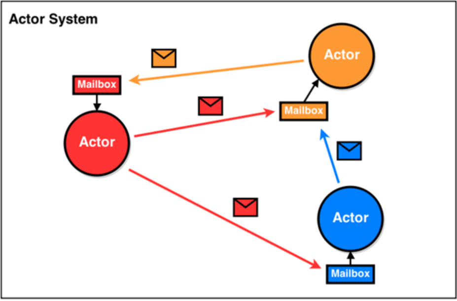
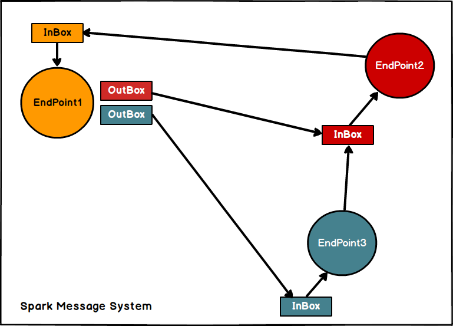
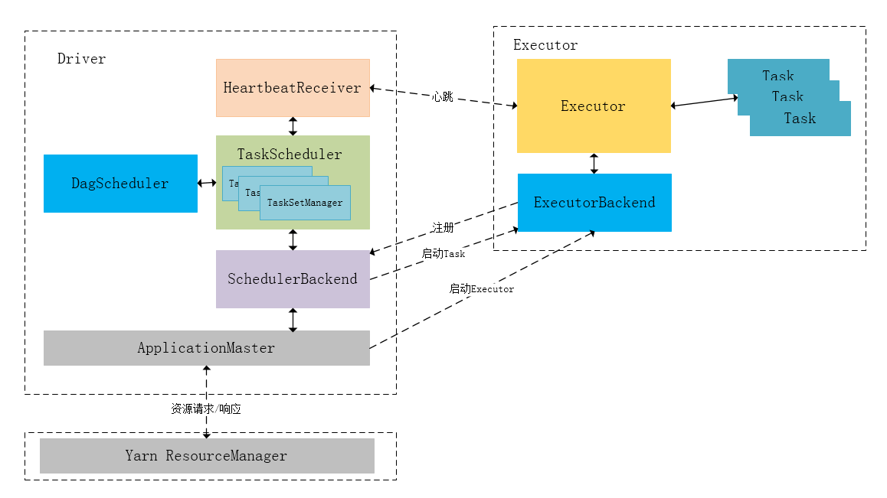
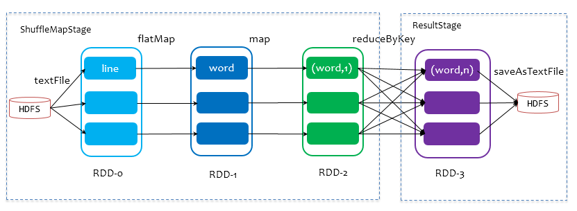
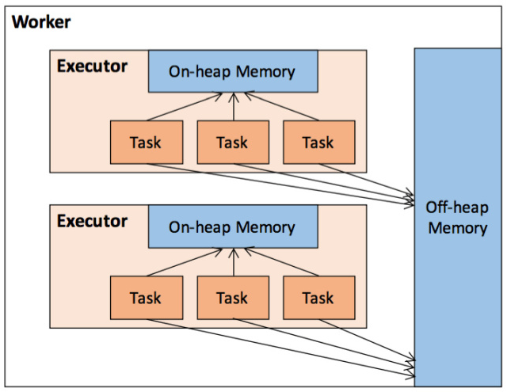
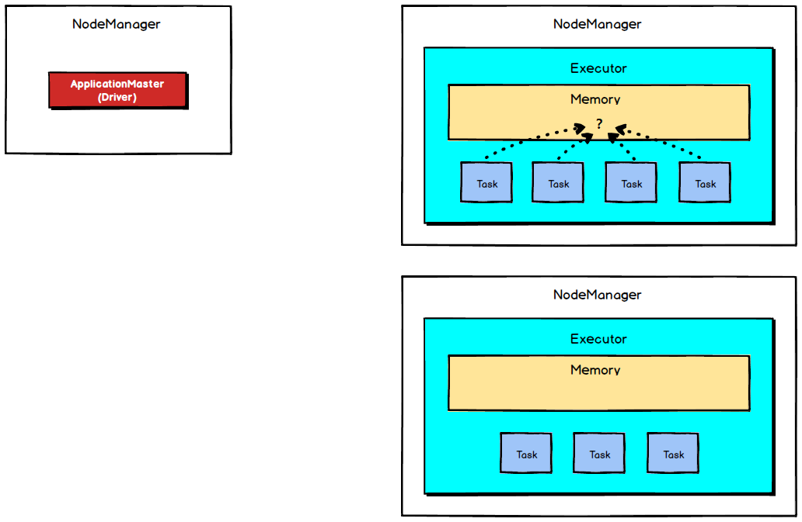
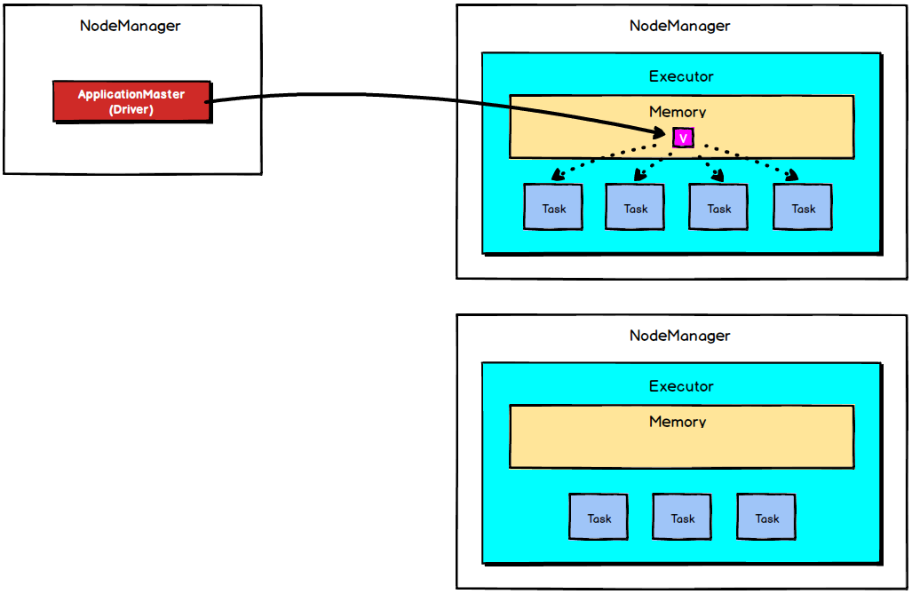

# Spark内核源码阅读笔记

——尚硅谷笔记整理

## SparkCore基础

### 任务提交

```shell
spark-submit \
  --master local[*]  \
  --driver-cores 2   \
  --driver-memory 8g \
  --executor-cores 4 \ #每个executor使用的内核数，默认为1
  --num-executors 10 \ #启动executors的数量，默认为2
  --executor-memory 8g \
  --class PackageName.ClassName XXXX.jar \
  --name "Spark Job Name" \
  InputPath      \
  OutputPath
```

* $executor\_cores\times num\_executors$
  表示的是能够并行执行Task的数目。不宜太小或太大！一般不超过总队列 cores 的 25%，比如队列总 cores 400，最大不要超过100，最小不建议低于 40，除非日志量很小。

* $executor\_cores$
  不宜为1！否则 work 进程中线程数过少，一般 2~4 为宜。

* $executor\_memory$
  一般 6~10g 为宜，最大不超过20G，否则会导致GC代价过高，或资源浪费严重。

* $driver\_memory$
  driver 不做任何计算和存储，只是下发任务与yarn资源管理器和task交互，除非你是 spark-shell，否则一般 1-2g

增加每个executor的内存量，增加了内存量以后，对性能的提升，有三点：

* 如果需要对RDD进行cache，那么更多的内存，就可以**缓存更多的数据**，将更少的数据写入磁盘，
  甚至不写入磁盘，**减少了磁盘IO**。
* 对于shuffle操作，**reduce端，会需要内存来存放拉取的数据并进行聚合**。如果内存不够，也会写入磁盘。如果给executor分配更多内存以后，就有更少的数据，需要写入磁盘，甚至不需要写入磁盘。减少了磁盘IO，提升了性能。
* 对于task的执行，可能会创建很多对象。如果内存比较小，可能会频繁导致JVM堆内存满了，然后**频繁GC，垃圾回收，minor GC和full GC（速度很慢）**。内存加大以后，带来更少的GC，垃圾回收，避免了速度变慢，性能提升。

#### 常见注意事项

* 预处理数据，丢掉一些不必要的数据
* 增加Task的数量
* 过滤掉一些容易导致发生倾斜的key
* 避免创建重复的RDD
* 尽可能复用一个RDD
* 对多次使用的RDD进行持久化
* 尽量避免使用shuffle算子
* 在要使用groupByKey算子的时候，尽量用reduceByKey或者aggregateByKey算子替代。因为调用groupByKey时候，按照相同的key进行分组，形成RDD[key,Iterable[value]]的形式，此时所有的键值对都将被重新洗牌,移动,对网络数据传输造成理论上的最大影响。而reduceByKey用于对每个key对应的多个value进行merge操作，最重要的是它能够在本地先进行merge操作，并且merge操作可以通过函数自定义。 
* 使用高性能的算子

### RDD、Job、Stage & Task

#### RDD

Resilient Distributed DataSet，弹性分布式数据集 ，有三个基本特性：

##### 分区

RDD 只是抽象意义的数据集合，分区内部并不会存储具体的数据，只会存储它在该 RDD 中的 index，通过该 RDD 的 ID 和分区的 index 可以唯一确定对应数据块的编号，然后通过底层存储层的接口提取到数据进行处理。在集群中，各个节点上的数据块会尽可能的存储在内存中，只有当内存没有空间时才会放入硬盘存储，这样可以最大化的减少硬盘 IO 的开销。

一个RDD的分区可以在创建时指定，也可以在计算时更改，默认为程序分到CPU资源的核数。

```scala
rdd.partitions.size //返回rdd的分区数
```

Spark调度任务时，会优先将计算任务分配到数据所在的机器上。Spark默认实现了哈希分区器和区域分区器。

##### 不可变

每个 RDD 都是只读的，它所包含的分区信息是不可变的。

我们在 RDD 的计算过程中，不需要立刻去存储计算出的数据本身，我们只要记录每个 RDD 是经过哪些转化操作得来的，即**依赖关系**，这样一方面可以提高计算效率，一方面是错误恢复会更加容易。 这即是“弹性”。
RDD 在 Lineage 依赖方面分为两种 Narrow Dependencies 与 Wide Dependencies 用来解决**数据容错时的高效性**以及**划分任务**时候起到重要作用。

##### 并行操作

因为RDD的分区特性，所以其天然支持并行处理的特性。即不同节点上的数据可以分别被处理，然后生成一个新的 RDD。

**RDD的弹性**体现在：

1. 自动进行内存和磁盘切换
2. 基于lineage的高效容错
3. task如果失败会特定次数的重试
4. stage如果失败会自动进行特定次数的重试，而且只会只计算失败的分片
5. checkpoint【每次对RDD操作都会产生新的RDD，如果链条比较长，计算比较笨重，就把数据放在硬盘中】和persist 【内存或磁盘中对数据进行复用】(检查点、持久化)
6. 数据调度弹性：DAG TASK 和资源管理无关
7. 数据分片的高度弹性repartion
   

#### Job

根据行动算子划分 

#### Stage

根据 RDD 之间的依赖关系的不同将 Job 划分成不同的 Stage，遇到一个宽依赖则划分一个 Stage。

#### Task

Stage 是一个 TaskSet，将 Stage 根据分区数划分成一个个的 Task  

Spark内核泛指Spark的核心运行机制，包括Spark核心组件的运行机制、Spark任务调度机制、Spark内存管理机制、Spark核心功能的运行原理等，熟练掌握Spark内核原理，能够帮助我们更好地完成Spark代码设计，并能够帮助我们准确锁定项目运行过程中出现的问题的症结所在。

### RDD常见操作

#### 创建

##### 从集合创建

```scala
sc.parallelize
sc.makeRDD(1 to 10, 3)
```

##### 从文件中创建

```scala
sc.textFile(path : String, minSplits : Int = defaultMinSplits)
sc.hadoopFile[K, V, F <: InputFormat[K, V]](path : String, minSplits : Int)
...
```

#### 转换算子

```scala
map()            // x => x
distinct()		 // 去重
flatMap()		 // x => ...

// 重新分区
repartition(numPartitions:Int)	 //底层调用coalesce()	
coalesce(numPartitions:Int, shuffle:Boolean=false) 
//分区数增多，必须shuffle
//分区数较小，可以不shuffle以提高效率

randomSplit(weight:Array[Double], seed:Long)  //将一个RDD切分成多个
glom()           //将RDD中每个分区中T类型的元素转化为Array[T]

union(other:RDD[T])         //合并两个RDD，不去重
intersection(other:RDD[T])  //交集，去重
subtract(other:RDD[T]) 		//差集
//intersection和subtract通常存在shuffle

//map
mapPartitions(Function,Boolean)
mapPartitionsWithIndex(Function,Boolean)
//mapPartitions与map类似，但映射函数的输入由RDD中每个元素变为RDD中每个分区的迭代器。
//在映射过程中如果需要频繁创建对象，map就比较低效，RDD中各个分区可以共享同一个对象以便提高性能，如：将RDD中所有数据通过JDBC连接写入数据库，如果使用map函数会为每个分区创建一个connection，开销很大，如果使用mapPartitions，可以针对每个分区创建一个connection。
//后面的perservesPartitions指明是否保留父RDD信息。

//zip 
zip(other:RDD)      //将两个RDD组合成K/V形式，两个RDD分区数目和每个分区元素必须相同
zipPartitions(.)    //将多个RDD按照分区号组合为新的RDD，必须具有相同分区数

zipWithIndex()		//将RDD中的元素与其ID组合成键值对，需要启动一个job来计算每个分区的起始索引号
zipWithUniqueId()	//这个ID全局唯一，1+k*N

//针对键值对RDD的转换操作
partitionBy(partitioner)
mapValues(Function)
flatMapValues(Function)

//RDD[K,V] => RDD[K,C]
combineByKey(createCombiner,mergerCombiner,partitioner,mapSideCombiner,serializer)
flodByKey(zeroValue,partitioner)
reduceByKey(partitioner,function)
groupByKey(partitioner)
//以上四种都会最终转化为combineByKey
//第一步：根据条件看是否进行mapSideCombiner
//第二步：根据partitioner Shuffle到不同分区
//第三步：再进行一个combiner操作

//join
cogroup(otherRDD, numPartitions)
join(otherRDD)			
leftOuterJoin(otherRDD)
rightOuterJoin(otherRDD)
//底层都是调用cogroup实现
//一个join过程会诞生三个RDD：CoGroupRDD，MapValuesRDD,FlatMapValuesRDD
//CoGroupRDD[K,Array(ArrayBuffer(),ArrayBuffer()...)]
//MapValuesRDD[K,ArrayBuffer(),ArrayBuffer(),...]
//FlatMapValuesRDD[K,V]
subtractByKey(otherRDD) //与subtract类似，只针对K值取差集
```

#### 持久化

```scala
//持久化
cache()
persist(storageLevel)//默认保存在内存中，保留血缘关系
checkpoint//持久化在HDFS，会切断RDD的血缘关系
	//Spark长时间驻留运行，定期checkpoint会节省系统资源
	//维护过长的血缘关系会使RDD容错重算的成本非常高
```

#### 行动算子

Spark中的每个行动算子都会触发Spark的一次调度并返回响应的结果。

```scala
first()				 //返回第一个元素
count()              //返回元素个数
reduce(function)

collect()/toArray()  //以集合形式返回
take(num)			 //返回下标0-num的元素
top(num)			 //按排序返回前num个，默认升序
takeOrdered(num)	 //与top顺序相反

aggregate(zeroValue,seqOpFunction,CombOpFunction)
//zeroValue
//seqOpFunction RDD中每个分区元素的聚合函数
//CombOpFunction 各个分区间的聚合函数
fold(zeroValue,opFunction) //分区间与分区内聚合函数相同

//存储
saveAsTextFile(path)
saveAsHadoopFile(path)
```

## SparkSQL基础

## SparkStream基础

## Spark 内核概述

### Spark 核心组件回顾

#### Driver

Spark驱动器节点，用于执行Spark任务中的main方法，负责实际代码的执行工作。Driver在Spark作业执行时主要负责：

1. 将用户程序转化为作业（job）；
2. 在Executor之间调度任务(task)；
3. 跟踪Executor的执行情况；
4. 通过UI展示查询运行情况；

总的来说，**SparkContext是程序的总入口**，SparkContext初始化过程中，Spark会分别**创建DAGScheduler作业调度和TaskScheduler任务调度两级调度模块**。

**作业调度模块为每个Spark作业根据Shuffle划分Stage，并为每个Stage构建一组具体的任务，然后以TaskSet任务组的形式提交给TaskScheduler。
为了抽象出一个公共的接口供DAGScheduler使用，任务调度模块均是基于TaskScheduler和SchedulerBackend两个接口实现的：**

* **TaskScheduler负责具体启动任务、监控、汇报任务；**
* **SchedulerBackend用来与底层资源调度系统交互，配合TaskScheduler实现具体任务执行所需的资源分配。**

#### Executor

**Spark Executor节点是一个JVM进程，负责在 Spark 作业中运行具体任务，任务彼此之间相互独立。**Spark 应用启动时，Executor节点被同时启动，并且始终伴随着整个 Spark 应用的生命周期而存在。**Excutor对每一个任务创建一个TaskRunner类，交给线程池运行，运行的结果通过ExcutorBackend返回，ExcutorBackend通过Netty与SchedulerBackend通信**。如果有Executor节点发生了故障或崩溃，Spark 应用也可以继续执行，会将出错节点上的任务调度到其他Executor节点上继续运行。

Executor有两个核心功能:

1. **负责运行组成Spark应用的任务，并将结果返回给驱动器进程，一台机器上可以有多个Excutor，一个Excutor可以以多线程的方式运行多个Task，每个Task必须至少独占一个CPU Core；**
2. **它们通过自身的块管理器（Block Manager）为用户程序中要求缓存的 RDD 提供内存式存储。RDD 是直接缓存在Executor进程内的，因此任务可以在运行时充分利用缓存数据加速运算。**

### Spark 通用运行流程概述


图为Spark通用运行流程，**不论Spark以何种模式进行部署，任务提交后，都会先启动Driver进程，随后Driver进程向集群管理器注册应用程序，之后集群管理器根据此任务的配置文件分配Executor并启动，当Driver所需的资源全部满足后，Driver开始执行main函数，Spark查询为懒执行，当执行到action算子时开始反向推算，根据宽依赖进行stage的划分，随后每一个stage对应一个taskset，taskset中有多个task，根据本地化原则，task会被分发到指定的Executor去执行，在任务执行的过程中，Executor也会不断与Driver进行通信，报告任务运行情况。**

## Spark 部署模式

Spark支持3种集群管理器（Cluster Manager），分别为：

1. **Standalone：独立模式，Spark原生的简单集群管理器，自带完整的服务，可单独部署到一个集群中，无需依赖任何其他资源管理系统，使用Standalone可以很方便地搭建一个集群；**
2. Apache Mesos：一个强大的分布式资源管理框架，它允许多种不同的框架部署在其上，包括yarn；
3. **Hadoop YARN：统一的资源管理机制，在上面可以运行多套计算框架，如mapreduce、storm等，根据driver在集群中的位置不同，分为yarn client和yarn cluster。**

实际上，除了上述这些通用的集群管理器外，Spark内部也提供了一些方便用户测试和学习的简单集群部署模式。由于在实际工厂环境下使用的绝大多数的集群管理器是Hadoop YARN，因此我们关注的重点是Hadoop YARN模式下的Spark集群部署。
**Spark的运行模式取决于传递给SparkContext的MASTER环境变量的值**，个别模式还需要辅助的程序接口来配合使用，目前支持的Master字符串及URL包括：

| **Master URL**        | **Meaning**                                                  |
| :-------------------- | :----------------------------------------------------------- |
| **local**             | 在本地运行，只有一个工作进程，无并行计算能力。               |
| **local[K]**          | 在本地运行，有K个工作进程，通常设置K为机器的CPU核心数量。    |
| **local[\*]**         | 在本地运行，工作进程数量等于机器的CPU核心数量。              |
| **spark://HOST:PORT** | 以Standalone模式运行，这是Spark自身提供的集群运行模式，默认端口号: 7077。详细文档见:Spark standalone cluster。 |
| **mesos://HOST:PORT** | 在Mesos集群上运行，Driver进程和Worker进程运行在Mesos集群上，部署模式必须使用固定值:–deploy-mode cluster。详细文档见:MesosClusterDispatcher. |
| **yarn-client**       | 在Yarn集群上运行，Driver进程在本地，Executor进程在Yarn集群上，部署模式必须使用固定值:–deploy-mode client。Yarn集群地址必须在HADOOP_CONF_DIR or YARN_CONF_DIR变量里定义。 |
| **yarn-cluster**      | 在Yarn集群上运行，Driver进程在Yarn集群上，Work进程也在Yarn集群上，部署模式必须使用固定值:–deploy-mode cluster。Yarn集群地址必须在HADOOP_CONF_DIR or YARN_CONF_DIR变量里定义。 |

用户在提交任务给Spark处理时，以下两个参数共同决定了Spark的运行方式。
**· –master MASTER_URL ：决定了Spark任务提交给哪种集群处理。**
**· –deploy-mode DEPLOY_MODE：决定了Driver的运行方式，可选值为Client或者Cluster。**

### Standalone 模式运行机制

Standalone集群有四个重要组成部分，分别是:

1. **Driver**：是一个进程，我们编写的Spark应用程序就运行在Driver上，由Driver进程执行；
2. **Master**(RM)：是一个进程，主要负责资源的调度和分配，并进行集群的监控等职责；
3. **Worker**(NM)：是一个进程，一个Worker运行在集群中的一台服务器上，主要负责两个职责，一个是用自己的内存存储RDD的某个或某些partition；另一个是启动其他进程和线程（Executor），对RDD上的partition进行并行的处理和计算。
4. **Executor**：是一个进程，一个Worker上可以运行多个Executor，Executor通过启动多个线程（task）来执行对RDD的partition进行并行计算，也就是执行我们对RDD定义的例如map、flatMap、reduce等算子操作。

#### Standalone Client 模式


在Standalone Client模式下，Driver在任务提交的本地机器上运行，Driver启动后向Master注册应用程序，Master根据submit脚本的资源需求找到内部资源至少可以启动一个Executor的所有Worker，然后在这些Worker之间分配Executor，Worker上的Executor启动后会向Driver反向注册，所有的Executor注册完成后，Driver开始执行main函数，之后执行到Action算子时，开始划分stage，每个stage生成对应的taskSet，之后将task分发到各个Executor上执行。

#### Standalone Cluster模式


在Stan54本的资源需求找到内部资源至少可以启动一个Executor的所有Worker，然后在这些Worker之间分配Executor，Worker上的Executor启动后会向Driver反向注册，所有的Executor注册完成后，Driver开始执行main函数，之后执行到Action算子时，开始划分stage，每个stage生成对应的taskSet，之后将task分发到各个Executor上执行。
**注意**
Standalone的两种模式下（client/Cluster），Master在接到Driver注册Spark应用程序的请求后，会获取其所管理的剩余资源能够启动一个Executor的所有Worker，然后在这些Worker之间分发Executor，此时的分发只考虑Worker上的资源是否足够使用，直到当前应用程序所需的所有Executor都分配完毕，Executor反向注册完毕后，Driver开始执行main程序。

### Yarn 模式运行机制

#### Yarn Client 模式


在YARN Client模式下，Driver在任务提交的本地机器上运行，**Driver启动后会和ResourceManager通讯申请启动ApplicationMaster**，随后**ResourceManager分配container**，在合适的NodeManager上**启动ApplicationMaster**，此时的**ApplicationMaster的功能相当于一个ExecutorLaucher，只负责向ResourceManager申请Executor内存**。

ResourceManager接到ApplicationMaster的资源申请后会**分配container**，然后ApplicationMaster**在资源分配指定的NodeManager上启动Executor进程**，Executor进程启动后会**向Driver反向注册**，Executor**全部注册完成后Driver开始执行main函数**，之后**执行到Action算子时，触发一个job**，并根据宽依赖开始**划分stage**，每个stage**生成对应的taskSet**，之后**将task分发到各个Executor上执行**。

**AppMaster负责Excutor的申请，Driver负责Job和Stage的划分以及Task的创建、分配、调度。**

#### Yarn Cluster 模式


在YARN Cluster模式下，任务提交后会和ResourceManager通讯申请启动ApplicationMaster，随后ResourceManager分配container，在合适的NodeManager上启动ApplicationMaster，此时的ApplicationMaster就是Driver。

Driver启动后向ResourceManager申请Executor内存，ResourceManager接到ApplicationMaster的资源申请后会分配container，然后在合适的NodeManager上启动Executor进程，Executor进程启动后会向Driver反向注册，Executor全部注册完成后Driver开始执行main函数，之后执行到Action算子时，触发一个job，并根据宽依赖开始划分stage，每个stage生成对应的taskSet，之后将task分发到各个Executor上执行。

## Spark 通讯架构

### Spark 通信架构概述

Spark2.x版本使用Netty通讯框架作为内部通讯组件。spark 基于netty新的rpc框架借鉴了Akka的中的设计，它是基于Actor模型，如下图所示：

Spark通讯框架中各个组件（Client/Master/Worker）可以认为是一个个独立的实体，各个实体之间通过消息来进行通信。具体各个组件之间的关系图如下：


Endpoint（Client/Master/Worker）有1个InBox和N个OutBox（N>Endpoint（Client/Master/Worker）有1个InBox和N个OutBox（N>=1，N取决于当前Endpoint与多少其他的Endpoint进行通信，一个与其通讯的其他Endpoint对应一个OutBox），Endpoint接收到的消息被写入InBox，发送出去的消息写入OutBox并被发送到其他Endpoint的InBox中。


### Spark 通讯架构解析

Spark通信架构如下图所示：


1. RpcEndpoint：RPC端点，Spark针对每个节点（Client/Master/Worker）都称之为一个Rpc端点，且都实现RpcEndpoint接口，内部根据不同端点的需求，设计不同的消息和不同的业务处理，如果需要发送（询问）则调用Dispatcher；
2. RpcEnv：RPC上下文环境，每个RPC端点运行时依赖的上下文环境称为RpcEnv；
3. Dispatcher：消息分发器，针对于RPC端点需要发送消息或者从远程RPC接收到的消息，分发至对应的指令收件箱/发件箱。如果指令接收方是自己则存入收件箱，如果指令接收方不是自己，则放入发件箱；
4. Inbox：指令消息收件箱，一个本地RpcEndpoint对应一个收件箱，Dispatcher在每次向Inbox存入消息时，都将对应EndpointData加入内部ReceiverQueue中，另外Dispatcher创建时会启动一个单独线程进行轮询ReceiverQueue，进行收件箱消息消费；
5. RpcEndpointRef：RpcEndpointRef是对远程RpcEndpoint的一个引用。当我们需要向一个具体的RpcEndpoint发送消息时，一般我们需要获取到该RpcEndpoint的引用，然后通过该应用发送消息。
6. OutBox：指令消息发件箱，对于当前RpcEndpoint来说，一个目标RpcEndpoint对应一个发件箱，如果向多个目标RpcEndpoint发送信息，则有多个OutBox。当消息放入Outbox后，紧接着通过TransportClient将消息发送出去。消息放入发件箱以及发送过程是在同一个线程中进行；
7. RpcAddress：表示远程的RpcEndpointRef的地址，Host + Port。
8. TransportClient：Netty通信客户端，一个OutBox对应一个TransportClient，TransportClient不断轮询OutBox，根据OutBox消息的receiver信息，请求对应的远程TransportServer；
9. TransportServer：Netty通信服务端，一个RpcEndpoint对应一个TransportServer，接受远程消息后调用Dispatcher分发消息至对应收发件箱；
   根据上面的分析，Spark通信架构的高层视图如下图所示：
   

## Spark 任务调度机制

在工厂环境下，Spark集群的部署方式一般为YARN-Cluster模式，之后的内核分析内容中我们默认集群的部署方式为YARN-Cluster模式。

### Spark 任务提交流程


下面的时序图清晰地说明了一个Spark应用程序从提交到运行的完整流程：

提交一个Spark应用程序，首先通过Client向ResourceManager请求启动一个Application，同时检查是否有足够的资源满足Application的需求，如果资源条件满足，则准备ApplicationMaster的启动上下文，交给ResourceManager，并循环监控Application状态。

当提交的资源队列中有资源时，ResourceManager会在某个NodeManager上启动ApplicationMaster进程，ApplicationMaster会单独启动Driver后台线程，当Driver启动后，ApplicationMaster会通过本地的RPC连接Driver，并开始向ResourceManager申请Container资源运行Executor进程（一个Executor对应与一个Container），当ResourceManager返回Container资源，ApplicationMaster则在对应的Container上启动Executor。

Driver线程主要是初始化SparkContext对象，准备运行所需的上下文，然后一方面保持与ApplicationMaster的RPC连接，通过ApplicationMaster申请资源，另一方面根据用户业务逻辑开始调度任务，将任务下发到已有的空闲Executor上。

当ResourceManager向ApplicationMaster返回Container资源时，ApplicationMaster就尝试在对应的Container上启动Executor进程，Executor进程起来后，会向Driver反向注册，注册成功后保持与Driver的心跳，同时等待Driver分发任务，当分发的任务执行完毕后，将任务状态上报给Driver。

从上述时序图可知，Client只负责提交Application并监控Application的状态。对于Spark的任务调度主要是集中在两个方面: 资源申请和任务分发，其主要是通过ApplicationMaster、Driver以及Executor之间来完成。

### Spark 任务调度概述

当Driver起来后，Driver则会根据用户程序逻辑准备任务，并根据Executor资源情况逐步分发任务。在详细阐述任务调度前，首先说明下Spark里的几个概念。一个Spark应用程序包括Job、Stage以及Task三个概念：

* Job是以Action方法为界，遇到一个Action方法则触发一个Job；
* Stage是Job的子集，以RDD宽依赖(即Shuffle)为界，遇到Shuffle做一次划分；
* Task是Stage的子集，以并行度(分区数)来衡量，分区数是多少，则有多少个task。
  Spark的任务调度总体来说分两路进行，一路是Stage级的调度，一路是Task级的调度，总体调度流程如下图所示：
  

Spark RDD通过其Transactions操作，形成了RDD血缘关系图，即DAG，最后通过Action的调用，触发Job并调度执行。DAGScheduler负责Stage级的调度，主要是将job切分成若干Stages，并将每个Stage打包成TaskSet交给TaskScheduler调度。TaskScheduler负责Task级的调度，将DAGScheduler给过来的TaskSet按照指定的调度策略分发到Executor上执行，调度过程中SchedulerBackend负责提供可用资源，其中SchedulerBackend有多种实现，分别对接不同的资源管理系统。有了上述感性的认识后，下面这张图描述了Spark-On-Yarn模式下在任务调度期间，ApplicationMaster、Driver以及Executor内部模块的交互过程：


Driver初始化SparkContext过程中，会分别初始化DAGScheduler、TaskScheduler、SchedulerBackend以及HeartbeatReceiver，并启动SchedulerBackend以及HeartbeatReceiver。SchedulerBackend通过ApplicationMaster申请资源，并不断从TaskScheduler中拿到合适的Task分发到Executor执行。HeartbeatReceiver负责接收Executor的心跳信息，监控Executor的存活状况，并通知到TaskScheduler。

### Spark Stage级调度

Spark的任务调度是从DAG切割开始，主要是由DAGScheduler来完成。当遇到一个Action操作后就会触发一个Job的计算，并交给DAGScheduler来提交，下图是涉及到Job提交的相关方法调用流程图。


Job由最终的RDD和Action方法封装而成，SparkContext将Job交给DAGScheduler提交，它会根据RDD的血缘关系构成的DAG进行切分，将一个Job划分为若干Stages，具体划分策略是，由最终的RDD不断通过依赖回溯判断父依赖是否是宽依赖，即以Shuffle为界，划分Stage，窄依赖的RDD之间被划分到同一个Stage中，可以进行pipeline式的计算，如上图紫色流程部分。**划分的Stages分两类，一类叫做ResultStage，为DAG最下游的Stage，由Action方法决定，另一类叫做ShuffleMapStage，为下游Stage准备数据**，下面看一个简单的例子WordCount。

Job由saveAsTextFile触发，该Job由RDD-3和saveAsTextFile方法组成，根据RDD之间的依赖关系从RDD-3开始回溯搜索，直到没有依赖的RDD-0，在**回溯搜索**过程中，RDD-3依赖RDD-2，并且是宽依赖，所以在RDD-2和RDD-3之间划分Stage，RDD-3被划到最后一个Stage，即ResultStage中，RDD-2依赖RDD-1，RDD-1依赖RDD-0，这些依赖都是窄依赖，所以将RDD-0、RDD-1和RDD-2划分到同一个Stage，即ShuffleMapStage中，实际执行的时候，数据记录会一气呵成地执行RDD-0到RDD-2的转化。不难看出，其本质上是一个深度优先搜索算法。

**一个Stage是否被提交，需要判断它的父Stage是否执行，只有在父Stage执行完毕才能提交当前Stage，如果一个Stage没有父Stage，那么从该Stage开始提交。**Stage提交时会将Task信息（分区信息以及方法等）序列化并被打包成TaskSet交给TaskScheduler，一个Partition对应一个Task，另一方面TaskScheduler会监控Stage的运行状态，只有Executor丢失或者Task由于Fetch失败才需要重新提交失败的Stage以调度运行失败的任务，其他类型的Task失败会在TaskScheduler的调度过程中重试。

相对来说DAGScheduler做的事情较为简单，仅仅是在Stage层面上划分DAG，提交Stage并监控相关状态信息。TaskScheduler则相对较为复杂，下面详细阐述其细节。

### Spark Task 级调度

Spark Task的调度是由TaskScheduler来完成，由前文可知，**DAGScheduler将Stage打包到TaskSet交给TaskScheduler**，**TaskScheduler会将TaskSet封装为TaskSetManager加入到调度队列**中，TaskSetManager结构如下图所示。


**TaskSetManager负责监控管理同一个Stage中的Tasks，TaskScheduler就是以TaskSetManager为单元来调度任务。**


前面也提到，**TaskScheduler初始化后会启动SchedulerBackend，它负责跟外界打交道，接收Executor的注册信息，并维护Executor的状态**，所以说SchedulerBackend是管“粮食”的，同时它在启动后会定期地去“询问”TaskScheduler有没有任务要运行，也就是说，它会定期地“问”TaskScheduler“我有这么余量，你要不要啊”，TaskScheduler在SchedulerBackend“问”它的时候，会**从调度队列中按照指定的调度策略选择TaskSetManager去调度运行**，大致方法调用流程如下图所示：


将TaskSetManager加入rootPool调度池中之后，调用SchedulerBackend的reciveOffers方法给driverEndpoint发送ReciveOffer消息；**driverEndpoint收到ReviveOffer消息后调用makeOffers方法，过滤出活跃状态的Executor（这些Executor都是任务启动时反向注册到Driver的Executor），然后将Executor封装成WorkerOffer对象；准备好计算资源（WorkerOffer）后，taskScheduler基于这些资源调用resourceOffer在Executor上分配task。**

#### 调度策略

前面讲到，TaskScheduler会先把DAGScheduler给过来的TaskSet封装成TaskSetManager扔到任务队列里，然后再从任务队列里按照一定的规则把它们取出来在SchedulerBackend给过来的Executor上运行。这个调度过程实际上还是比较粗粒度的，是面向TaskSetManager的。
**TaskScheduler是以树的方式来管理任务队列，树中的节点类型为Schdulable，叶子节点为TaskSetManager，非叶子节点为Pool**，下图是它们之间的继承关系。


TaskScheduler**支持两种调度策略，一种是FIFO，也是默认的调度策略，另一种是FAIR**。在TaskScheduler初始化过程中会实例化rootPool，表示树的根节点，是Pool类型。

##### FIFO调度策略

如果是采用FIFO调度策略，则直接简单地将TaskSetManager按照先来先到的方式入队，出队时直接拿出最先进队的TaskSetManager，其树结构如下图所示，TaskSetManager保存在一个FIFO队列中。


##### FAIR 调度策略

FAIR调度策略的树结构如下图所示：


FAIR模式中有一个rootPool和多个子Pool，各个子Pool中存储着所有待分配的TaskSetMagager。
在FAIR模式中，需要**先对子Pool进行排序，再对子Pool里面的TaskSetMagager进行排序**，因为Pool和TaskSetMagager都继承了Schedulable特质，因此使用相同的排序算法。
排序过程的比较是基于Fair-share来比较的，**每个要排序的对象包含三个属性: runningTasks值（正在运行的Task数）、minShare值、weight值**，比较时会综合考量runningTasks值，minShare值以及weight值。
注意，minShare、weight的值均在公平调度配置文件fairscheduler.xml中被指定，调度池在构建阶段会读取此文件的相关配置。

1. 如果A对象的runningTasks大于它的minShare，B对象的runningTasks小于它的minShare，那么B排在A前面；（runningTasks比minShare小的先执行）
2. 如果A、B对象的runningTasks都小于它们的minShare，那么就比较runningTasks与minShare的比值（minShare使用率），谁小谁排前面；（minShare使用率低的先执行）
3. 如果A、B对象的runningTasks都大于它们的minShare，那么就比较runningTasks与weight的比值（权重使用率），谁小谁排前面。（权重使用率低的先执行）
4. 如果上述比较均相等，则比较名字。
   整体上来说就是通过minShare和weight这两个参数控制比较过程，可以做到让minShare使用率和权重使用率少（实际运行task比例较少）的先运行。
   FAIR模式排序完成后，所有的TaskSetManager被放入一个ArrayBuffer里，之后依次被取出并发送给Executor执行。
   从调度队列中拿到TaskSetManager后，由于TaskSetManager封装了一个Stage的所有Task，并负责管理调度这些Task，那么接下来的工作就是TaskSetManager按照一定的规则一个个取出Task给TaskScheduler，TaskScheduler再交给SchedulerBackend去发到Executor上执行。

#### 本地化调度

DAGScheduler切割Job，划分Stage, 通过调用submitStage来提交一个Stage对应的tasks，submitStage会调用submitMissingTasks，submitMissingTasks 确定每个需要计算的 task 的preferredLocations，通过调用getPreferrdeLocations()得到partition 的优先位置，由于一个partition对应一个task，此partition的优先位置就是task的优先位置，对于要提交到TaskScheduler的TaskSet中的每一个task，该task优先位置与其对应的partition对应的优先位置一致。

从调度队列中拿到TaskSetManager后，那么接下来的工作就是TaskSetManager按照一定的规则一个个取出task给TaskScheduler，TaskScheduler再交给SchedulerBackend去发到Executor上执行。前面也提到，TaskSetManager封装了一个Stage的所有task，并负责管理调度这些task。

根据每个task的优先位置，确定task的Locality级别，Locality一共有五种，优先级由高到低顺序：

| **名称**          | **解析**                                                     |
| :---------------- | :----------------------------------------------------------- |
| **PROCESS_LOCAL** | 进程本地化，task和数据在同一个Executor中，性能最好。         |
| **NODE_LOCAL**    | 节点本地化，task和数据在同一个节点中，但是task和数据不在同一个Executor中，数据需要在进程间进行传输。 |
| **RACK_LOCAL**    | 机架本地化，task和数据在同一个机架的两个节点上，数据需要通过网络在节点之间进行传输。 |
| **NO_PREF**       | 对于task来说，从哪里获取都一样，没有好坏之分。               |
| **ANY**           | task和数据可以在集群的任何地方，而且不在一个机架中，性能最差。 |

在调度执行时，Spark调度总是会尽量让每个task以最高的本地性级别来启动，当一个task以X本地性级别启动，但是该本地性级别对应的所有节点都没有空闲资源而启动失败，此时并不会马上降低本地性级别启动而是在某个时间长度内再次以X本地性级别来启动该task，若超过限时时间则降级启动，去尝试下一个本地性级别，依次类推。

可以通过调大每个类别的最大容忍延迟时间，在等待阶段对应的Executor可能就会有相应的资源去执行此task，这就在在一定程度上提到了运行性能。

#### 失败重试与黑名单机制

除了选择合适的Task调度运行外，还需要监控Task的执行状态，前面也提到，与外部打交道的是SchedulerBackend，Task被提交到Executor启动执行后，Executor会将执行状态上报给SchedulerBackend，SchedulerBackend则告诉TaskScheduler，TaskScheduler找到该Task对应的TaskSetManager，并通知到该TaskSetManager，这样TaskSetManager就知道Task的失败与成功状态，对于失败的Task，会记录它失败的次数，如果失败次数还没有超过最大重试次数，那么就把它放回待调度的Task池子中，否则整个Application失败。

在记录Task失败次数过程中，会记录它上一次失败所在的Executor Id和Host，这样下次再调度这个Task时，会使用黑名单机制，避免它被调度到上一次失败的节点上，起到一定的容错作用。黑名单记录Task上一次失败所在的Executor Id和Host，以及其对应的“拉黑”时间，“拉黑”时间是指这段时间内不要再往这个节点上调度这个Task了。

## Spark Shuffle 解析

### Shuffle 的核心要点

#### ShuffleMapStage与ResultStage


**在划分stage时，最后一个stage称为finalStage，它本质上是一个ResultStage对象，前面的所有stage被称为ShuffleMapStage。**
**ShuffleMapStage的结束伴随着shuffle文件的写磁盘。**
**ResultStage基本上对应代码中的action算子，即将一个函数应用在RDD的各个partition的数据集上，意味着一个job的运行结束。**

#### Shuffle中的任务个数

我们知道，**Spark Shuffle分为map阶段和reduce阶段**，或者称之为**ShuffleRead**阶段和**ShuffleWrite**阶段，那么对于一次Shuffle，map过程和reduce过程都会由若干个task来执行，那么map task和reduce task的数量是如何确定的呢？

假设**Spark任务从HDFS中读取数据**，那么**初始RDD分区个数由该文件的split个数决定**，也就是一个split对应生成的RDD的一个partition，我们假设初始partition个数为N。

初始RDD经过一系列算子计算后（假设没有执行repartition和coalesce算子进行重分区，则分区个数不变，仍为N，如果经过重分区算子，那么分区个数变为M），我们假设分区个数不变，当执行到Shuffle操作时，map端的task个数和partition个数一致，即map task为N个。

**reduce端的stage默认取spark.default.parallelism这个配置项的值作为分区数**，如果**没有配置，则以map端的最后一个RDD的分区数作为其分区数**（也就是N），那么**分区数就决定了reduce端的task的个数**。

#### reduce端数据的读取

根据stage的划分我们知道，map端task和reduce端task不在相同的stage中，map task位于ShuffleMapStage，reduce task位于ResultStage，map task会先执行，那么后执行的reduce task如何知道从哪里去拉取map task落盘后的数据呢？
**reduce端的数据拉取过程如下：**

1. map task 执行完毕后会将**计算状态以及磁盘小文件位置等信息封装到MapStatus对象**中，然后由**本进程中的MapOutPutTrackerWorker对象将mapStatus对象发送给Driver进程的MapOutPutTrackerMaster对象**；
2. 在reduce task开始执行之前会先让本进程中的MapOutputTrackerWorker向Driver进程中的MapoutPutTrakcerMaster发动请求，**请求磁盘小文件位置信息**；
3. **当所有的Map task执行完毕后**，Driver进程中的MapOutPutTrackerMaster就掌握了所有的磁盘小文件的位置信息。此时MapOutPutTrackerMaster会告诉MapOutPutTrackerWorker磁盘小文件的位置信息；
4. 完成之前的操作之后，由**BlockTransforService去Executor0所在的节点拉数据，默认会启动五个子线程。每次拉取的数据量不能超过48M（reduce task每次最多拉取48M数据，将拉来的数据存储到Executor内存的20%内存中）**。

### HashShuffle解析

以下的讨论都假设每个Executor有1个CPU core。

#### 未经优化的HashShuffleManager

**shuffle write**阶段，主要就是在一个stage结束计算之后，为了下一个stage可以执行shuffle类的算子（比如reduceByKey），而**将每个task处理的数据按key进行“划分”**。所谓“划分”，就是对相同的key执行hash算法，从而将相同key都写入同一个磁盘文件中，而每一个磁盘文件都只属于下游stage的一个task。在将数据写入磁盘之前，会先将数据写入内存缓冲中，当内存缓冲填满之后，才会溢写到磁盘文件中去。

下一个stage的task有多少个，当前stage的每个task就要创建多少份磁盘文件。比如下一个stage总共有100个task，那么当前stage的每个task都要创建100份磁盘文件。如果当前stage有50个task，总共有10个Executor，每个Executor执行5个task，那么每个Executor上总共就要创建500个磁盘文件，所有Executor上会创建5000个磁盘文件。由此可见，**未经优化的shuffle write操作所产生的磁盘文件的数量是极其惊人的**。

**shuffle read**阶段，通常就是一个stage刚开始时要做的事情。此时该stage的每一个task就需要**将上一个stage的计算结果中的所有相同key，从各个节点上通过网络都拉取到自己所在的节点上**，然后进行key的聚合或连接等操作。由于shuffle write的过程中，map task给下游stage的每个reduce task都创建了一个磁盘文件，因此shuffle read的过程中，每个reduce task只要从上游stage的所有map task所在节点上，拉取属于自己的那一个磁盘文件即可。

**shuffle read的拉取过程是一边拉取一边进行聚合的。每个shuffle read task都会有一个自己的buffer缓冲，每次都只能拉取与buffer缓冲相同大小的数据，然后通过内存中的一个Map进行聚合等操作**。聚合完一批数据后，再拉取下一批数据，并放到buffer缓冲中进行聚合操作。以此类推，直到最后将所有数据到拉取完，并得到最终的结果。

未优化的HashShuffleManager工作原理如图所示：


#### 优化后的HashShuffleManager

为了优化HashShuffleManager我们可以设置一个参数，spark.shuffle. consolidateFiles，该参数默认值为false，将其设置为true即可开启优化机制，通常来说，如果我们使用HashShuffleManager，那么都建议开启这个选项。

开启**consolidate机制**之后，在shuffle write过程中，task就不是为下游stage的每个task创建一个磁盘文件了，此时会出现**shuffleFileGroup**的概念，**每个shuffleFileGroup会对应一批磁盘文件，磁盘文件的数量与下游stage的task数量是相同的。**一个Executor上有多少个CPU core，就可以并行执行多少个task。而第一批并行执行的每个task都会创建一个shuffleFileGroup，并将数据写入对应的磁盘文件内。

当Executor的CPU core执行完一批task，接着执行下一批task时，下一批task就会复用之前已有的shuffleFileGroup，包括其中的磁盘文件，也就是说，此时task会将数据写入已有的磁盘文件中，而不会写入新的磁盘文件中。因此，consolidate机制允许不同的task复用同一批磁盘文件，这样就可以有效将多个task的磁盘文件进行一定程度上的合并，从而大幅度减少磁盘文件的数量，进而提升shuffle write的性能。

假设第二个stage有100个task，第一个stage有50个task，总共还是有10个Executor（Executor CPU个数为1），每个Executor执行5个task。那么原本使用未经优化的HashShuffleManager时，每个Executor会产生500个磁盘文件，所有Executor会产生5000个磁盘文件的。但是此时经过优化之后，每个Executor创建的磁盘文件的数量的计算公式为：CPU core的数量 * 下一个stage的task数量，也就是说，每个Executor此时只会创建100个磁盘文件，所有Executor只会创建1000个磁盘文件。

优化后的HashShuffleManager工作原理如图所示：


#### SortShuffle解析

SortShuffleManager的运行机制主要分成两种，一种是普通运行机制，另一种是bypass运行机制。**当shuffle read task的数量小于等于spark.shuffle.sort. bypassMergeThreshold参数的值时（默认为200），就会启用bypass机制。**

##### **普通运行机制**

在该模式下，数据会先写入一个内存数据结构中，此时**根据不同的shuffle算子，可能选用不同的数据结构**。如果是reduceByKey这种**聚合类的shuffle算子，那么会选用Map数据结构，一边通过Map进行聚合，一边写入内存**；如果是**join这种普通的shuffle算子，那么会选用Array数据结构，直接写入内存**。接着，每写一条数据进入内存数据结构之后，就会判断一下，是否达到了某个临界阈值。如果**达到临界阈值的话，那么就会尝试将内存数据结构中的数据溢写到磁盘，然后清空内存数据结构。**

在溢写到磁盘文件之前，会**先根据key对内存数据结构中已有的数据进行排序**。排序过后，会**分批将数据写入磁盘文件。默认的batch数量是10000条**，也就是说，排序好的数据，会以每批1万条数据的形式分批写入磁盘文件。写入磁盘文件是通过Java的**BufferedOutputStream**实现的。BufferedOutputStream是Java的缓冲输出流，**首先会将数据缓冲在内存中，当内存缓冲满溢之后再一次写入磁盘文件中，这样可以减少磁盘IO次数，提升性能**。

一个task将所有数据写入内存数据结构的过程中，会发生多次磁盘溢写操作，也就会产生多个临时文件。最后会将之前**所有的临时磁盘文件都进行合并，这就是merge过程**，此时会将之前所有临时磁盘文件中的数据读取出来，然后**依次写入最终的磁盘文件之中**。此外，由于一个task就只对应一个磁盘文件，也就意味着该task为下游stage的task准备的数据都在这一个文件中，**因此还会单独写一份索引文件，其中标识了下游各个task的数据在文件中的start offset与end offset。**

SortShuffleManager由于有一个磁盘文件merge的过程，因此大大减少了文件数量。比如第一个stage有50个task，总共有10个Executor，每个Executor执行5个task，而第二个stage有100个task。由于每个task最终只有一个磁盘文件，因此此时每个Executor上只有5个磁盘文件，所有Executor只有50个磁盘文件。

普通运行机制的SortShuffleManager工作原理如图所示：


##### **bypass运行机制**

**bypass运行机制的触发条件如下：**

* **shuffle map task数量小于spark.shuffle.sort.bypassMergeThreshold参数的值。**
* **不是聚合类的shuffle算子。**

此时，每个task会**为每个下游task都创建一个临时磁盘文件**，并将数据按key进行hash然后**根据key的hash值，将key写入对应的磁盘文件之中**。当然，写入磁盘文件时也是先写入内存缓冲，缓冲写满之后再溢写到磁盘文件的。最后，同样会将所有**临时磁盘文件都合并成一个磁盘文件，并创建一个单独的索引文件**。

该过程的磁盘写机制其实跟未经优化的HashShuffleManager是一模一样的，因为都要创建数量惊人的磁盘文件，只是在最后会做一个磁盘文件的合并而已。因此少量的最终磁盘文件，也让该机制相对未经优化的HashShuffleManager来说，shuffle read的性能会更好。

而该机制与普通SortShuffleManager运行机制的不同在于：**第一，磁盘写机制不同；第二，不会进行排序。**也就是说，启用该机制的最大好处在于，shuffle write过程中，不需要进行数据的排序操作，也就节省掉了这部分的性能开销。

bypass运行机制的SortShuffleManager工作原理如图所示：


## Spark 内存管理

在执行Spark 的应用程序时，**Spark 集群会启动 Driver 和 Executor 两种 JVM 进程**，前者为主控进程，负责创建 Spark 上下文，提交 Spark 作业（Job），并将作业转化为计算任务（Task），在各个 Executor 进程间协调任务的调度，后者负责在工作节点上执行具体的计算任务，并将结果返回给 Driver，同时为需要持久化的 RDD 提供存储功能。由于 Driver 的内存管理相对来说较为简单，本节主要对 Executor 的内存管理进行分析，下文中的 Spark 内存均特指 Executor 的内存。

### 堆内和堆外内存规划

作为一个 JVM 进程，Executor 的内存管理建立在 JVM 的内存管理之上，Spark 对 JVM 的堆内（On-heap）空间进行了更为详细的分配，以充分利用内存。同时，Spark 引入了堆外（Off-heap）内存，使之可以直接在工作节点的系统内存中开辟空间，进一步优化了内存的使用。
**堆内内存受到JVM统一管理，堆外内存是直接向操作系统进行内存的申请和释放。**


#### 堆内内存

堆内内存的大小，**由 Spark 应用程序启动时的 –executor-memory 或 spark.executor.memory 参数配置**。Executor 内运行的并发任务共享 JVM 堆内内存，这些任务在**缓存 RDD 数据和广播（Broadcast）数据时占用的内存被规划为存储（Storage）内存**，而这些任务在**执行 Shuffle 时占用的内存被规划为执行（Execution）内存**，**剩余的部分不做特殊规划**，那些 Spark 内部的对象实例，或者用户定义的 Spark 应用程序中的对象实例，均占用剩余的空间。不同的管理模式下，这三部分占用的空间大小各不相同。
Spark 对堆内内存的管理是一种逻辑上的”规划式”的管理，因为对象实例占用内存的申请和释放都由 JVM 完成，Spark 只能在申请后和释放前记录这些内存，我们来看其具体流程：
**申请内存流程如下：**

1. Spark 在代码中 new 一个对象实例；
2. JVM 从堆内内存分配空间，创建对象并返回对象引用；
3. Spark 保存该对象的引用，记录该对象占用的内存。

**释放内存流程如下：**

1. Spark记录该对象释放的内存，删除该对象的引用；
2. 等待JVM的垃圾回收机制释放该对象占用的堆内内存。

我们知道，**JVM 的对象可以以序列化的方式存储，序列化的过程是将对象转换为二进制字节流，本质上可以理解为将非连续空间的链式存储转化为连续空间或块存储**，在访问时则需要进行序列化的逆过程——反序列化，将字节流转化为对象，序列化的方式可以节省存储空间，但增加了存储和读取时候的计算开销。

对于 **Spark 中序列化的对象，由于是字节流的形式，其占用的内存大小可直接计算，而对于非序列化的对象，其占用的内存是通过周期性地采样近似估算而得**，即并不是每次新增的数据项都会计算一次占用的内存大小，这种方法降低了时间开销但是有可能误差较大，导致**某一时刻的实际内存有可能远远超出预期**。此外，在**被 Spark 标记为释放的对象实例，很有可能在实际上并没有被 JVM 回收，导致实际可用的内存小于 Spark 记录的可用内存**。所以 Spark 并不能准确记录实际可用的堆内内存，从而也就**无法完全避免内存溢出（OOM, Out of Memory）的异常**。

虽然不能精准控制堆内内存的申请和释放，但 Spark 通过对存储内存和执行内存各自独立的规划管理，可以决定是否要在存储内存里缓存新的 RDD，以及是否为新的任务分配执行内存，在一定程度上可以提升内存的利用率，减少异常的出现。

#### 堆外内存

为了进一步优化内存的使用以及提高 Shuffle 时排序的效率，Spark 引入了堆外（Off-heap）内存，使之可以直接在工作节点的系统内存中开辟空间，存储经过序列化的二进制数据。

堆外内存意味着把内存对象分配在Java虚拟机的堆以外的内存，这些内存直接受操作系统管理（而不是虚拟机）。这样做的结果就是能保持一个较小的堆，以减少垃圾收集对应用的影响。

利用 JDK Unsafe API（从 Spark 2.0 开始，在管理堆外的存储内存时不再基于 Tachyon，而是与堆外的执行内存一样，基于 JDK Unsafe API 实现），**Spark 可以直接操作系统堆外内存，减少了不必要的内存开销，以及频繁的 GC 扫描和回收，提升了处理性能**。**堆外内存可以被精确地申请和释放**（堆外内存之所以能够被精确的申请和释放，是由于内存的申请和释放不再通过JVM机制，而是直接向操作系统申请，JVM对于内存的清理是无法准确指定时间点的，因此无法实现精确的释放），而且序列化的数据占用的空间可以被精确计算，所以相比堆内内存来说降低了管理的难度，也降低了误差。

**在默认情况下堆外内存并不启用，可通过配置 spark.memory.offHeap.enabled 参数启用，并由 spark.memory.offHeap.size 参数设定堆外空间的大小**。除了没有 other 空间，堆外内存与堆内内存的划分方式相同，所有运行中的并发任务共享存储内存和执行内存。

（该部分内存主要用于程序的共享库、Perm Space、线程Stack和一些Memory mapping等, 或者类C方式allocate object）

### 内存空间分配

#### 静态内存管理

在 Spark 最初采用的静态内存管理机制下，存储内存、执行内存和其他内存的大小在 Spark 应用程序运行期间均为固定的，但用户可以应用程序启动前进行配置，堆内内存的分配如图所示：


```shell
# 堆内内存计算公式
可用的存储内存 = systemMaxMemory * spark.storage.memoryFraction * spark.storage.safety Fraction
可用的执行内存 = systemMaxMemory * spark.shuffle.memoryFraction * spark.shuffle.safety Fraction
```

其中 systemMaxMemory 取决于当前 JVM 堆内内存的大小，最后可用的执行内存或者存储内存要在此基础上与各自的 memoryFraction 参数和 safetyFraction 参数相乘得出。上述计算公式中的两个 safetyFraction 参数，其意义在于在逻辑上预留出 1-safetyFraction 这么一块保险区域，降低因实际内存超出当前预设范围而导致 OOM 的风险（上文提到，对于非序列化对象的内存采样估算会产生误差）。值得注意的是，这个预留的保险区域仅仅是一种逻辑上的规划，在具体使用时 Spark 并没有区别对待，和”其它内存”一样交给了 JVM 去管理。

Storage内存和Execution内存都有预留空间，目的是防止OOM，因为Spark堆内内存大小的记录是不准确的，需要留出保险区域。

堆外的空间分配较为简单，只有存储内存和执行内存，如图1-3所示。可用的执行内存和存储内存占用的空间大小直接由参数spark.memory.storageFraction 决定，由于堆外内存占用的空间可以被精确计算，所以无需再设定保险区域。

静态内存管理机制实现起来较为简单，但如果用户不熟悉 Spark 的存储机制，或没有根据具体的数据规模和计算任务或做相应的配置，很容易造成”一半海水，一半火焰”的局面，即存储内存和执行内存中的一方剩余大量的空间，而另一方却早早被占满，不得不淘汰或移出旧的内容以存储新的内容。由于新的内存管理机制的出现，这种方式目前已经很少有开发者使用，出于兼容旧版本的应用程序的目的，Spark 仍然保留了它的实现。

#### 统一内存管理

Spark 1.6 之后引入的统一内存管理机制，与静态内存管理的区别在于存储内存和执行内存共享同一块空间，可以动态占用对方的空闲区域，统一内存管理的堆内内存结构如图所示：


其中最重要的优化在于动态占用机制，其规则如下：

1. 设定**基本的存储内存和执行内存区域（spark.storage.storageFraction 参数）**，该设定确定了双方各自拥有的空间的范围；
2. **双方的空间都不足时，则存储到硬盘；若己方空间不足而对方空余时，可借用对方的空间;**（存储空间不足是指不足以放下一个完整的 Block）
3. **执行内存的空间被对方占用后，可让对方将占用的部分转存到硬盘，然后”归还”借用的空间**；
4. **存储内存的空间被对方占用后，无法让对方”归还”，因为需要考虑 Shuffle 过程中的很多因素，实现起来较为复杂。**
   统一内存管理的动态占用机制如图所示：


凭借统一内存管理机制，Spark 在一定程度上提高了堆内和堆外内存资源的利用率，降低了开发者维护 Spark 内存的难度，但并不意味着开发者可以高枕无忧。如果存储内存的空间太大或者说缓存的数据过多，反而会导致频繁的全量垃圾回收，降低任务执行时的性能，因为**缓存的 RDD 数据通常都是长期驻留内存的**。所以要想充分发挥 Spark 的性能，需要开发者进一步了解存储内存和执行内存各自的管理方式和实现原理。

### 存储内存管理

#### RDD持久化机制

**弹性分布式数据集（RDD）作为 Spark 最根本的数据抽象，是只读的分区记录（Partition）的集合，只能基于在稳定物理存储中的数据集上创建，或者在其他已有的 RDD 上执行转换（Transformation）操作产生一个新的 RDD。转换后的 RDD 与原始的 RDD 之间产生的依赖关系，构成了血统（Lineage）。凭借血统，Spark 保证了每一个 RDD 都可以被重新恢复。但 RDD 的所有转换都是惰性的，即只有当一个返回结果给 Driver 的行动（Action）发生时，Spark 才会创建任务读取 RDD，然后真正触发转换的执行。**

Task 在启动之初读取一个分区时，会先判断这个分区是否已经被持久化，如果没有则需要检查 Checkpoint 或按照血统重新计算。所以如果一个 RDD 上要执行多次行动，可以在第一次行动中使用 persist 或 cache 方法，在内存或磁盘中持久化或缓存这个 RDD，从而在后面的行动时提升计算速度。

事实上，**cache 方法是使用默认的 MEMORY_ONLY 的存储级别将 RDD 持久化到内存**，故缓存是一种特殊的持久化。 堆内和堆外存储内存的设计，便可以对缓存 RDD 时使用的内存做统一的规划和管理。

RDD 的持久化由 Spark 的 **Storage 模块负责**，实现了 RDD 与物理存储的解耦合。Storage 模块负责管理 Spark 在计算过程中产生的数据，将那些在内存或磁盘、在本地或远程存取数据的功能封装了起来。在具体实现时 **Driver 端和 Executor 端的 Storage 模块构成了主从式的架构，即 Driver 端的 BlockManager 为 Master，Executor 端的 BlockManager 为 Slave。**

Storage 模块在逻辑上**以 Block 为基本存储单位**，**RDD 的每个 Partition 经过处理后唯一对应一个 Block**（BlockId 的格式为 rdd_RDD-ID_PARTITION-ID ）。**Driver端的Master 负责整个 Spark 应用程序的 Block 的元数据信息的管理和维护，而Executor端的 Slave 需要将 Block 的更新等状态上报到 Master，同时接收 Master 的命令，例如新增或删除一个 RDD。**


在对 RDD 持久化时，Spark 规定了 MEMORY_ONLY、MEMORY_AND_DISK 等 7 种不同的存储级别 ，而存储级别是以下 5 个变量的组合：

```scala
class StorageLevel (
    private var _useDisk:Boolean, //磁盘
    private var _useMemory:Boolean, //这里其实是指堆内内存
    private var _useOffHeap:Boolean, //堆外内存
    private var _deserialized:Boolean, //是否为非序列化
    private var _replication:Int=1 //副本个数
)
```

Spark中7种存储级别如下：

| **持久化级别**                                   | **含义**                                                     |
| :----------------------------------------------- | :----------------------------------------------------------- |
| **MEMORY_ONLY**                                  | 以非序列化的Java对象的方式持久化在JVM内存中。如果内存无法完全存储RDD所有的partition，那么那些没有持久化的partition就会在下一次需要使用它们的时候，重新被计算 |
| **MEMORY_AND_DISK**                              | 同上，但是当某些partition无法存储在内存中时，会持久化到磁盘中。下次需要使用这些partition时，需要从磁盘上读取 |
| **MEMORY_ONLY_SER**                              | 同MEMORY_ONLY，但是会使用Java序列化方式，将Java对象序列化后进行持久化。可以**减少内存开销，但是需要进行反序列化，因此会加大CPU开销** |
| **MEMORY_AND_DISK_SER**                          | 同MEMORY_AND_DISK，但是使用序列化方式持久化Java对象          |
| **DISK_ONLY**                                    | 使用非序列化Java对象的方式持久化，完全存储到磁盘上           |
| **MEMORY_ONLY_2** **MEMORY_AND_DISK_2** **等等** | 如果是尾部加了2的持久化级别，表示将持久化数据复用一份，保存到其他节点，从而在数据丢失时，不需要再次计算，只需要使用备份数据即可 |

通过对数据结构的分析，可以看出存储级别从**三个维度定义了 RDD 的 Partition（同时也就是 Block）的存储方式**：

1. **存储位置：磁盘／堆内内存／堆外内存**。如 MEMORY_AND_DISK 是同时在磁盘和堆内内存上存储，实现了冗余备份。OFF_HEAP 则是只在堆外内存存储，目前选择堆外内存时不能同时存储到其他位置。
2. **存储形式：Block 缓存到存储内存后，是否为非序列化的形式**。如 MEMORY_ONLY 是非序列化方式存储，OFF_HEAP 是序列化方式存储。
3. **副本数量：大于 1 时需要远程冗余备份到其他节点**。如 DISK_ONLY_2 需要远程备份 1 个副本。

#### RDD缓存过程

RDD 在缓存到存储内存之前，Partition 中的数据一般以迭代器（Iterator）的数据结构来访问，这是 Scala 语言中一种遍历数据集合的方法。通过 Iterator 可以获取分区中每一条序列化或者非序列化的数据项(Record)，这些 Record 的对象实例在逻辑上占用了 JVM 堆内内存的 other 部分的空间，**同一 Partition 的不同 Record 的存储空间并不连续**。

RDD 在缓存到存储内存之后，Partition 被转换成 Block，**Record 在堆内或堆外存储内存中占用一块连续的空间**。将**Partition由不连续的存储空间转换为连续存储空间的过程，Spark称之为"展开"（Unroll）**。

Block 有序列化和非序列化两种存储格式，具体以哪种方式取决于该 RDD 的存储级别。非序列化的 Block 以一种 DeserializedMemoryEntry 的数据结构定义，用一个数组存储所有的对象实例，序列化的 Block 则以 SerializedMemoryEntry的数据结构定义，用字节缓冲区（ByteBuffer）来存储二进制数据。每个 Executor 的 Storage 模块用一个链式 Map 结构（LinkedHashMap）来管理堆内和堆外存储内存中所有的 Block 对象的实例，对这个 LinkedHashMap 新增和删除间接记录了内存的申请和释放。

因为不能保证存储空间可以一次容纳 Iterator 中的所有数据，当前的计算任务在 Unroll 时要向 MemoryManager 申请足够的 Unroll 空间来临时占位，空间不足则 Unroll 失败，空间足够时可以继续进行。
对于序列化的 Partition，其所需的 Unroll 空间可以直接累加计算，一次申请。

对于非序列化的 Partition 则要在遍历 Record 的过程中依次申请，即每读取一条 Record，采样估算其所需的 Unroll 空间并进行申请，空间不足时可以中断，释放已占用的 Unroll 空间。

如果最终 Unroll 成功，当前 Partition 所占用的 Unroll 空间被转换为正常的缓存 RDD 的存储空间，如下图所示。


#### 淘汰与落盘

由于同一个 Executor 的所有的计算任务共享有限的存储内存空间，**当有新的 Block 需要缓存但是剩余空间不足且无法动态占用时，就要对 LinkedHashMap 中的旧 Block 进行淘汰（Eviction），而被淘汰的 Block 如果其存储级别中同时包含存储到磁盘的要求，则要对其进行落盘（Drop），否则直接删除该 Block。**
存储内存的淘汰规则为：

* 被淘汰的旧 Block 要与新 Block 的 MemoryMode 相同，即同属于堆外或堆内内存；
* 新旧 Block 不能属于同一个 RDD，避免循环淘汰；
* 旧 Block 所属 RDD 不能处于被读状态，避免引发一致性问题；
* 遍历 LinkedHashMap 中 Block，按照最近最少使用（LRU）的顺序淘汰，直到满足新 Block 所需的空间。其中 LRU 是 LinkedHashMap 的特性。

落盘的流程则比较简单，如果其存储级别符合\_useDisk 为 true 的条件，再根据其\_deserialized 判断是否是非序列化的形式，若是则对其进行序列化，最后将数据存储到磁盘，在 Storage 模块中更新其信息。

### 执行内存管理

执行内存主要用来存储任务在执行 Shuffle 时占用的内存，Shuffle 是按照一定规则对 RDD 数据重新分区的过程，我们来看 Shuffle 的 Write 和 Read 两阶段对执行内存的使用：

* Shuffle Write

1. 若在 map 端选择普通的排序方式，会采用 ExternalSorter 进行外排，在内存中存储数据时主要占用堆内执行空间。
2. 若在 map 端选择 Tungsten 的排序方式，则采用 ShuffleExternalSorter 直接对以序列化形式存储的数据排序，在内存中存储数据时可以占用堆外或堆内执行空间，取决于用户是否开启了堆外内存以及堆外执行内存是否足够。

* Shuffle Read

1. 在对 reduce 端的数据进行聚合时，要将数据交给 Aggregator 处理，在内存中存储数据时占用堆内执行空间。
2. 如果需要进行最终结果排序，则要将再次将数据交给 ExternalSorter 处理，占用堆内执行空间。

在 ExternalSorter 和 Aggregator 中，Spark 会使用一种叫 **AppendOnlyMap 的哈希表在堆内执行内存中存储数据**，但在 Shuffle 过程中所有数据并不能都保存到该哈希表中，当**这个哈希表占用的内存会进行周期性地采样估算，当其大到一定程度，无法再从 MemoryManager 申请到新的执行内存时，Spark 就会将其全部内容存储到磁盘文件中，这个过程被称为溢存(Spill)，溢存到磁盘的文件最后会被归并(Merge)。**
Shuffle Write 阶段中用到的 **Tungsten** 是 Databricks 公司提出的对 Spark 优化内存和 CPU 使用的计划（**钨丝计划**），解决了一些 JVM 在性能上的限制和弊端。Spark 会根据 Shuffle 的情况来自动选择是否采用 Tungsten 排序。

**Tungsten 采用的页式内存管理机制建立在 MemoryManager 之上，即 Tungsten 对执行内存的使用进行了一步的抽象，这样在 Shuffle 过程中无需关心数据具体存储在堆内还是堆外。**
每个内存页用一个 MemoryBlock 来定义，并用 Object obj 和 long offset 这两个变量统一标识一个内存页在系统内存中的地址。

堆内的 MemoryBlock 是以 long 型数组的形式分配的内存，其 obj 的值为是这个数组的对象引用，offset 是 long 型数组的在 JVM 中的初始偏移地址，两者配合使用可以定位这个数组在堆内的绝对地址；堆外的 MemoryBlock 是直接申请到的内存块，其 obj 为 null，offset 是这个内存块在系统内存中的 64 位绝对地址。Spark 用 MemoryBlock 巧妙地将堆内和堆外内存页统一抽象封装，并用页表(pageTable)管理每个 Task 申请到的内存页。
Tungsten 页式管理下的所有内存用 64 位的逻辑地址表示，由页号和页内偏移量组成：

* 页号：占 13 位，唯一标识一个内存页，Spark 在申请内存页之前要先申请空闲页号。
* 页内偏移量：占 51 位，是在使用内存页存储数据时，数据在页内的偏移地址。

有了统一的寻址方式，Spark 可以用 64 位逻辑地址的指针定位到堆内或堆外的内存，整个 Shuffle Write 排序的过程只需要对指针进行排序，并且无需反序列化，整个过程非常高效，对于内存访问效率和 CPU 使用效率带来了明显的提升。

**Spark 的存储内存和执行内存有着截然不同的管理方式：对于存储内存来说，Spark 用一个 LinkedHashMap 来集中管理所有的 Block，Block 由需要缓存的 RDD 的 Partition 转化而成；而对于执行内存，Spark 用 AppendOnlyMap 来存储 Shuffle 过程中的数据，在 Tungsten 排序中甚至抽象成为页式内存管理，开辟了全新的 JVM 内存管理机制。**

## Spark 核心组件解析

**BlockManager**是整个Spark底层负责数据存储与管理的一个组件，Driver和Executor的所有数据都由对应的BlockManager进行管理。

**Driver上有BlockManagerMaster**，**负责对各个节点上的BlockManager内部管理的数据的元数据进行维护，比如block的增删改等操作，都会在这里维护好元数据的变更。**

**每个节点都有一个BlockManager**，每个BlockManager创建之后，第一件事即使去向BlockManagerMaster进行注册，此时BlockManagerMaster会为其创建对应的BlockManagerInfo。
BlockManager运行原理如下图所示：

**BlockManagerMaster与BlockManager的关系非常像NameNode与DataNode的关系**，BlockManagerMaster中保存中BlockManager内部管理数据的元数据，进行维护，当BlockManager进行Block增删改等操作时，都会在BlockManagerMaster中进行元数据的变更，这与NameNode维护DataNode的元数据信息，DataNode中数据发生变化时NameNode中的元数据信息也会相应变化是一致的。

每个节点上都有一个BlockManager，BlockManager中有3个非常重要的组件：

* DiskStore：负责对磁盘数据进行读写；
*  MemoryStore：负责对内存数据进行读写；
* BlockTransferService：负责建立BlockManager到远程其 他节点的BlockManager的连接，负责对远程其他节点的BlockManager的数据进行读写；

每个BlockManager创建之后，做的第一件事就是想BlockManagerMaster进行注册，此时BlockManagerMaster会为其创建对应的BlockManagerInfo。

使用BlockManager进行写操作时，比如说，RDD运行过程中的一些中间数据，或者我们手动指定了persist()，会优先将数据写入内存中，如果内存大小不够，会使用自己的算法，将内存中的部分数据写入磁盘；此外，如果persist()指定了要replica，那么会使用BlockTransferService将数据replicate一份到其他节点的BlockManager上去。

使用BlockManager进行读操作时，比如说，shuffleRead操作，如果能从本地读取，就利用DiskStore或者MemoryStore从本地读取数据，但是本地没有数据的话，那么会用BlockTransferService与有数据的BlockManager建立连接，然后用BlockTransferService从远程BlockManager读取数据；例如，shuffle Read操作中，很有可能要拉取的数据在本地没有，那么此时就会到远程有数据的节点上，找那个节点的BlockManager来拉取需要的数据。

只要使用BlockManager执行了数据增删改的操作，那么必须将Block的BlockStatus上报到BlockManagerMaster，在BlockManagerMaster上会对指定BlockManager的BlockManagerInfo内部的BlockStatus进行增删改操作，从而达到元数据的维护功能。

### Spark共享变量底层实现

Spark一个非常重要的特性就是共享变量。

默认情况下，如果在一个算子的函数中使用到了某个外部的变量，那么这个变量的值会被拷贝到每个task中，此时每个task只能操作自己的那份变量副本。如果多个task想要共享某个变量，那么这种方式是做不到的。

**Spark为此提供了两种共享变量，一种是Broadcast Variable（广播变量），另一种是Accumulator（累加变量）。Broadcast Variable会将用到的变量，仅仅为每个节点拷贝一份**，即每个Executor拷贝一份，更大的用途是**优化性能，减少网络传输以及内存损耗**。**Accumulator则可以让多个task共同操作一份变量，主要可以进行累加操作。Broadcast Variable是共享读变量，task不能去修改它，而Accumulator可以让多个task操作一个变量。**

#### 广播变量

广播变量允许编程者在每个Executor上保留外部数据的只读变量，而不是给每个任务发送一个副本。

**每个task都会保存一份它所使用的外部变量的副本**，当一个Executor上的多个task都使用一个大型外部变量时，对于Executor内存的消耗是非常大的，因此，我们可以将**大型外部变量封装为广播变量**，此时**一个Executor保存一个变量副本**，此Executor上的所有task共用此变量，不再是一个task单独保存一个副本，这在一定程度上降低了Spark任务的内存占用。


Spark还尝试使用高效的广播算法分发广播变量，以降低通信成本。

Spark提供的Broadcast Variable是只读的，并且在每个Executor上只会有一个副本，而不会为每个task都拷贝一份副本，因此，它的最大作用，就是减少变量到各个节点的网络传输消耗，以及在各个节点上的内存消耗。此外，Spark内部也使用了高效的广播算法来减少网络消耗。

可以通过调用SparkContext的broadcast()方法来针对每个变量创建广播变量。然后在算子的函数内，使用到广播变量时，每个Executor只会拷贝一份副本了，每个task可以使用广播变量的value()方法获取值。
**在任务运行时，Executor并不获取广播变量，当task执行到 使用广播变量的代码时，会向Executor的内存中请求广播变量**，如下图所示：

**之后Executor会通过BlockManager向Driver拉取广播变量，然后提供给task进行使用**，如下图所示：

**广播大变量是Spark中常用的基础优化方法，通过减少内存占用实现任务执行性能的提升。**

### 累加器

**累加器（accumulator）：Accumulator是仅仅被相关操作累加的变量，因此可以在并行中被有效地支持。它们可用于实现计数器（如MapReduce）或总和计数。**

**Accumulator是存在于Driver端的，集群上运行的task进行Accumulator的累加，随后把值发到Driver端，在Driver端汇总**（Spark UI在SparkContext创建时被创建，即在Driver端被创建，因此它可以读取Accumulator的数值），由于Accumulator存在于Driver端，**从节点读取不到Accumulator的数值**。

Spark提供的Accumulator主要用于多个节点对一个变量进行共享性的操作。Accumulator只提供了累加的功能，但是却给我们提供了多个task对于同一个变量并行操作的功能，但是**task只能对Accumulator进行累加操作，不能读取它的值，只有Driver程序可以读取Accumulator的值**。

Accumulator的底层原理如下图所示：


## 面试题

### Spark 内存溢出 处理 及 优化

#### 1. map过程产生大量对象导致内存溢出

这种溢出的原因是在单个map中产生了大量的对象导致的。

例如：rdd.map(x=>for(i <- 1 to 10000) yield i.toString)，这个操作在rdd中，每个对象都产生了10000个对象，这肯定很容易产生内存溢出的问题。针对这种问题，在不增加内存的情况下，可以通过减少每个Task的大小，以便达到每个Task即使产生大量的对象Executor的内存也能够装得下。具体做法可以在会产生大量对象的map操作之前调用repartition方法，分区成更小的块传入map。例如：rdd.repartition(10000).map(x=>for(i <- 1 to 10000) yield i.toString)。 
面对这种问题注意，不能使用rdd.coalesce方法，这个方法只能减少分区，不能增加分区，不会有shuffle的过程。

#### 2.数据不平衡导致内存溢出

数据不平衡除了有可能导致内存溢出外，也有可能导致性能的问题，解决方法和上面说的类似，就是调用repartition重新分区。这里就不再累赘了。

#### 3.coalesce调用导致内存溢出

这是我最近才遇到的一个问题，因为hdfs中不适合存小问题，所以Spark计算后如果产生的文件太小，我们会调用coalesce合并文件再存入hdfs中。但是这会导致一个问题，例如在coalesce之前有100个文件，这也意味着能够有100个Task，现在调用coalesce(10)，最后只产生10个文件，因为coalesce并不是shuffle操作，这意味着coalesce并不是按照我原本想的那样先执行100个Task，再将Task的执行结果合并成10个，而是从头到位只有10个Task在执行，原本100个文件是分开执行的，现在每个Task同时一次读取10个文件，使用的内存是原来的10倍，这导致了OOM。解决这个问题的方法是令程序按照我们想的先执行100个Task再将结果合并成10个文件，这个问题同样可以通过repartition解决，调用repartition(10)，因为这就有一个shuffle的过程，shuffle前后是两个Stage，一个100个分区，一个是10个分区，就能按照我们的想法执行。

#### 4.shuffle后内存溢出

shuffle内存溢出的情况可以说都是shuffle后，单个文件过大导致的。在Spark中，join，reduceByKey这一类型的过程，都会有shuffle的过程，在shuffle的使用，需要传入一个partitioner，大部分Spark中的shuffle操作，默认的partitioner都是HashPatitioner，默认值是父RDD中最大的分区数,这个参数通过spark.default.parallelism控制(在spark-sql中用spark.sql.shuffle.partitions) ， spark.default.parallelism参数只对HashPartitioner有效，所以如果是别的Partitioner或者自己实现的Partitioner就不能使用spark.default.parallelism这个参数来控制shuffle的并发量了。如果是别的partitioner导致的shuffle内存溢出，就需要从partitioner的代码增加partitions的数量。

#### 5. standalone模式下资源分配不均匀导致内存溢出

在standalone的模式下如果配置了–total-executor-cores 和 –executor-memory 这两个参数，但是没有配置–executor-cores这个参数的话，就有可能导致，每个Executor的memory是一样的，但是cores的数量不同，那么在cores数量多的Executor中，由于能够同时执行多个Task，就容易导致内存溢出的情况。这种情况的解决方法就是同时配置–executor-cores或者spark.executor.cores参数，确保Executor资源分配均匀。

#### 6.在RDD中，共用对象能够减少OOM的情况

这个比较特殊，这里说记录一下，遇到过一种情况，类似这样rdd.flatMap(x=>for(i <- 1 to 1000) yield (“key”,”value”))导致OOM，但是在同样的情况下，使用rdd.flatMap(x=>for(i <- 1 to 1000) yield “key”+”value”)就不会有OOM的问题，这是因为每次(“key”,”value”)都产生一个Tuple对象，而”key”+”value”，不管多少个，都只有一个对象，指向常量池。具体测试如下： 


这个例子说明(“key”,”value”)和(“key”,”value”)在内存中是存在不同位置的,也就是存了两份,但是”key”+”value”虽然出现了两次,但是只存了一份,在同一个地址,这用到了JVM常量池的知识。于是乎,如果RDD中有大量的重复数据,或者Array中需要存大量重复数据的时候我们都可以将重复数据转化为String,能够有效的减少内存使用.

#### 优化

##### 1. 使用mapPartitions代替大部分map操作，或者连续使用的map操作

这里需要稍微讲一下RDD和DataFrame的区别。RDD强调的是不可变对象，每个RDD都是不可变的，当调用RDD的map类型操作的时候，都是产生一个新的对象，这就导致了一个问题，如果对一个RDD调用大量的map类型操作的话，每个map操作会产生一个到多个RDD对象，这虽然不一定会导致内存溢出，但是会产生大量的中间数据，增加了gc操作。另外RDD在调用action操作的时候，会出发Stage的划分，但是在每个Stage内部可优化的部分是不会进行优化的，例如rdd.map(*+1).map(*+1)，这个操作在数值型RDD中是等价于rdd.map(_+2)的，但是RDD内部不会对这个过程进行优化。DataFrame则不同，DataFrame由于有类型信息所以是可变的，并且在可以使用sql的程序中，都有除了解释器外，都会有一个sql优化器，DataFrame也不例外，有一个优化器Catalyst，具体介绍看后面参考的文章。

上面说到的这些RDD的弊端，有一部分就可以使用mapPartitions进行优化，mapPartitions可以同时替代rdd.map,rdd.filter,rdd.flatMap的作用，所以在长操作中，可以在mapPartitons中将RDD大量的操作写在一起，避免产生大量的中间rdd对象，另外是mapPartitions在一个partition中可以复用可变类型，这也能够避免频繁的创建新对象。使用mapPartitions的弊端就是牺牲了代码的易读性。

##### 2. broadcast join和普通join

在大数据分布式系统中，大量数据的移动对性能的影响也是巨大的。基于这个思想，在两个RDD进行join操作的时候，如果其中一个RDD相对小很多，可以将小的RDD进行collect操作然后设置为broadcast变量，这样做之后，另一个RDD就可以使用map操作进行join，这样能够有效的减少相对大很多的那个RDD的数据移动。

##### 3. 先filter在join

这个就是谓词下推，这个很显然，filter之后再join，shuffle的数据量会减少，这里提一点是spark-sql的优化器已经对这部分有优化了，不需要用户显示的操作，个人实现rdd的计算的时候需要注意这个。

##### 4. partitonBy优化

这一部分在另一篇文章[《spark partitioner使用技巧 》](http://blog.csdn.net/yhb315279058/article/details/50955282)有详细介绍，这里不说了。

##### 5. combineByKey的使用：

这个操作在Map-Reduce中也有，这里举个例子：rdd.groupByKey().mapValue(_.sum)比rdd.reduceByKey的效率低，原因如下两幅图所示(网上盗来的，侵删) 


上下两幅图的区别就是上面那幅有combineByKey的过程减少了shuffle的数据量，下面的没有。combineByKey是key-value型rdd自带的API，可以直接使用。

##### 6. 内存不足时的优化

在内存不足的使用，使用rdd.persist(StorageLevel.MEMORY_AND_DISK_SER)代替rdd.cache(): 
rdd.cache()和rdd.persist(Storage.MEMORY_ONLY)是等价的，在内存不足的时候rdd.cache()的数据会丢失，再次使用的时候会重算，而rdd.persist(StorageLevel.MEMORY_AND_DISK_SER)在内存不足的时候会存储在磁盘，避免重算，只是消耗点IO时间。

##### 7. 在spark使用hbase的时候，spark和hbase搭建在同一个集群：

在spark结合hbase的使用中，spark和hbase最好搭建在同一个集群上上，或者spark的集群节点能够覆盖hbase的所有节点。hbase中的数据存储在HFile中，通常单个HFile都会比较大，另外Spark在读取Hbase的数据的时候，不是按照一个HFile对应一个RDD的分区，而是一个region对应一个RDD分区。所以在Spark读取Hbase的数据时，通常单个RDD都会比较大，如果不是搭建在同一个集群，数据移动会耗费很多的时间。

#### 参数优化部分

##### 8. spark.driver.memory (default 1g)

这个参数用来设置Driver的内存。在Spark程序中，SparkContext，DAGScheduler都是运行在Driver端的。对应rdd的Stage切分也是在Driver端运行，如果用户自己写的程序有过多的步骤，切分出过多的Stage，这部分信息消耗的是Driver的内存，这个时候就需要调大Driver的内存。

##### 9.spark.rdd.compress (default false)

这个参数在内存吃紧的时候，又需要persist数据有良好的性能，就可以设置这个参数为true，这样在使用persist(StorageLevel.MEMORY_ONLY_SER)的时候，就能够压缩内存中的rdd数据。减少内存消耗，就是在使用的时候会占用CPU的解压时间。

##### 10.spark.serializer (default org.apache.spark.serializer.JavaSerializer )

建议设置为 org.apache.spark.serializer.KryoSerializer，因为KryoSerializer比JavaSerializer快，但是有可能会有些Object会序列化失败，这个时候就需要显示的对序列化失败的类进行KryoSerializer的注册，这个时候要配置spark.kryo.registrator参数或者使用参照如下代码： 
valconf=newSparkConf().setMaster(…).setAppName(…) 
conf.registerKryoClasses(Array(classOf[MyClass1],classOf[MyClass2])) 
valsc =newSparkContext(conf)

##### 11.spark.memory.storageFraction (default 0.5)

这个参数设置内存表示 Executor内存中 storage/(storage+execution)，虽然spark-1.6.0+的版本内存storage和execution的内存已经是可以互相借用的了，但是借用和赎回也是需要消耗性能的，所以如果明知道程序中storage是多是少就可以调节一下这个参数。

##### 12. spark.locality.wait (default 3s)

spark中有4中本地化执行level，PROCESS_LOCAL->NODE_LOCAL->RACK_LOCAL->ANY,一个task执行完，等待spark.locality.wait时间如果，第一次等待PROCESS的Task到达，如果没有，等待任务的等级下调到NODE再等待spark.locality.wait时间，依次类推，直到ANY。分布式系统是否能够很好的执行本地文件对性能的影响也是很大的。如果RDD的每个分区数据比较多，每个分区处理时间过长，就应该把 spark.locality.wait 适当调大一点，让Task能够有更多的时间等待本地数据。特别是在使用persist或者cache后，这两个操作过后，在本地机器调用内存中保存的数据效率会很高，但是如果需要跨机器传输内存中的数据，效率就会很低。

##### 13.spark.speculation (default false)

一个大的集群中，每个节点的性能会有差异，spark.speculation这个参数表示空闲的资源节点会不会尝试执行还在运行，并且运行时间过长的Task，避免单个节点运行速度过慢导致整个任务卡在一个节点上。这个参数最好设置为true。与之相配合可以一起设置的参数有spark.speculation.×开头的参数。参考中有文章详细说明这个参数。

### 7. spark数据倾斜怎么办？

### 8. RDD与DataFrame区别

RDD是分布式的Java对象的集合。DataFrame是分布式的Row对象的集合。
而对于DataFrame来说，它不仅可以知道里面的数据，而且它还可以知道里面的schema信息。

因为每一列的数据类型是一样的，因此可以采用更好的压缩，这样的话整个DF存储所占用的东西必然是比RDD要少很多的（这也是DF的优点）

RDD[Person]虽然以Person为类型参数，但Spark框架本身不了解Person类的内部结构。而DataFrame却提供了详细的结构信息，使得Spark SQL可以清楚地知道该数据集中包含哪些列，每列的名称和类型各是什么。DataFrame多了数据的结构信息，即schema。

DataFrame除了提供了比RDD更丰富的算子以外，更重要的特点是提升执行效率、减少数据读取以及执行计划的优化，比如filter下推、裁剪等。

##### 提升执行效率

**RDD** API是函数式的，强调**不变性**，在大部分场景下倾向于创建新对象而不是修改老对象。这一特点虽然带来了干净整洁的API，却也使得Spark应用程序**在运行期倾向于创建大量临时对象，对GC造成压力**。在现有RDD API的基础之上，我们固然可以利用mapPartitions方法来重载RDD单个分片内的数据创建方式，用复用可变对象的方式来减小对象分配和GC的开销，但这牺牲了代码的可读性，而且要求开发者对Spark运行时机制有一定的了解，门槛较高。另一方面，Spark SQL在框架内部已经**在各种可能的情况下尽量重用对象**，这样做虽然在内部会打破了不变性，但**在将数据返回给用户时，还会重新转为不可变数据**。利用 DataFrame API进行开发，可以免费地享受到这些优化效果。

##### 减少数据读取

分析大数据，最快的方法就是——忽略它。这里的“忽略”并不是熟视无睹，而是根据查询条件进行恰当的剪枝。

上文讨论分区表时提到的分区剪 枝便是其中一种——当查询的过滤条件中涉及到分区列时，我们可以根据查询条件**剪掉肯定不包含目标数据的分区目录**，从而减少IO。

对于一些“智能”数据格 式，Spark SQL还可以根据数据文件中附带的统计信息来进行剪枝。简单来说，在这类数据格式中，数据是分段保存的，每段数据都带有最大值、最小值、null值数量等 一些基本的统计信息。当统计信息表名某一数据段肯定不包括符合查询条件的目标数据时，该数据段就可以直接跳过（例如某整数列a某段的最大值为100，而查询条件要求a > 200）。

此外，Spark SQL也可以充分利用RCFile、ORC、Parquet等列式存储格式的优势，仅扫描查询真正涉及的列，忽略其余列的数据。

##### **执行优化**

人口数据分析示例

为了说明查询优化，我们来看上图展示的人口数据分析的示例。图中构造了两个DataFrame，将它们join之后又做了一次filter操作。如果原封不动地执行这个执行计划，最终的执行效率是不高的。因为join是一个代价较大的操作，也可能会产生一个较大的数据集。如果我们能将filter下推到 join下方，先对DataFrame进行过滤，再join过滤后的较小的结果集，便可以有效缩短执行时间。而Spark SQL的查询优化器正是这样做的。简而言之，逻辑查询计划优化就是一个利用基于关系代数的等价变换，将高成本的操作替换为低成本操作的过程。

得到的优化执行计划在转换成物 理执行计划的过程中，还可以根据具体的数据源的特性将过滤条件下推至数据源内。最右侧的物理执行计划中Filter之所以消失不见，就是因为溶入了用于执行最终的读取操作的表扫描节点内。

对于普通开发者而言，查询优化 器的意义在于，即便是经验并不丰富的程序员写出的次优的查询，也可以被尽量转换为高效的形式予以执行。